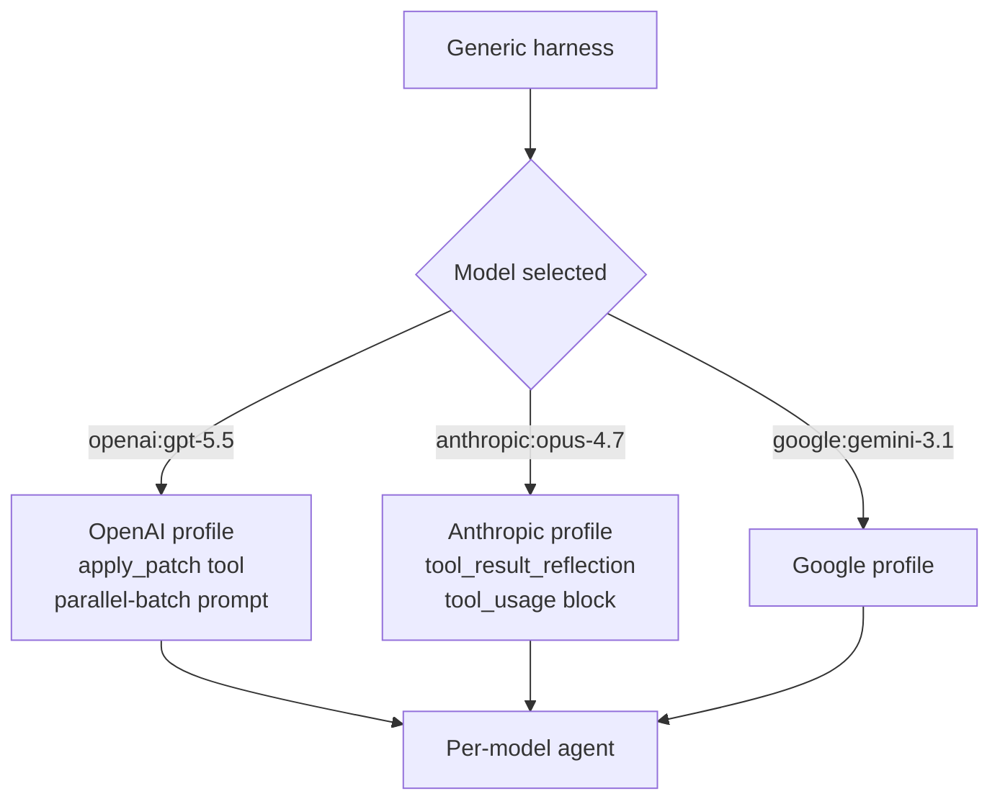
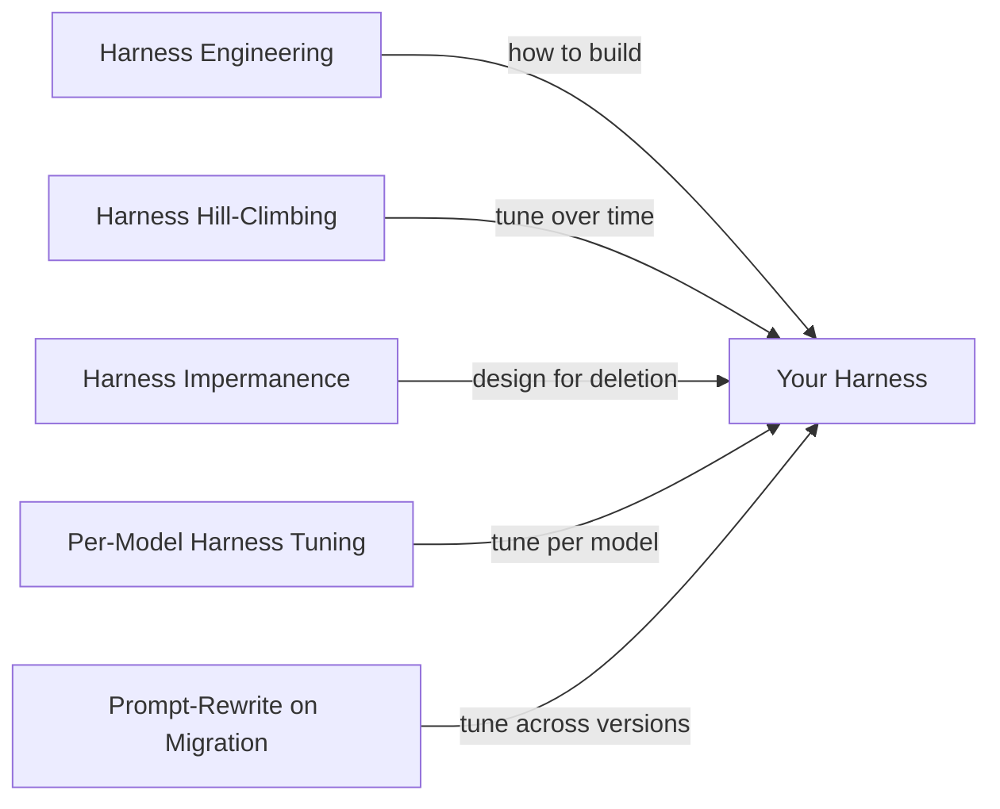

# Per-Model Harness Tuning

> The same harness produces different behaviour on different backing models. Treat the model as a first-class harness variable — tune prompt structure, tool descriptions, and middleware per model — instead of forcing one generic configuration to work everywhere.

## The Pattern

Frontier vendors train models on provider-specific prompt and tool conventions. A harness shaped for one violates the other's training distribution. Declare per-model overrides — system-prompt prefix and suffix, tool inclusion and naming, middleware, subagent configuration — that the harness applies whenever a particular model is selected.

LangChain's deepagents library shipped this as **harness profiles** on 2026-04-29. On a tau2-bench subset, profiles produced a 10-20 point jump per model: GPT 5.3 Codex went from 33% to 53%; Claude Opus 4.7 from 43% to 53% ([LangChain](https://blog.langchain.com/tuning-deep-agents-different-models)).



## What Varies Per Model

The override surface covers components that vendor prompting guides prescribe differently:

| Component | Why it varies | Source |
|---|---|---|
| System prompt prefix/suffix | XML sections for Claude vs batch-call instructions for Codex | [Claude prompting](https://platform.claude.com/docs/en/build-with-claude/prompt-engineering/claude-prompting-best-practices); [Codex prompting](https://developers.openai.com/codex/prompting) |
| Tool inclusion and naming | Codex is trained on `apply_patch` and shell-style names; generic file-edit tools score worse | [LangChain](https://blog.langchain.com/tuning-deep-agents-different-models) |
| Tool descriptions | Calibrate against each model's literal-interpretation profile | [Anthropic migration](https://platform.claude.com/docs/en/about-claude/models/migration-guide) |
| Middleware selection | Summarisation middleware tuned for one model's verbosity over-corrects on another | [Cursor](https://cursor.com/blog/codex-model-harness) |
| Subagent configuration | Spawn-frequency defaults differ across models | [Anthropic migration](https://platform.claude.com/docs/en/about-claude/models/migration-guide) |

Structural mechanisms — sandboxing, permission gates, file-persistent context, observability hooks — depend on the harness contract, not the model, and port cleanly. See [Temporary Compensatory Mechanisms](temporary-compensatory-mechanisms.md) for the structural-vs-compensatory split.

## Concrete Per-Model Deltas

LangChain published the actual changes that produced their tau2-bench deltas ([LangChain](https://blog.langchain.com/tuning-deep-agents-different-models)).

For Codex, the changes were tool-shape: replace the default `file_edit` with [`apply_patch`](https://developers.openai.com/codex/prompting/api/docs/guides/tools-apply-patch), alias `execute` as `shell_command`, and add a parallel-batch prompt: "Before any tool call, decide ALL files and resources you will need. Batch reads, searches, and other independent operations into parallel tool calls instead of issuing them one at a time."

For Opus 4.7, the changes were prompt-only — XML-tagged blocks the model is trained to recognise:

```xml
<tool_result_reflection>
After receiving tool results, carefully reflect on their quality
and determine optimal next steps before proceeding.
</tool_result_reflection>

<tool_usage>
When a task depends on the state of files, tests, or system output,
use tools to observe that state directly rather than reasoning from
memory about what it probably contains.
</tool_usage>
```

Cursor reports the same shape independently: shell-style tool names for Codex, explicit `read_lints` triggers, removed mid-turn user-talk language because Codex models cannot "talk" until the end of a turn ([Cursor](https://cursor.com/blog/codex-model-harness)).

## Expressing the Deltas

LangChain's profile API keys overrides on a bare provider name (`"openai"`) or fully qualified `provider:model` (`"openai:gpt-5.4"`) ([Deep Agents Profiles docs](https://docs.langchain.com/oss/python/deepagents/profiles)).

```python
from deepagents import HarnessProfile, register_harness_profile

register_harness_profile(
    "openai:gpt-5.4",
    HarnessProfile(
        system_prompt_suffix="Respond in under 100 words.",
        excluded_tools={"execute"},
        excluded_middleware={"SummarizationMiddleware"},
    ),
)
```

Merge semantics are field-typed: prompts last-wins, tool-description mappings merge per key, excluded sets union, extra middleware appended by class identity. Provider-level and model-level profiles compose at resolve time — model-level inherits from provider-level. The `create_deep_agent` call site does not change.

The mechanism generalises beyond deepagents — any harness can adopt a model key, a delta record, and resolution at agent construction. The discipline is keeping deltas declarative so they version, diff, and ship as plugins rather than scattering `if model == ...` branches through the loop.

## Relation to Adjacent Harness Patterns



Per-model tuning is the orthogonal axis to existing harness disciplines:

- [Harness Engineering](harness-engineering.md) builds the harness contract.
- [Harness Hill-Climbing](harness-hill-climbing.md) tunes a fixed configuration over time. Per-model tuning tunes across models at one point in time.
- [Harness Impermanence](harness-impermanence.md) designs for cheap removal when the next model subsumes the capability — author profiles as declarative overrides so the same removal seam applies.
- [Prompt-Rewrite on Cross-Generation Migration](../instructions/prompt-rewrite-on-cross-generation-migration.md) handles the temporal dimension (one model upgrades). Per-model tuning handles the spatial dimension (N models against one harness).

## When This Backfires

Per-model profiles cost more than they pay back under specific conditions:

- **Single-model deployments.** No portability surface to manage; profile machinery is dead weight.
- **Minor-version successors with stable evals.** "Claude Opus 4.7 should have strong out-of-the-box performance on existing Claude Opus 4.6 prompts and evals" ([Anthropic: Migration guide](https://platform.claude.com/docs/en/about-claude/models/migration-guide)) — a profile per minor version is churn without measurable gain.
- **No representative eval suite.** Per-model deltas need measurement to validate the override actually improves the target model. See [Harness Hill-Climbing](harness-hill-climbing.md) for the eval discipline.
- **Provider-managed harnesses.** Claude Managed Agents and Copilot consumer tiers route to successors automatically; the user has no harness surface to tune.
- **Capability convergence.** As frontier models converge on shared tool conventions (`apply_patch`, shell, structured outputs), the eval gap shrinks while maintenance cost stays flat.

Per-model deltas are exactly the kind of hand-coded knowledge model releases tend to subsume. Author profiles as declarative overrides so deletion is one config change, not a refactor.

## Example

A team running deepagents against both OpenAI and Anthropic registers two profiles at startup:

```python
from deepagents import HarnessProfile, register_harness_profile

# Codex needs apply_patch and parallel-batch guidance
register_harness_profile(
    "openai",
    HarnessProfile(
        system_prompt_suffix=(
            "Before any tool call, decide ALL files and resources "
            "you will need. Batch independent reads and searches into "
            "parallel tool calls instead of issuing them one at a time."
        ),
        excluded_tools={"file_edit"},  # apply_patch wins for Codex
    ),
)

# Opus 4.7 needs explicit reflection and tool-investigation cues
register_harness_profile(
    "anthropic:claude-opus-4-7",
    HarnessProfile(
        system_prompt_suffix=(
            "<tool_result_reflection>"
            "After receiving tool results, reflect on quality and "
            "determine optimal next steps before proceeding."
            "</tool_result_reflection>"
        ),
    ),
)
```

The `create_deep_agent(model=...)` call site is unchanged. Switching `model="openai:gpt-5.5"` to `model="anthropic:claude-opus-4-7"` swaps the active profile automatically; the agent inherits the right deltas without per-call branching.

## Key Takeaways

- The same harness produces measurably different behaviour on different backing models — LangChain documented 10-20 point tau2-bench deltas from profile work alone ([LangChain](https://blog.langchain.com/tuning-deep-agents-different-models)).
- The override surface is system prompt, tool inclusion and naming, tool descriptions, middleware selection, and subagent configuration. Structural mechanisms (sandboxing, permissions, observability) port cleanly and stay shared.
- Express deltas as declarative model-keyed overrides so they version, compose, and remove. Avoid `if model == ...` branches through the agent loop.
- Profile work pays off only with a representative eval suite. Without measurement, per-model tuning is unmeasured prompt churn.
- Skip the discipline for single-model deployments, minor-version successors with stable evals, and provider-managed harnesses where there is no harness surface to tune.
- Per-model tuning is the spatial counterpart to [Prompt-Rewrite on Cross-Generation Migration](../instructions/prompt-rewrite-on-cross-generation-migration.md) (temporal) and orthogonal to [Harness Hill-Climbing](harness-hill-climbing.md) (single-model, over time).

## Related

- [Harness Engineering](harness-engineering.md) — the discipline of building the harness this pattern overrides per model
- [Harness Hill-Climbing](harness-hill-climbing.md) — eval-driven tuning of a fixed configuration over time, orthogonal to per-model tuning
- [Harness Impermanence](harness-impermanence.md) — author scaffolding for cheap removal; profiles benefit from the same discipline
- [Prompt-Rewrite on Cross-Generation Migration](../instructions/prompt-rewrite-on-cross-generation-migration.md) — the temporal counterpart for handling model-version upgrades
- [Temporary Compensatory Mechanisms](temporary-compensatory-mechanisms.md) — structural-vs-compensatory split that determines which components belong in profiles
- [Cross-Vendor Competitive Routing](cross-vendor-competitive-routing.md) — running multiple vendor agents on the same task; per-model profiles are how each side gets a fair shot
- [Harness Design Dimensions and Archetypes](harness-design-dimensions.md) — the population-level dimensions per-model deltas vary along
- [Managed vs Self-Hosted Harness](managed-vs-self-hosted-harness.md) — managed harnesses remove the surface this pattern operates on
