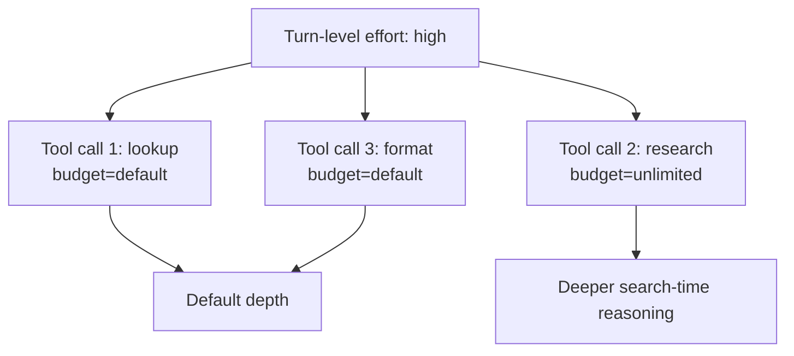

# Per-Tool Extended Reasoning Opt-In: Tool-Call-Scoped Budgets

> A tool-design pattern in which one tool invocation opts itself into deeper reasoning via a per-call parameter, while the surrounding turn keeps its default effort.

## The Primitive

Per-tool extended reasoning opt-in is a tool-design pattern in which a single tool invocation carries a parameter that asks the runtime to spend more reasoning on this specific call — without raising the turn's global `reasoning_effort`. OpenAI shipped this shape in 2026 with the `return_token_budget` parameter on the Responses API web-search tool: callers opt into longer GPT-5+ reasoning web-search runs "for high-effort research and evaluation workloads" while every other call in the turn keeps its default budget ([OpenAI API changelog](https://platform.openai.com/docs/changelog), [Web search guide](https://platform.openai.com/docs/guides/tools-web-search)).

Only two values are supported — `"default"` and `"unlimited"` ([Web search guide](https://platform.openai.com/docs/guides/tools-web-search)). The parameter applies only to the hosted `web_search` tool with GPT-5+ reasoning models; it does not change the search context window and does not apply to `web_search_preview`, Chat Completions search models, legacy Search API paths, or container web search.

Three controls share the budget vocabulary but differ in scope:

| Control | Scope | Who decides |
|---------|-------|-------------|
| Turn-level `reasoning_effort` | Every step in the turn | Operator (per-call API arg) |
| [Heuristic effort scaling](heuristic-effort-scaling.md) | Whole turn, tiered by complexity | Agent (from system-prompt rules) |
| Per-tool opt-in (`return_token_budget` etc.) | One tool call | Agent (from tool-call args) |

The per-tool control occupies the slot that turn-level knobs cannot reach: heterogeneous depth across tool calls in the same turn.

## How It Works

The runtime exposes a budget parameter on the tool's input schema and documents it in the tool description. The model decides whether to set the parameter from what the description teaches; the description carries the entire trigger burden, including which values to populate ([Agent Skills: optimizing descriptions](https://agentskills.io/skill-creation/optimizing-descriptions)).



Two design choices keep the pattern from collapsing into a turn-level knob. The default must be the cost-optimal common case — opting in is the rare path, not the safe path. OpenAI's guidance is explicit: keep the default for most requests; use `"unlimited"` selectively because it raises latency and cost ([Web search guide](https://platform.openai.com/docs/guides/tools-web-search)). And the description must teach *when* to opt in — trigger phrases like "for high-effort research and evaluation workloads" tell the model which prompts should set the parameter.

## Why It Works

The mechanism is decoupling marginal value-of-information from a single global compute knob. Turn-level `reasoning_effort` commits the same depth to every call — uniform allocation across actions with sharply different expected-value-per-token. Routine lookups, formatting calls, and deep research queries do not benefit equally from extra reasoning; pricing them the same wastes surplus on cheap calls and starves expensive ones.

[Lin et al. (2026)](https://arxiv.org/abs/2511.17006) establish this for tool-use: budget-aware agents push the cost-performance Pareto frontier, and "a tool-call limit offers a more relevant and direct constraint on an agent's ability to acquire external knowledge than tokens used for internal reasoning." Adaptive per-call allocation beats uniform empirically — [AdaTIR](https://arxiv.org/abs/2601.14696) cuts tool calls by up to 97.6% on simple tasks at equivalent accuracy, and [Ares](https://arxiv.org/abs/2603.07915) cuts reasoning-token usage by up to 52.7% versus fixed high-effort reasoning with minimal accuracy loss; the same compute-optimal-beats-uniform result holds for test-time compute generally ([Snell et al. (2024)](https://arxiv.org/abs/2408.03314)). `return_token_budget` is the productised instance at the tool-call boundary.

## Where the Parameter Lives

| Placement | Example | Reach |
|-----------|---------|-------|
| Hosted tool parameter | `return_token_budget` on `web_search` | Single vendor, hosted tools only |
| Project-defined function-tool parameter | Custom `extended_reasoning: bool` on a research tool | Any model that supports function-calling |
| MCP tool annotation | None today | Would require spec change |

MCP is not yet viable. Its annotation surface — `readOnlyHint`, `destructiveHint`, `idempotentHint`, `openWorldHint`, `title` — covers risk and behavior, not compute budget, and the spec says "clients MUST consider tool annotations to be untrusted unless they come from trusted servers" ([MCP blog: tool annotations](https://blog.modelcontextprotocol.io/posts/2026-03-16-tool-annotations/)). A per-call budget belongs on the tool's input schema, not in a server-declared hint. For project-defined tools routing to expensive backends — deep research, plan-synthesis subagents — adding the parameter and teaching its trigger phrases in the description is the portable form.

## When This Backfires

**Sycophantic always-on.** The model reads the opt-in as "be thorough" and engages it on every call, turning the budget into fixed overhead. The budget-aware literature documents this overthinking: LLMs miscalibrate effort in both directions, generating unnecessarily long paths when unconstrained ([Plan and Budget (arxiv 2505.16122)](https://arxiv.org/abs/2505.16122)). The fix lives in the description's trigger phrases — frame the cost ("increases latency and cost — use selectively") and restrict the trigger to a narrow vocabulary.

**Never-on dead capability.** The description names the parameter but offers no trigger phrases, examples, or cost framing, so the model defaults it and the capability sits unused. The description carries the entire trigger burden ([Agent Skills docs](https://agentskills.io/skill-creation/optimizing-descriptions)).

**Non-monotonic depth backfire.** Deeper reasoning is not unconditionally a win. ["Brief Is Better" (arxiv 2604.02155)](https://arxiv.org/abs/2604.02155) found brief 32-token reasoning improves function-calling accuracy by +45% relative while extended 256-token reasoning degrades it. An opt-in tuned past the inflection point worsens the very calls it was meant to help.

**Misalignment with turn budget.** A late opt-in can land after the turn-level effort has spent its slack on cheaper calls; without coordination between the two controls, the call-level request is one the harness cannot fulfil.

**Portability illusion.** The only documented production instance is OpenAI's `return_token_budget` on one hosted tool. MCP annotations don't carry the hint, and re-implementing it as a custom function-tool parameter loses the host's hosted-tool integration — portability is real only for the project-defined form.

## Example

A research agent has two tools: a routine `lookup` tool and a research-grade `deep_search` tool that wraps the hosted Responses API web search. The opt-in parameter lives on `deep_search`:

```jsonc
{
  "name": "deep_search",
  "description": "Search the web for one topic. Set return_token_budget=unlimited only for high-effort research and evaluation workloads that need to inspect many pages — this increases latency and cost. Keep the default for routine fact lookups.",
  "parameters": {
    "type": "object",
    "properties": {
      "query": {"type": "string"},
      "return_token_budget": {
        "type": "string",
        "enum": ["default", "unlimited"],
        "default": "default",
        "description": "Use 'unlimited' only when the question explicitly requires inspecting many pages — surveys, audits, cross-source claim verification. Use 'default' for single-fact lookups, recent news, and single-source confirmation."
      }
    },
    "required": ["query"]
  }
}
```

The agent receives two prompts in the same turn:

- "What's GPT-5's context window?" — single-fact lookup; the model picks `return_token_budget=default`.
- "Audit the literature on per-tool reasoning budgets across the 2025–2026 corpus." — multi-page survey; the model picks `return_token_budget=unlimited`.

The turn's global `reasoning_effort` stays at `high` for both calls. The opt-in moves the depth decision to the call where the marginal value is highest, leaving the cheap call at its cost-optimal default.

## Key Takeaways

- Per-tool extended reasoning opt-in is a tool-design pattern; it lives as a parameter on the tool's input schema, not as a server hint or annotation.
- The default value must be the cost-optimal common case — opting in is the rare path. OpenAI's `return_token_budget` defaults to `default` and exposes only one opt-in value (`unlimited`).
- The tool description is the load-bearing teaching surface; the model decides whether to opt in from description text, not from runtime feedback ([Agent Skills docs](https://agentskills.io/skill-creation/optimizing-descriptions)).
- Adaptive per-call allocation has consistent empirical support — Lin et al., AdaTIR, Ares — but depth past the inflection point degrades function-calling accuracy (["Brief Is Better"](https://arxiv.org/abs/2604.02155)).
- MCP tool annotations are not the right home for a per-call budget; the annotation surface is risk vocabulary, not compute budget, and annotations are advisory and untrusted by default.
- Cross-vendor portability is real for project-defined function-tool parameters; the hosted-tool form (`return_token_budget` on `web_search`) is vendor-locked today.

## Related

- [Heuristic-Based Effort Scaling in Agent Prompts](heuristic-effort-scaling.md) — turn-level alternative: the agent classifies complexity and sets effort for the whole turn rather than per call
- [Dual-Budget Control for Search Agents](dual-budget-control-search-agents.md) — adjacent primitive: which action gets the next budget unit, rather than how deeply one action thinks
- [Interactive Effort Sliders: Per-Turn Reasoning-Budget Controls](interactive-effort-sliders.md) — per-turn operator control; this page is per-call agent control
- [Reasoning Budget Allocation: The Reasoning Sandwich](reasoning-budget-allocation.md) — phase-based allocation (plan, execute, verify) — the architectural alternative to runtime per-call dialling
- [Effort-Aware Hooks](../tool-engineering/effort-aware-hooks.md) — hook-side surface reading the active effort tier; complementary to the tool-side opt-in
