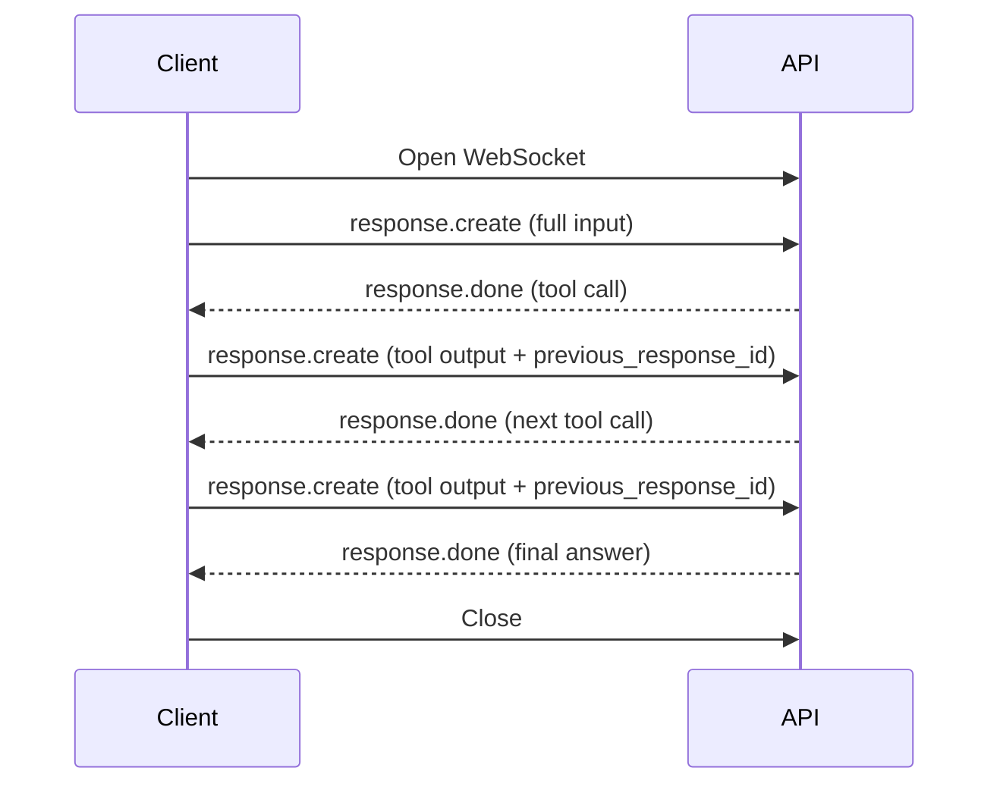

# Persistent-Connection Agent Transport

> Hold one bidirectional channel to the model API across an agent rollout, sending only incremental input each turn so per-request overhead amortises over the full session.

## The Per-Turn Overhead Problem

A typical agent loop issues many sequential model calls — read a file, edit it, run a test, inspect output, repeat. Each turn over stateless HTTP pays the same fixed costs: TLS handshake, request validation, conversation rendering, safety classifier passes, tokenization, and model routing. As model inference itself gets faster, this fixed overhead becomes the dominant share of latency. OpenAI reports that for GPT-5.3-Codex-Spark — running at ~1,000 tokens per second versus 65 TPS on prior flagship models — Responses API overhead grew larger than the inference time it surrounded ([OpenAI: Speeding up agentic workflows with WebSockets](https://openai.com/index/speeding-up-agentic-workflows-with-websockets/)).

## The Pattern

Open one persistent socket for the lifetime of the agent rollout. Each turn sends a message containing only the new input — the most recent tool output and any new user message — and a reference to the prior turn's response. The server keeps a connection-local in-memory cache of previous-response state and reuses it instead of rebuilding the conversation from scratch ([OpenAI WebSocket Mode docs](https://developers.openai.com/api/docs/guides/websocket-mode)).

Cached state typically includes:

- The previous response object
- Prior input and output items
- Tool definitions and namespaces
- Reusable sampling artifacts such as pre-rendered tokens



## Mechanism

The latency win comes from amortising fixed per-request work across the connection lifetime. With cached previous-response state in memory, the server can:

- Run safety classifiers and validators on new input only, not the full transcript
- Skip retokenisation by appending to a kept token cache
- Reuse model resolution and routing from the prior turn
- Overlap non-blocking postinference work like billing with the next request

OpenAI reports up to 40% end-to-end latency reduction on rollouts with 20 or more sequential tool calls. Vercel integrated the transport into the AI SDK and reports up to 40% lower latency; Cline reports 39% faster multi-file workflows; Cursor reports up to 30% faster OpenAI model responses ([OpenAI: Speeding up agentic workflows with WebSockets](https://openai.com/index/speeding-up-agentic-workflows-with-websockets/)).

## Provider Availability

- **OpenAI Responses API** — WebSocket mode launched April 22, 2026, compatible with `store=false` and Zero Data Retention ([WebSocket Mode docs](https://developers.openai.com/api/docs/guides/websocket-mode)).
- **Anthropic Claude API** — streaming uses Server-Sent Events, which is server-to-client only; the API is stateless and each turn re-sends full conversation history ([Claude streaming](https://platform.claude.com/docs/en/build-with-claude/streaming), [Claude tool use](https://docs.anthropic.com/en/docs/build-with-claude/tool-use)).

## Constraints to Design Around

OpenAI's implementation defines the constraints to plan for; equivalents on other providers will likely have similar shape.

- **Single in-flight response per socket** — no multiplexing. Open multiple connections for parallel runs ([WebSocket Mode docs](https://developers.openai.com/api/docs/guides/websocket-mode)).
- **60-minute connection cap** — `websocket_connection_limit_reached` forces a reconnect; long rollouts must continue on a fresh socket using either persisted response IDs (`store=true`) or a freshly compacted input window ([WebSocket Mode docs](https://developers.openai.com/api/docs/guides/websocket-mode)).
- **Cache eviction on error** — a 4xx or 5xx evicts the referenced `previous_response_id` from the connection-local cache, preventing stale-state reuse but requiring the client to handle continuation from a clean base ([WebSocket Mode docs](https://developers.openai.com/api/docs/guides/websocket-mode)).
- **Sticky sessions required** — persistent connections consume server memory and pin a session to one backend; horizontal scaling needs sticky load-balancing or specialised infrastructure ([Ably: WebSockets vs HTTP](https://ably.com/topic/websockets-vs-http)).
- **No built-in message acknowledgement** — clients must handle their own retry, dedup, and ordering logic on top of the socket ([DigitalSamba: HTTP vs WebSocket](https://www.digitalsamba.com/blog/websocket-vs-http)).

## When This Backfires

The transport adds lifecycle complexity. Stay on stateless HTTP when:

- **Short rollouts** — fewer than ~10 tool calls per turn, where per-request overhead is small relative to inference time. The reported 40% figure is for rollouts of 20 or more tool calls ([OpenAI: Speeding up agentic workflows with WebSockets](https://openai.com/index/speeding-up-agentic-workflows-with-websockets/)).
- **Stateless serverless harnesses** — agent processes that restart between turns or run on different instances (Lambda, Cloudflare Workers) can never hit the connection-local cache; the in-memory benefit is structurally unavailable.
- **Multi-replica deployments without sticky sessions** — load balancers must pin sessions for the full connection window, complicating horizontal scaling ([Ably: WebSockets vs HTTP](https://ably.com/topic/websockets-vs-http)).
- **Provider-portable harnesses** — only OpenAI offers this transport today. A harness that depends on persistent-socket optimisation cannot be portable across Anthropic and Google APIs without per-provider transport branches.

## Example

A coding agent rollout that issues three tool calls — read, edit, test — using OpenAI's WebSocket mode. Each follow-up turn sends only the new tool output plus `previous_response_id`, not the full transcript ([WebSocket Mode docs](https://developers.openai.com/api/docs/guides/websocket-mode)).

```python
from websocket import create_connection
import json, os

ws = create_connection(
    "wss://api.openai.com/v1/responses",
    header=[f"Authorization: Bearer {os.environ['OPENAI_API_KEY']}"],
)

# Turn 1: full input
ws.send(json.dumps({
    "type": "response.create",
    "model": "gpt-5.5",
    "store": False,
    "input": [{"type": "message", "role": "user",
               "content": [{"type": "input_text", "text": "Fix the failing test."}]}],
    "tools": [...],
}))
resp1 = json.loads(ws.recv())  # response.done with tool call

# Turn 2: only new input + previous_response_id
ws.send(json.dumps({
    "type": "response.create",
    "model": "gpt-5.5",
    "store": False,
    "previous_response_id": resp1["id"],
    "input": [{"type": "function_call_output",
               "call_id": "call_abc",
               "output": "<file contents>"}],
}))
```

The server reuses the cached tool definitions, prior tokens, and routing decisions from turn 1 — it processes only the new tool output before the next sampling step.

## Key Takeaways

- Persistent-connection transport amortises fixed per-request overhead across a multi-turn agent rollout
- The benefit is conditional: tool-call-heavy workloads (~20+ calls), single-replica or sticky-session deployment, and provider availability
- OpenAI's Responses API offers it today; Anthropic and Google use stateless request/response with SSE streaming
- Plan for connection caps, single-in-flight semantics, and cache eviction on error — these dictate the reconnect logic the client must own

## Related

- [Agent Harness: Initializer and Coding Agent Pattern](agent-harness.md)
- [Agent Turn Model](agent-turn-model.md)
- [Cost-Aware Agent Design](cost-aware-agent-design.md)
- [Harness Design Dimensions](harness-design-dimensions.md)
- [Managed vs Self-Hosted Harness](managed-vs-self-hosted-harness.md)
