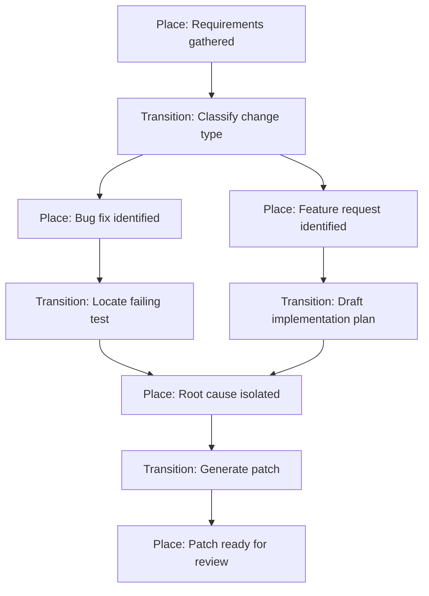

# Petri Net of Thoughts: Formal Process Models as Prompting Scaffolds

> Derive reasoning structure from process evidence — Petri net places define states, transitions define decisions, and token replay drives each prompt step with accumulated context.

## The Technique

Standard structured prompting (CoT, ToT, GoT) relies on the developer to decompose reasoning steps by hand. Petri Net of Thoughts (PNoT) inverts this: the structure comes from a formally discovered or expert-defined process model, not ad-hoc intuition.

A Petri net is a bipartite graph of **places** (states) and **transitions** (decisions). Tokens flow through the net according to firing rules — a transition fires when all its input places hold tokens, consuming them and producing tokens in output places. This gives three properties that looser prompting topologies lack:

1. **Formally defined paths** — places and transitions encode sequence, concurrency, and choice explicitly
2. **State-aware prompts** — each transition receives a system prompt reflecting the current marking (token distribution), not just the prior step's output
3. **Traceable reasoning** — when output diverges, trace backward through transitions to the point of failure

[Gavric, Bork, and Proper (2025)](https://doi.org/10.18420/EMISA2025_15) introduced PNoT at EMISA 2025, applying process discovery techniques to derive the net structure from event logs or domain expertise, then using token replay to guide the LLM through each transition sequentially.

## How Token Replay Drives Prompting

[Token replay](https://en.wikipedia.org/wiki/Token-based_replay) is a process mining algorithm that simulates execution by moving tokens through the net. In PNoT, each transition firing maps to an LLM call:

1. **Initialize** — place tokens at the start place; the initial system prompt encodes the task definition and net structure
2. **Fire** — when a transition is enabled (all input places have tokens), call the LLM with a system prompt reflecting the current state and the decision the transition represents
3. **Advance** — consume input tokens, produce output tokens in the next places; append the LLM's response to the accumulated context
4. **Repeat** — continue until tokens reach the final place

Each LLM call sees both the accumulated reasoning history and the specific decision it must make — the Petri net constrains what the model considers at each step.

## When This Adds Value

PNoT pays off when the reasoning process has **known structure** — a defined sequence of decisions, branching conditions, and convergence points:

- **CI/CD pipelines** — classify failure type, select remediation strategy, verify fix
- **Code review workflows** — check style, check logic, check security, aggregate findings
- **Regulatory or compliance checks** — sequential gates with defined pass/fail criteria

MedVerse (2025) independently validated this approach for medical diagnosis, formalizing differential diagnosis as a Colored Petri Net with parallel transition firing. The result: [4.8-8.9% accuracy gains over CoT and 1.3x latency reduction](https://arxiv.org/abs/2602.07529) through topology-aware parallel execution.

## When Simpler Approaches Suffice

The overhead of defining a Petri net — places, transitions, firing rules — is not justified for every task:

- **Open-ended exploration** — the reasoning path is unknown upfront; a plan-mode prompt or Tree of Thoughts is more appropriate
- **Single-step tasks** — one decision, one action; [structured reasoning adds no benefit](../anti-patterns/reasoning-overuse.md)
- **Advanced reasoning models** — models with extended thinking (Claude with ultrathink, o1) internalize multi-step reasoning; external scaffolding may add latency without improving outcomes [unverified]

The formal taxonomy of reasoning topologies ([Besta et al., IEEE TPAMI 2025](https://arxiv.org/abs/2401.14295)) positions PNoT alongside CoT (chain), ToT (tree), and GoT (graph) — each suited to different task structures. PNoT is strongest when the structure is derivable from evidence rather than designed by intuition.

## Key Takeaways

- PNoT derives reasoning structure from process models rather than hand-crafted decomposition — the net comes from evidence or domain expertise
- Token replay maps each transition to an LLM call with a state-aware system prompt, constraining what the model considers at each step
- Traceability is built in: trace backward through transitions to find where reasoning diverged
- Best suited for process-aware tasks with known decision sequences — CI pipelines, review workflows, compliance checks
- For open-ended reasoning or single-step tasks, simpler topologies (CoT, ToT, plan mode) have lower overhead

## Related

- [Reasoning Budget Allocation: The Reasoning Sandwich](reasoning-budget-allocation.md) — Allocate reasoning compute by phase rather than uniformly
- [Chain-of-Thought Reasoning Fallacy](../fallacies/chain-of-thought-reasoning-fallacy.md) — Why coherent reasoning traces are not proof of correct decisions
- [Indiscriminate Structured Reasoning](../anti-patterns/reasoning-overuse.md) — When structured reasoning adds cost without benefit
- [Agent Composition Patterns](agent-composition-patterns.md) — Multi-agent structural patterns including chains, fan-out, pipelines
- [Three Reasoning Spaces: Plan, Bead, and Code](three-reasoning-spaces.md) — Explicit gates between planning, task decomposition, and implementation
- [The Think Tool](think-tool.md) — Mid-stream reasoning checkpoints between tool calls
