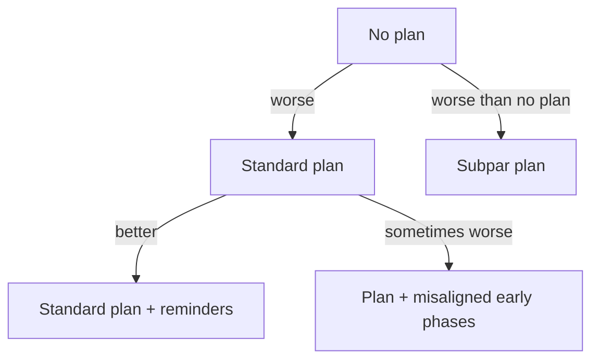

# Plan Compliance in Agents: Measure What They Execute, Not What You Wrote

> Agents do not reliably execute the phases you instruct. Plan quality, phase alignment, and periodic reminders determine whether the plan you wrote is the plan that actually runs.

## The Silent Gap

Writing an instructed plan into a system prompt does not mean the agent follows it. A 16,991-trajectory study of SWE-agent across four LLMs on SWE-bench Verified and SWE-bench Pro, under eight plan variations, produced the first systematic measurement of plan compliance in programming agents ([Liu et al., 2026](https://arxiv.org/abs/2604.12147)). The core finding: "without an explicit plan, agents fall back on workflows internalized during training, which are often incomplete, overfit, or inconsistently applied."

Until compliance is measured, pass rates conflate two distinct sources of success: strategic reasoning driven by the instructed plan, and memorised pattern-matching against benchmark-adjacent training data. Resolution rate alone cannot tell them apart ([Liu et al., 2026](https://arxiv.org/abs/2604.12147)).

## Four Empirical Effects

Each effect is drawn directly from [Liu et al., 2026](https://arxiv.org/abs/2604.12147):

1. **Standard plans beat no plans.** A phase sequence such as navigation → reproduction → patch → validation improves issue resolution over unprompted execution.
2. **Periodic reminders reduce violations.** Re-injecting the plan during execution mitigates drift and improves task success.
3. **Subpar plans underperform no plan.** A low-quality plan actively hurts — worse than leaving the agent to its training priors.
4. **Misaligned extra phases degrade performance.** Adding early-stage phases that conflict with the model's internal problem-solving strategy can lower resolution rates.

Effects 3 and 4 invert the naive assumption that "more plan, earlier plan" is monotonically better.

## Why Compliance Fails Without Reminders

The compliance decay mechanism is documented in adjacent work. Agents exhibit goal drift correlated with increasing pattern-matching susceptibility as context grows — all tested models drift to some degree, with the best case maintaining near-perfect adherence only up to ~100,000 tokens under specific conditions ([Arike et al., 2025](https://arxiv.org/abs/2505.02709)). Instruction fade-out is documented as a distinct failure mode that event-driven system reminders are designed to counter ([Bui, 2025](https://arxiv.org/abs/2603.05344)).

Re-injecting the plan as the context lengthens pushes it back into the high-attention recency zone. This is the same structural defense that [goal recitation](../context-engineering/goal-recitation.md) uses for objectives and [critical instruction repetition](../instructions/critical-instruction-repetition.md) uses for hard constraints.

## Applying This in Practice

Treat the plan as an engineered artifact with four operational questions:

- **Does the plan match the model's strategy?** If early phases contradict how the model naturally approaches the problem class, performance drops below no-plan baselines. Pilot the plan against the unprompted trajectory before locking it in.
- **Is the plan high quality?** A bad plan is worse than no plan. Iterate on phase boundaries and success criteria rather than shipping a first draft.
- **Are there reminders?** Without mid-run reinjection, plan adherence decays in long sessions. Inject reminders at phase boundaries or on token thresholds.
- **Is compliance measured?** Pass rate hides non-compliance. Compare executed trajectories against the instructed phases — deviation rate is the signal.

Measurement turns the plan from a hope into a testable contract. Without it, every benchmark number risks being a pattern-match from training rather than a product of the plan you wrote.

## Example

Two agents handle the same SWE-bench issue. Both produce a passing patch.

**Agent A** — no plan. Trajectory: grep for the error string, open the matched file, edit the apparent cause, run the failing test, patch until green. Skips reproduction and validation phases entirely.

**Agent B** — instructed plan (navigation → reproduction → patch → validation) with a reminder at each phase boundary. Trajectory: locate the module, write a minimal reproducer, confirm failure, patch, run the full test subset, verify no regression.

Looking at resolution rate alone, both succeed. Looking at trajectory-to-plan diff, only Agent B followed the instructed strategy. If the benchmark is near the training distribution, Agent A's success may generalise poorly; Agent B's success is attributable to the plan and is likelier to hold on unseen issues — the distinction [Liu et al., 2026](https://arxiv.org/abs/2604.12147) identify as invisible without compliance analysis.

## Key Takeaways

- Writing a plan does not mean the agent executes it — measure compliance, not just pass rate.
- Standard plans outperform no plans; subpar plans underperform no plans.
- Extra early-stage phases degrade performance when they misalign with the model's internal strategy.
- Periodic plan reminders during execution reduce violations and improve task success.
- Pass rate without compliance analysis cannot distinguish strategic reasoning from training-data pattern matching.

## Related

- [The Plan-First Loop: Design Before Code](../workflows/plan-first-loop.md) — upstream: building the plan with the agent before execution
- [Goal Recitation: Countering Drift in Long Sessions](../context-engineering/goal-recitation.md) — agent-initiated objective reinjection, complementary to plan reminders
- [Critical Instruction Repetition](../instructions/critical-instruction-repetition.md) — author-placed repetition for hard constraints
- [Event-Driven System Reminders](../instructions/event-driven-system-reminders.md) — harness mechanism for injecting reminders on detected conditions
- [The Instruction Compliance Ceiling](../instructions/instruction-compliance-ceiling.md) — compliance decay driven by rule count
- [Task List Divergence as Instruction Quality Diagnostic](../verification/task-list-divergence-diagnostic.md) — divergence in generated plans as an instruction-quality signal
- [Goal Monitoring and Progress Tracking](goal-monitoring-progress-tracking.md) — observing whether the agent executed what was planned
- [Objective Drift: When Agents Lose the Thread](../anti-patterns/objective-drift.md) — the failure mode plan reminders mitigate
