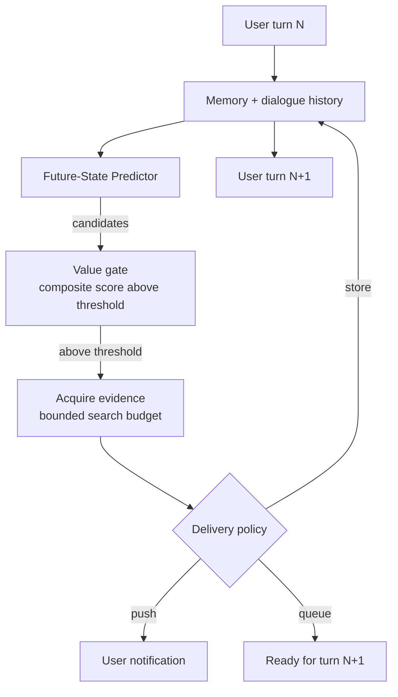

# Proactive Idle-Time Anticipation (ProAct)

> Anticipation of likely next user needs runs during idle wall-clock between turns, using dialogue history and persistent memory to direct speculative prefetching.

Proactive idle-time anticipation runs a future-state predictor over recent dialogue and persistent memory during the wall-clock between user turns, value-scores candidate needs, and spends a bounded search budget acquiring evidence before the user asks. The technique only outperforms a reactive baseline when the dialogue admits predictable need chains, the idle window is long enough for delivery before the next turn, dollar cost is not the binding constraint, and the deployment context tolerates the privacy posture of speculative memory reads ([Hu et al., arXiv:2605.25971](https://arxiv.org/abs/2605.25971)).

## When This Applies

Four conditions must hold together before the pattern earns back its speculative compute. If any one fails, run a reactive baseline and route the saved budget into [reasoning budget allocation](reasoning-budget-allocation.md) or trajectory reduction.

- **Predictable need chains in the dialogue.** ProAct's evaluation explicitly models scenarios with a hidden user-needs graph whose nodes carry `predictable_after` dependencies; the technique scored 0.447 Anticipation Recall versus 0.020 for an undirected proactive baseline ([arXiv:2605.25971](https://arxiv.org/abs/2605.25971)). Without structure to predict against — single-shot Q&A, scattershot topic-hopping — there is nothing to anticipate.
- **Persistent memory exists and is trustworthy.** The predictor decomposes future needs from user profiles, entity facts, conversation summaries, and prior artifacts. No memory means the predictor degenerates to dialogue-only extrapolation; stale memory injects wrong predictions confidently. See [agent memory patterns](agent-memory-patterns.md) for the substrate this technique runs on top of.
- **Idle wall-clock exceeds the predict-acquire-deliver loop.** Anticipation only pays off if the artifact lands before the next user turn. In 82 of 200 ProActEval scenarios anticipation recall improved without reducing user effort because predicted information arrived too late ([arXiv:2605.25971](https://arxiv.org/abs/2605.25971)).
- **Latency dominates dollar cost.** Directed Idle consumed **111.8k active tokens per scenario** versus 0 for Reactive, with wall-clock 687s vs 265s. The paper states the search budget "should be treated as an operating point that balances efficiency gains against compute cost, rather than as a parameter to maximize" ([arXiv:2605.25971](https://arxiv.org/abs/2605.25971)).

## How It Works

Two modules run during the idle window between user turns, sharing memory as state.

**Future-State Prediction** generates candidate needs through three channels: local scenario prediction from recent turns, related expansion from user profile and stored facts, and memory-gap augmentation when stored knowledge is stale or incomplete. Candidates pass through confidence filtering and deduplication ([arXiv:2605.25971](https://arxiv.org/abs/2605.25971)).

**Idle-Time Acquisition and Delivery** value-scores each candidate by `S(z) = wr·rz + wg·gz + wv·vz + wτ·τz` — weighting user relevance, knowledge gap, incremental value, and timeliness. Candidates above threshold θval consume search budget for retrieval and artifact generation. A delivery policy then routes each artifact via `push` (notify immediately), `queue` (integrate at next turn), or `store` (silent memory write) ([arXiv:2605.25971](https://arxiv.org/abs/2605.25971)).



The mechanism is structurally similar to [idle-time speculative planning](idle-time-speculative-planning.md) but operates at a different timescale: that technique speculates *plans* between tool dispatch and observation *inside one turn*; this one speculates *user needs* between turns. They compose — an agent can run both, with each filling a different idle window.

## Why It Works

Idle time between user turns is structurally underutilised compute: the inference budget is paid or available regardless of whether tokens are generated. The accuracy lift comes from converting that slack into *directed* speculation — needs anticipated and resolved before the user's next turn are skipped by the simulator, directly reducing `User Effort` and `T100` (turns to 100% must-have coverage). Removing the predictor (Undirected Idle, matched token budget) only beats Reactive by 0.9% on T100 versus Directed Idle's 14.1% — direction is the load-bearing component, not raw compute ([arXiv:2605.25971](https://arxiv.org/abs/2605.25971)). The hallucination reduction (28.1%) comes from memory-gap augmentation: when a candidate need exposes incomplete stored knowledge, the agent acquires evidence before the user asks, so the next answer is grounded rather than confabulated.

## When This Backfires

The pattern is a Qualified technique, not a default. Five failure modes recur in the paper's own evaluation.

- **Proactive context competes with the reactive answer.** In 3% of ProActEval scenarios (6/200), Directed Idle achieved *smaller* must-have coverage than Reactive. The museum-conservation case (Table 13) shows Directed Idle at 50% coverage versus Reactive's 100%, with T100 worsening from 6 to 11 turns — the proactive artifact crowds the response budget ([arXiv:2605.25971](https://arxiv.org/abs/2605.25971)).
- **Precision-recall decoupling.** In 82 scenarios, Anticipation Recall improved without reducing User Effort — the prediction was correct but the artifact arrived after the user already asked. Anticipation that doesn't beat the next turn is pure cost.
- **Low-value push pressure.** Scaling the search budget to k=16 lifted Anticipation Recall to 0.432 while User Effort gains flat-lined and unhelpful pushes increased, altering conversation trajectories negatively ([arXiv:2605.25971](https://arxiv.org/abs/2605.25971)).
- **Cost-bound deployments on metered APIs.** 111.8k extra tokens per scenario at GPT-4o rates is real money for a 14.8% T100 win. Pair with [cost-aware agent design](cost-aware-agent-design.md) to confirm latency, not dollar cost, is the binding constraint before adopting.
- **Privacy posture incompatible with speculative memory reads.** The authors flag this directly under Broader Impacts: "persistent memory and future-need prediction can create privacy risks if applied to real user histories, especially if systems infer sensitive needs or monitor behavior without clear consent" ([arXiv:2605.25971](https://arxiv.org/abs/2605.25971)). Clinical, financial, and legal deployments need consent, retention, and access-log controls before the predictor reads memory at all.

The paper itself caveats the headline result: "These results come from a closed-world synthetic benchmark, so they should be read as controlled evidence rather than a deployment guarantee in open-world personal assistants" ([arXiv:2605.25971](https://arxiv.org/abs/2605.25971)). Real deployments need user controls, rate limits, and ongoing monitoring.

## Reported Gains

On ProActEval (200 scenarios, 40 domains, GPT-4o assistant and simulator, GPT-4o-mini judge), Directed Idle versus Reactive ([arXiv:2605.25971](https://arxiv.org/abs/2605.25971)):

| Metric | Reactive | Directed Idle | Delta |
|--------|----------|---------------|-------|
| T100 (turns to full must-have coverage) | baseline | −14.8% | improvement |
| User Effort (explicit user questions) | baseline | −11.7% | improvement |
| Hallucination Rate | baseline | −28.1% | improvement |
| Anticipation Recall | 0 | 0.447 | 703 / 1,572 predictable needs anticipated |
| Active tokens per scenario | 0 | 111.8k | cost |
| Wall-clock per scenario | 264.8s | 687.2s | longer |

Anticipation Recall comparison against the prior baseline ProactiveAgent (Lu et al., 2024; [arXiv:2410.12361](https://arxiv.org/abs/2410.12361)): 0.447 versus 0.020. The 22× gap isolates the contribution of directed prediction over undirected proactive task initiation.

## Example

The ProAct reference implementation runs three evaluation conditions against the same 200 ProActEval scenarios — useful for ablating whether idle compute or *directed* idle compute is doing the work ([AgentACE-AI/ProAct on GitHub](https://github.com/AgentACE-AI/ProAct)).

```bash
# .env
OPENAI_API_KEY=sk-...
SERPER_API_KEY=...    # optional, for web search during acquisition
JINA_API_KEY=...      # optional, for content fetching

# Run the three evaluation conditions against a single scenario
python experiments/run_scenario.py \
  --scenario scenarios/personal_life/scenario_007.json \
  --condition baseline       # Reactive — no idle compute
python experiments/run_scenario.py \
  --scenario scenarios/personal_life/scenario_007.json \
  --condition blind          # Undirected idle — search without prediction
python experiments/run_scenario.py \
  --scenario scenarios/personal_life/scenario_007.json \
  --condition full-single-idle  # Directed idle — full ProAct
```

The three conditions ablate the load-bearing component: `baseline` measures the reactive floor, `blind` measures the value of idle compute *without* direction, and `full-single-idle` measures the value of *directed* idle compute. The 0.9%-vs-14.1% T100 gap between `blind` and `full-single-idle` is what tells you the predictor (not the search budget) is what's earning the latency win ([arXiv:2605.25971](https://arxiv.org/abs/2605.25971)).

## Key Takeaways

- Idle time between user turns is wasted compute on a reactive harness; ProAct converts it into directed prefetching of likely next needs from dialogue history and persistent memory.
- The accuracy lift is causal — needs anticipated and resolved before the next turn skip explicit user questions — but only when the dialogue admits predictable need chains and the idle window is long enough for delivery.
- Direction is the load-bearing component: idle compute *without* the future-state predictor barely beats Reactive (0.9% T100 gain) while idle compute *with* the predictor lifts T100 by 14.1%.
- The technique is Qualified, not a default: skip when need chains aren't predictable, idle windows are short, dollar cost is the binding constraint, or the privacy posture forbids speculative memory reads. In 3% of evaluated scenarios proactive context competed with the reactive answer and *worsened* coverage.
- Compose with [agent memory patterns](agent-memory-patterns.md) (the prediction substrate) and [idle-time speculative planning](idle-time-speculative-planning.md) (the intra-turn sibling that fills a different idle window).

## Related

- [Idle-Time Speculative Planning for ReAct Agents](idle-time-speculative-planning.md) — intra-turn idle-time technique; speculates plans between tool dispatch and observation while this page speculates needs between user turns
- [Asynchronous Agent I/O and Speculative Tool Calling](asynchronous-agent-io-and-speculative-tools.md) — speculative tool dispatch at the FSM/tool boundary for real-time agents; complementary idle-time mechanism at the tool-call layer
- [Background Todo Agent](background-todo-agent.md) — another pattern that offloads work to a different idle channel — bookkeeping rather than anticipation
- [Agent Memory Patterns: Learning Across Conversations](agent-memory-patterns.md) — the persistent-memory substrate the predictor reads from
- [Cost-Aware Agent Design: Route by Complexity, Not Habit](cost-aware-agent-design.md) — the cost-routing discipline that decides whether the 111.8k speculative tokens per scenario are worth spending
