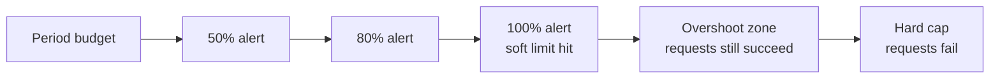

# Progressive Spend Threshold Alerting for Agent Cost Governance

> Pair a soft spend cap with progressive alerts at fixed budget percentages — typically 50%, 80%, 100% — so the budget signals approaching exhaustion ahead of the hard cutoff, giving operators time to rebalance, raise the cap, or throttle low-priority agents before user-visible failure.

## The Signal That Cost Gives You

Cost accumulates monotonically inside a billing window. Unlike error rate or latency — which reset across operations — spend is a one-way ratchet: once consumed, only the period boundary returns capacity. That makes percent-of-budget a forecasting signal in its own right, separate from the failure-rate signal driving [tool-level circuit breakers](agent-circuit-breaker.md) or the loop-progress signals in [Circuit Breakers for Agent Loops](../observability/circuit-breakers.md).

A hard cap alone collapses that forecast — users learn the budget was exhausted only when requests start failing. Progressive thresholds reframe the budget as a *graduated* circuit-breaker: at each notification, runway shortens and the operator response narrows.

| Threshold | Remaining runway | Operator response window |
|-----------|------------------|--------------------------|
| 50% | Half the period | Investigate, rebalance, plan |
| 80% | Tail of the period | Throttle low-priority agents, raise cap |
| 100% (soft) | Overshoot only | Extend cap or stop work |
| Hard cutoff | None | Requests fail |

## Soft Cap + Overshoot Zone

The pattern depends on a **soft** cap. Cursor's 2026-05-04 enterprise release introduced this as `Soft Spend Limits` paired with automatic alerts at 50%, 80%, and 100% of the configured limit ([Cursor changelog](https://cursor.com/changelog)). The release frames the goal: "keeps users productive while giving admins and users visibility into consumption patterns."

A soft cap creates an overshoot zone past 100% where requests still succeed and the operator can intervene. The same alerts on a hard cap reduce to pre-failure pings — useful, but the intervention window only exists when there is overshoot to absorb.

## Distinct From Other Circuit-Breaker Patterns

Three circuit-breaker patterns share vocabulary but operate on different signals:

| Pattern | Signal | Operates on |
|---------|--------|-------------|
| [Agent Circuit Breaker](agent-circuit-breaker.md) | Per-tool failure rate | Single tool endpoint |
| [Circuit Breakers for Agent Loops](../observability/circuit-breakers.md) | Iterations, repetition, errors, cost | One agent loop |
| Progressive spend threshold alerting | Cumulative spend % vs period budget | Org / team / user budget |

The loop-level page lists "cost threshold exceeded" as one of five stopping signals but treats it as a single binary cutoff. This pattern decomposes that signal into a sequence of forecasts at the governance tier, not inside one agent's loop.

## Implementation Hooks

Three axes determine whether the pattern produces useful intervention:

- **Period window.** Daily, weekly, or monthly. Spiky workloads need longer windows; metered consumer products lean shorter to bound exposure.
- **Tier.** Per-org, per-team, or per-user. Cursor exposes admin-set limits at the user level ([Cursor changelog](https://cursor.com/changelog)); cloud platforms expose them at account, project, or tag level. The right tier matches the team with authority to act.
- **Audience.** Each threshold can route differently: 50% to a finance Slack channel, 80% to an engineering manager, 100% to an on-call paging webhook. Cursor's release does not document per-threshold routing; cloud-cost vendors typically allow it.

## When This Backfires

The pattern is governance-tier infrastructure. It earns its complexity at multi-user scale and underperforms at the small end:

- **Solo developer or single API key.** With no audience to route alerts to, the "graceful intervention window" reduces to a self-notification. A single hard cap is simpler and produces the same outcome.
- **Spiky workloads on a tight window.** A team running batch jobs may legitimately cross 50% and 80% on day one of the period and 100% on day two, then sit idle. Each threshold fires every period; trust in the alerts erodes. Widen the window or stop alerting on repeating crossings.
- **Recipient has no action authority.** If the recipient cannot raise the cap, throttle agents, or shift work, alerts produce visibility without governance. The 100% cutoff still lands as a surprise because no upstream control was exercised.
- **Hard limit with no overshoot zone.** Applying 50/80/100 alerts to a hard cap collapses the pattern back to pre-failure pings. The graceful-intervention argument requires headroom past 100% to absorb in-flight work.
- **Semantic vs cost failures.** Like the [tool-level circuit breaker](agent-circuit-breaker.md), this pattern only sees what its meter sees. Spend metering does not catch agents whose requests succeed but produce useless output. Pair with output evaluation, not in place of it.

## Example

Cursor's 2026-05-04 release announces the pattern operationally:

> "Cursor can also monitor usage and sends automatic alerts to users reaching 50%, 80%, and 100% of their soft or hard limits."
>
> — [Cursor changelog: Spend Management Updates](https://cursor.com/changelog)

The release pairs three primitives the pattern depends on: a configurable soft limit ("soft limits instead of hard limits to avoid blocking users"), automatic alerts at fixed percentages of that limit, and per-user usage analytics broken down by product surface so operators can decide *which* agent class to throttle when an alert fires.

The 50/80/100 split is the Cursor implementation; the pattern itself is "progressive thresholds against a soft cap with a defined overshoot zone." Cloud-cost platforms typically expose the same primitive at account scope, with operator-chosen threshold percentages — the implementation is closest in shape to a budget alert ladder, not to a hard quota.

## Key Takeaways

- Cost accumulates monotonically inside a billing window — percent-of-budget is a forecasting signal, not just a failure signal.
- The pattern is a graduated cost circuit-breaker: progressive alerts before the cutoff, not at it.
- A soft cap with overshoot is load-bearing; the same alerts on a hard cap reduce to pre-failure pings.
- Threshold percentages (Cursor uses 50/80/100) are the implementation; the pattern is *progressive thresholds against a soft cap*.
- Useful at multi-user scale where alerts have a defined audience with action authority. At solo scale, a single hard cap is simpler.
- Pair with output evaluation — spend metering does not catch agents whose requests succeed but produce useless work.

## Related

- [Cost-Aware Agent Design: Route by Complexity, Not Habit](cost-aware-agent-design.md) — the routing layer that determines spend rate; progressive alerts are the governance layer above it
- [Agent Circuit Breaker](agent-circuit-breaker.md) — per-tool failure-rate state machine; complementary, operates on a different signal
- [Circuit Breakers for Agent Loops](../observability/circuit-breakers.md) — loop-level stops including a single cost threshold; this pattern decomposes that signal
- [Reasoning Budget Allocation: The Reasoning Sandwich](reasoning-budget-allocation.md) — controls per-turn cost; progressive alerts catch what the per-turn allocation lets through over a period
- [Copilot vs Claude Billing Semantics](../human/copilot-vs-claude-billing-semantics.md) — defines the unit (premium request vs token) over which the budget window is measured
