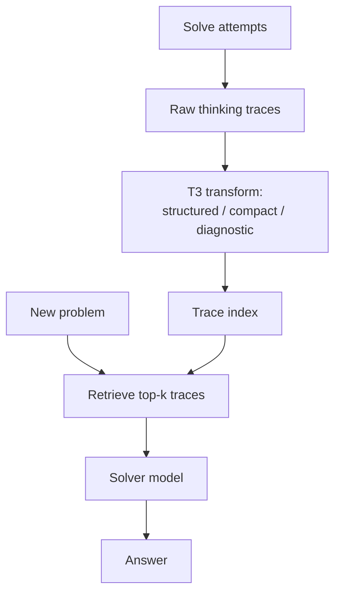

# RAG over Thinking Traces

> RAG over thinking traces indexes prior reasoning trajectories instead of documents; on reasoning tasks, the same retrieve-then-generate pipeline beats both no-RAG and document-RAG.

## The Corpus Is the Lever

Document RAG is widely treated as ineffective for reasoning-intensive tasks: a textbook chunk does not close the gap between problem and solution. The limitation is the corpus, not retrieval. When the index holds **thinking traces** (intermediate trajectories from a model attempting similar problems), retrieve-then-generate consistently lifts reasoning performance — beating both no-RAG and retrieval over standard web corpora ([Arabzadeh et al., 2026](https://arxiv.org/abs/2605.03344)).

On AIME 2025–2026, traces produced by Gemini-2-thinking delivered relative gains of +56.3% for Gemini-2.5-Flash, +8.6% for GPT-OSS-120B, and +7.6% for GPT-5, with inference cost flat or down up to 15%. The pattern held on LiveCodeBench (code) and GPQA-Diamond (science).

The mechanism is distribution match. Document chunks describe procedural knowledge; reasoning trajectories enact it. Retrieved exemplars in the desired output modality narrow the gap the model must bridge — the same reason few-shot exemplars beat instruction-only prompting. Two independent lines confirm it: [Buffer of Thoughts](https://arxiv.org/abs/2406.04271) retrieves distilled "thought-templates", and [Procedural Knowledge at Scale](https://arxiv.org/html/2604.01348) finds that injecting procedural traces into the thinking stream improves math and coding reasoning.

## What Goes in the Index

A thinking-trace corpus is built offline from prior solve attempts. Three properties separate a usable one from a misleading one:

- **Provenance** — each trace records source model, prompt, and problem class so retrieval prefers comparable solvers.
- **Outcome label** — successful traces serve as direct exemplars; failed ones drive negative-example pruning.
- **Structure** — the T3 transform converts long, noisy traces into compact, retrieval-friendly representations, lifting retrieval precision and reducing inference cost ([Arabzadeh et al., 2026](https://arxiv.org/abs/2605.03344)).


```mermaid
graph TD
    A[Solve attempts] --> B[Raw thinking traces]
    B --> C[T3 transform:<br>structured / compact / diagnostic]
    C --> D[Trace index]
    E[New problem] --> F[Retrieve top-k traces]
    D --> F
    F --> G[Solver model]
    G --> H[Answer]
```

This is distinct from agent memory. [Episodic memory retrieval](episodic-memory-retrieval.md) stores one agent's own problem-solving arcs for cross-session recall; trace-RAG indexes a separate, larger corpus of trajectories — often from many runs or a stronger model — that the solver consults at inference time. Both hold that the unit of storage matters; they differ on scope and source.

## When the Substitution Pays Off

The benchmark gains are real but conditional.

**Pays off when:**

- The target tasks are reasoning-shaped — math, competitive programming, scientific QA, multi-step debugging — where chain-of-thought is the operative output.
- A trace corpus already exists or can be harvested cheaply — for example, traces produced by a stronger reasoning model on a representative training distribution, then run through a T3-style transform.
- The team can afford the offline pipeline: trace generation, structuring, embedding, periodic refresh.

**Does not pay off when:**

- The target distribution differs sharply from the corpus distribution — a coding agent on a proprietary codebase or internal DSL receives plausible but wrong-domain traces, biasing the solver.
- Traces lack provenance and outcome labels. A corpus that mixes successful and failed runs without distinguishing them propagates failure patterns; this is the trace-side of the [reasoning misalignment](https://arxiv.org/abs/2407.12216) failure mode that already plagues document-RAG.
- The bottleneck is elsewhere. If the agent is failing on tool reliability, prompt drift, or eval gaps, swapping the corpus does not address the cause. [Retrieval is Not Enough](https://arxiv.org/html/2504.14858) argues that even reasoning-shaped retrieval needs test-time critique to be reliable.
- [Benchmark contamination](../verification/benchmark-contamination-eval-risk.md) risk is high. If the corpus contains traces for the exact items the system will be evaluated on, gains reflect leakage rather than transfer; provenance metadata and held-out splits are non-negotiable for honest measurement.

The headline +56% attaches to one configuration — math benchmark, traces from a stronger model, clean held-out split. Agents closer to engineering work than to AIME should expect smaller gains.

## Operating the Corpus

Treat the trace index as a maintained artifact, not a one-time build.

| Concern | What to do |
|---------|------------|
| Freshness | Re-harvest when the target distribution shifts (new product area, framework upgrade, model rotation). Stale traces silently bias toward retired patterns. |
| Quality filter | Score traces by terminal outcome and intermediate consistency. Drop failed-without-recovery traces from the success shard; keep them in a labelled negative shard. |
| Structuring | T3 does real work — compact representations fit more exemplars in the context budget and improve retrieval precision over raw transcripts. |
| Evaluation | Hold out a slice of the target distribution that contributed no traces. Report gains against both no-RAG and document-RAG baselines. |
| Cost accounting | Track end-to-end cost including offline harvest and refresh — the paper's inference savings exclude build cost. |

## Example

A small team running an internal math-tutor agent has access to a frontier reasoning model for batch use but not for online inference (cost). They want the cheap online model to perform closer to the frontier on AIME-style problems.

**Before** — document-RAG over a math textbook corpus:

```text
Index: ~10k textbook paragraphs, embedded
Retrieval: top-3 paragraphs by query embedding
Solver: small online model, given paragraphs as context
Result on AIME held-out: roughly the same as no-RAG; paragraphs describe
techniques but the solver still has to instantiate them from scratch.
```

**After** — trace-RAG over T3-structured trajectories:

```text
Index: ~10k thinking traces from the frontier model on a separate AIME-shaped
       training set, T3-transformed into compact diagnostic representations,
       provenance-labelled, success-only shard
Retrieval: top-3 traces by problem-similarity
Solver: same small online model, given retrieved traces as context
Result on the held-out split: substantial relative lift; the retrieved trace
acts as a worked exemplar in the same output modality, narrowing the gap
the small model has to bridge.
```

The lift is not free — the team pays for periodic batch generation and the T3 transform — but online inference cost stays flat or drops, and the corpus refreshes on a slower cadence than user traffic.

## Key Takeaways

- For reasoning-intensive tasks, the high-leverage change is what you index, not how you retrieve. Documents under-deliver; thinking traces over-deliver.
- Trace corpora need provenance, outcome labels, and structuring (T3-style) to be safer than raw transcripts.
- Headline gains attach to math/code/science benchmarks with held-out splits. Production agents on novel distributions should expect smaller lifts and invest in the corpus, not just the pipeline.
- The pattern is orthogonal to per-agent [episodic memory](episodic-memory-retrieval.md) — same intuition (units of storage matter), different scope (cross-run reasoning corpus vs single-agent history).

## Related

- [Episodic Memory Retrieval](episodic-memory-retrieval.md)
- [Memory Synthesis from Execution Logs](memory-synthesis-execution-logs.md)
- [Subtask-Level Memory for Software Engineering Agents](subtask-level-memory.md)
- [Dual-Trace Memory Encoding](dual-trace-memory-encoding.md)
- [Abstention-Aware Memory Retrieval](abstention-aware-memory-retrieval.md)
