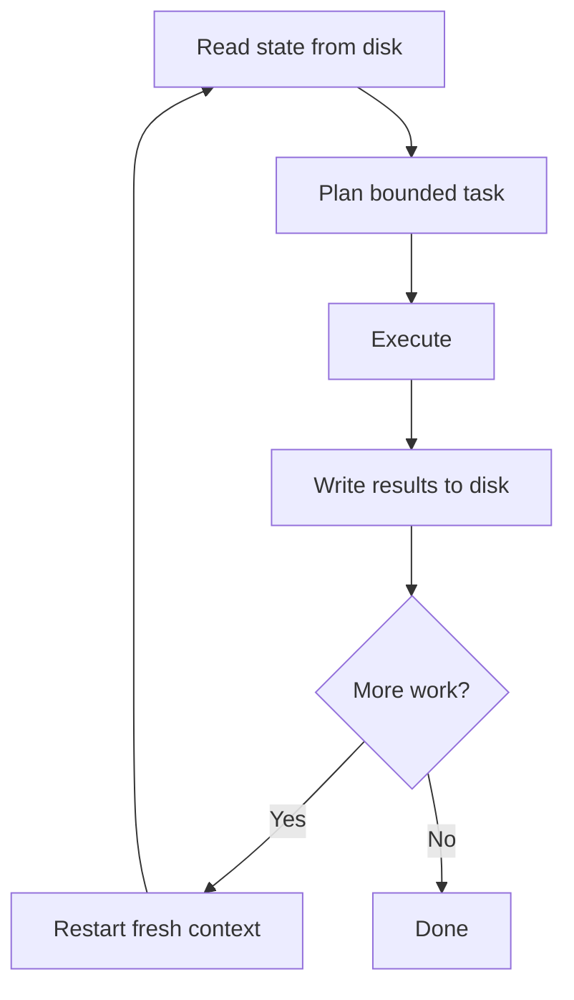

# The Ralph Wiggum Loop: Fresh-Context Iteration Pattern

> Iterate in bounded units with fresh context each cycle, persisting state to disk between iterations, so context never accumulates to the point of degradation.

## The Pattern

Long agent sessions degrade as context fills. Early instructions get pushed out. The agent starts ignoring conventions it followed hours ago. Accumulated context is not a feature — it's a liability.

The Ralph Wiggum Loop addresses this by design: each iteration starts with a clean context window, reads persistent state from disk, completes a bounded unit of work, and writes results back before restarting. State lives in files, not in conversation history.

Named and popularized by Geoff Huntley [unverified], the pattern is now widely used for unattended and long-running agent workflows [unverified].

## Cycle Structure



**Read**: The agent reads specs, AGENTS.md, task lists, progress markers, and any other persistent state from the file system at session start.

**Plan**: The agent identifies one bounded unit of work from the state. "Bounded" means completable within a single session without context pressure.

**Execute**: The agent completes the task using its tools.

**Write**: The agent writes results — output files, updated task lists, progress markers — back to disk before the session ends.

**Restart**: The next iteration opens a fresh context and reads the updated state.

## What Counts as Persistent State

Any information the agent needs across iterations should live in files:

- Task lists and progress markers (which items are done, which are next)
- Specs and requirements
- AGENTS.md — conventions the agent reads at session start
- Partial outputs when a deliverable spans multiple iterations

## Natural Recovery

If an iteration fails, the disk state reflects the last successful write. The next iteration reads that state and continues from there, without inheriting the failed session's context or misconceptions. Recovery is automatic.

## Unattended Operation

The pattern enables unattended loops: a script restarts the agent after each iteration, checks CI or test results, and feeds the outcome back into disk state for the next cycle. The human reviews results periodically rather than supervising continuously.

This pairs well with worktree isolation — each iteration runs in a sandboxed environment, and failures don't contaminate the working directory.

## Anti-Pattern: Infinite Session

Running one continuous session across many tasks means:

- Context fills over time, degrading instruction adherence
- Early session state colors later decisions
- A failure midway requires recovering from an unknown state
- No natural verification point between tasks

## Example

A bash wrapper script implements the loop externally, restarting the agent after each iteration:

```bash
#!/usr/bin/env bash
# loop-runner.sh - restarts the agent each cycle until the task list is empty

TASK_FILE="tasks.md"
MAX_CYCLES=20
CYCLE=0

while [[ $CYCLE -lt $MAX_CYCLES ]]; do
  remaining=$(grep -c "^- \[ \]" "$TASK_FILE" 2>/dev/null || echo 0)
  if [ "$remaining" -eq 0 ]; then
    echo "All tasks complete."
    exit 0
  fi

  echo "=== Cycle $((CYCLE + 1)) ==="
  claude --no-cache --prompt "Read $TASK_FILE. Complete the next unchecked task. Mark it done. Write all output files. Stop."

  CYCLE=$((CYCLE + 1))
done

echo "Max cycles reached." && exit 1
```

The agent prompt instructs it to read state, complete one bounded task, and write results. The `--no-cache` flag ensures a genuinely fresh context each cycle. The script exits when the task list is empty.

## Key Takeaways

- Fresh context each iteration prevents the ["dumb zone"](../context-engineering/context-window-dumb-zone.md) that accumulates in long sessions.
- Persistent state belongs on disk, not in conversation history.
- Bounded tasks per iteration ensure each cycle is verifiable and recoverable.
- Failed iterations leave disk state at the last successful write — the next cycle continues cleanly.

## Related

- [AGENTS.md: A README for AI Coding Agents](../standards/agents-md.md) — project instruction file that agents read at session start for conventions and context
- [Worktree Isolation](../workflows/worktree-isolation.md)
- [Agent Handoff Protocols](../multi-agent/agent-handoff-protocols.md)
- [The Delegation Decision](delegation-decision.md)
- [Agent Backpressure](agent-backpressure.md)
- [Loop Strategy Spectrum](loop-strategy-spectrum.md)
- [Session Initialization Ritual](session-initialization-ritual.md)
- [Agent Self-Review Loop](agent-self-review-loop.md)
- [Convergence Detection](convergence-detection.md)
- [Steering Running Agents](steering-running-agents.md)
- [Model a Single Agent Turn as Many Inference and Tool-Call Iterations](agent-turn-model.md)
- [Evaluator-Optimizer Pattern](evaluator-optimizer.md)
- [Agent Memory Patterns](agent-memory-patterns.md)
- [Agent Harness](agent-harness.md)
- [Agent Loop Middleware](agent-loop-middleware.md)
- [Harness Engineering for Building Reliable AI Agents](harness-engineering.md)
- [Idempotent Agent Operations](idempotent-agent-operations.md) — design operations for safe retry across iterations
- [Rollback-First Design](rollback-first-design.md) — plan recovery before execution, complementing fresh-context recovery
- [Exception Handling and Recovery Patterns](exception-handling-recovery-patterns.md) — progressive failure response strategies that complement fresh-context recovery
- [Goal Monitoring and Progress Tracking](goal-monitoring-progress-tracking.md) — tracking progress across the multi-session iterations this pattern creates
