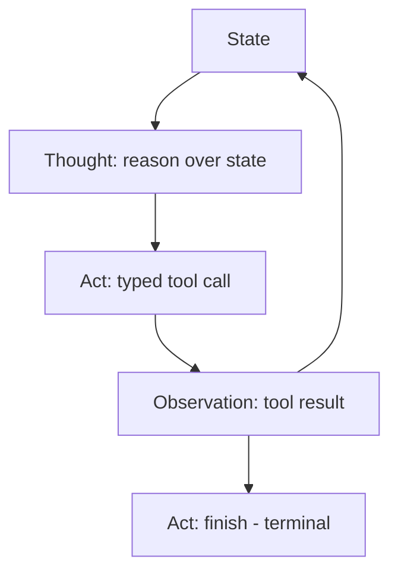

# ReAct (Reason + Act): Interleaved Reasoning-Action Loops

> ReAct interleaves thought, tool call, and observation each step — re-conditioning the next thought on real evidence, not the model's prior generation.

## When ReAct Pays Back

Reach for ReAct when the next action genuinely depends on what the previous tool call returned, and a fresh inference step costs less than an unverified next reasoning step. Skip it when the action sequence is predictable enough to plan upfront — see [When This Backfires](#when-this-backfires). The pattern is canonically associated with Yao et al., 2022 ([arXiv:2210.03629](https://arxiv.org/abs/2210.03629)).

## The Loop

Each step emits three slots in sequence, then re-enters the model with the result appended:

- **Thought** — free-form reasoning over the current state. No external effect.
- **Act** — a typed tool call from the available action space (search, lookup, click, write, finish).
- **Observation** — the tool's return value, appended verbatim to the context.

The loop terminates when the model emits a terminal `Act: finish[answer]` instead of a new tool call ([arXiv:2210.03629 §2](https://arxiv.org/abs/2210.03629)). The same three-slot trajectory underlies every "agent loop" in modern coding tools — Codex, Claude Code, and Cursor each unroll a model-driven inference-tool-call sequence per user turn ([Agent Turn Model](agent-turn-model.md)).

## ReAct vs Plan-Then-Execute vs Pure Chain-of-Thought

All three families ship today; the choice between them is structural, not a preference.

| Pattern | Decides next action by | Recomputes plan after each observation | When it wins |
|---|---|---|---|
| **Pure Chain-of-Thought** | Internal reasoning only, no tool grounding | N/A — no tool calls | Closed-book tasks where the answer is in the model's weights |
| **ReAct** | Reasoning that re-conditions on each new observation | Yes — every step | Sparse-feedback, novel-decision tool-grounded tasks where the next move depends on the last observation |
| **Plan-then-execute** | A single upfront plan, then deterministic execution | No — plan is fixed | Predictable action sequences where the action shape is known before any observation arrives |

ReAct is the textbook example of a [CoALA Decision-Making Loop](coala-decision-making-loop.md) instantiation that **skips the explicit evaluate and select sub-stages** — one reasoning step produces one grounding action with no candidate scoring ([CoALA §4.3, arXiv:2309.02427](https://arxiv.org/html/2309.02427v3)). Plan-then-execute does the opposite: it makes propose/evaluate/select explicit upfront, then strips them from the runtime loop.

## Why It Works

The act-observe boundary forces each next thought to condition on a *real* observation rather than the model's own *generated* prior thought. Chain-of-Thought compounds errors across steps because every step conditions on the previous generation; ReAct breaks the chain by re-grounding on tool output. On HotpotQA, the original paper reports ReAct's hallucination rate at **6% vs 56% for Chain-of-Thought** with the same backbone model ([Yao et al., 2022, arXiv:2210.03629](https://arxiv.org/abs/2210.03629)). On ALFWorld and WebShop, one- or two-shot ReAct gives **+34% and +10% absolute success** over imitation- and RL-trained baselines on the same tasks ([Yao et al., 2022](https://arxiv.org/abs/2210.03629)).

The mechanism only pays back when the observation actually disambiguates the next thought. When every observation is predictable from prior state, the extra inference step costs without buying signal.

## When This Backfires

ReAct's per-step recomputation costs inference that bounded-call alternatives skip. Skip the loop under any of:

- **Predictable, structured workflows.** Profile-Then-Reason bounds language-model calls to 2-3 per task and **beats ReAct on 16 of 24 configurations across 6 benchmarks and 4 models**; the authors note ReAct only retains advantage when "substantial online adaptation" is required ([PTR, arXiv:2604.04131](https://arxiv.org/abs/2604.04131)). For deterministic refactor pipelines and fixed-shape tool routers, an upfront plan is cheaper and equally reliable.
- **LLM-generated tool names without a typed registry.** In a 200-task ReAct benchmark, **466 of 513 retries — 90.8% — targeted hallucinated tool names** that cannot succeed by definition; 19 of 21 failures shared the same root cause ([Towards Data Science benchmark](https://towardsdatascience.com/your-react-agent-is-wasting-90-of-its-retries-heres-how-to-stop-it/)). Deterministic tool routing — output a step type, not a tool name — fixes it by exiting the ReAct loop.
- **Tight latency or cost budgets.** Cost and latency grow linearly with trajectory length because reasoning is "repeatedly recomputed after each observation" ([PTR §1, arXiv:2604.04131](https://arxiv.org/abs/2604.04131)). For bulk fan-out the per-action inference overhead exceeds the per-action reliability gain.
- **Complex multi-step planning with explicit state.** Model-First Reasoning argues "many LLM planning failures stem from representational deficiencies rather than reasoning limitations" — explicit problem modeling reduces constraint violations vs ReAct across medical scheduling, route planning, resource allocation, and logic puzzles ([arXiv:2512.14474](https://arxiv.org/abs/2512.14474)).
- **External verification already gates the act.** When a PreToolUse hook, type-checker, test suite, or sandbox sits between the agent and any irreversible action, the implicit evaluate hidden inside each ReAct thought is redundant with the external check ([CoALA Decision-Making Loop](coala-decision-making-loop.md)).

Anthropic's broader guidance applies: add agentic loops "only when simpler solutions fall short" ([Building Effective Agents](https://www.anthropic.com/engineering/building-effective-agents)).

## Failure Modes Inside the Loop

When ReAct is the right shape, two failure modes still recur:

- **Reasoning-trace drift.** Long thought tokens can wander from the original task; later thoughts condition on earlier *generated* tokens rather than observations. The original paper traces several ALFWorld failures to thought drift compounding across steps ([Yao et al., 2022](https://arxiv.org/abs/2210.03629)).
- **Observation overload.** Tool results that dump large payloads (full search-result pages, untrimmed file contents) flood the context and crowd out signal — the act-observe boundary stops working when observations are 90% noise ([Context Engineering](../context-engineering/context-engineering.md)).

## Key Takeaways

- ReAct interleaves thought → act → observation; each step re-conditions on real evidence instead of the model's prior generation ([arXiv:2210.03629](https://arxiv.org/abs/2210.03629)).
- The mechanism is environmental grounding: HotpotQA hallucination drops from 56% (CoT) to 6% (ReAct) on the same backbone model ([Yao et al., 2022](https://arxiv.org/abs/2210.03629)).
- ReAct is one CoALA instantiation that **skips evaluate and select**; plan-then-execute and Tree of Thoughts make those sub-stages explicit ([CoALA §4.3](https://arxiv.org/html/2309.02427v3)).
- Bounded-call alternatives (PTR's 2-3 LM calls) beat ReAct on 16 of 24 configurations across 6 benchmarks when the task is predictable enough to plan upfront ([arXiv:2604.04131](https://arxiv.org/abs/2604.04131)).
- Hallucinated tool names consumed 90.8% of retries in one production benchmark — deterministic tool routing prevents the failure ([Towards Data Science](https://towardsdatascience.com/your-react-agent-is-wasting-90-of-its-retries-heres-how-to-stop-it/)).

## Related

- [CoALA Decision-Making Loop as an Orchestration Lens](coala-decision-making-loop.md) — Locates ReAct on the propose/evaluate/select/act taxonomy; ReAct skips the middle two sub-stages
- [Cognitive Reasoning vs Execution: A Two-Layer Agent](cognitive-reasoning-execution-separation.md) — The architectural split underlying typed tool interfaces that make ReAct's act-observe boundary enforceable
- [Model a Single Agent Turn as Many Inference and Tool-Call Iterations](agent-turn-model.md) — Generalises the inference-tool-call loop that every modern coding agent unrolls per user turn
- [Anthropic's Effective Agents Framework: A Pattern Map](anthropic-effective-agents-framework.md) — Workflows-vs-agents distinction; the "start simple" gate for adopting any agentic loop
- [Eval Strategy by Agent Generation: A Structure-to-Eval Locator](eval-strategy-by-agent-generation.md) — The ReAct loop is generation 3 in the structure-to-eval taxonomy; eval surface needed is trace-level
