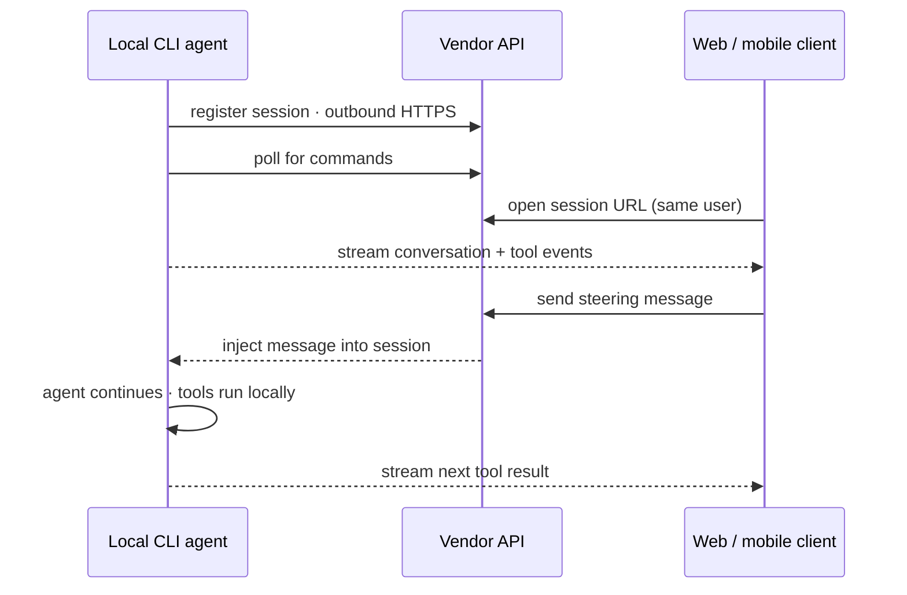

# Remote Session Control for Local CLI Agents

> A locally-running CLI agent session exposes a bidirectional bridge to a web or mobile client so the developer can monitor, send steering messages, switch modes, and approve prompts from another device — while the agent keeps running on the original workstation.

Two tools shipped this capability within 48 hours in April 2026: Copilot CLI's [`copilot --remote`](https://github.blog/changelog/2026-04-13-remote-control-cli-sessions-on-web-and-mobile-in-public-preview/) (public preview, 2026-04-13) and Claude Code v2.1.110's [push notification tool](https://code.claude.com/docs/en/changelog) (2026-04-15) layered on [`claude remote-control`](https://code.claude.com/docs/en/remote-control). The convergence names a distinct pattern: the developer is no longer pinned to the workstation where the agent runs.

## What the pattern is not

| Pattern | Agent runs | Control surface |
|---------|-----------|-----------------|
| **Cloud agent dispatch** ([Mission Control](../tools/copilot/agent-mission-control.md), Agent HQ, Claude Code on the web) | Vendor cloud | Dashboard-native |
| **Permission relay** ([channels](../tools/claude/channels-permission-relay.md)) | Local workstation | Approve/deny tool calls only |
| **Remote session control** (this pattern) | Local workstation | Messages, modes, plans, prompts, permissions |

It inverts the SSH model: the workstation polls outbound HTTPS instead of accepting inbound connections, so any authenticated client can attach.

## The control surface

Copilot CLI exposes this set from web and GitHub Mobile ([docs](https://docs.github.com/en/copilot/concepts/agents/copilot-cli/about-remote-access#what-you-can-do-remotely)):

- Respond to tool, file path, and URL permission requests
- Answer `ask_user` questions
- Approve or reject plans before implementation starts
- Submit new prompts mid-session
- Switch between plan, interactive, and autopilot modes
- Cancel the agent's current operation

Claude Code Remote Control exposes a matching set from `claude.ai/code` and the mobile app, plus local filesystem `@`-autocomplete and local MCP servers ([docs](https://code.claude.com/docs/en/remote-control)). Interactive-picker slash commands — `/mcp`, `/plugin`, `/resume` on Claude Code; `/allow-all` on Copilot — stay local-only.

Terminal and remote surface run simultaneously. Copilot: "Copilot CLI uses the first response it receives to any prompt or permission request" — whichever reply lands first wins.

## Architecture



The workstation never opens an inbound port. All traffic is outbound HTTPS over TLS, authenticated with short-lived per-session credentials. Shell, filesystem, and tool execution stay local.

## Pairing and gating

Both tools print a session URL and QR code. Copilot CLI uses `copilot --remote` or `/remote` in-session, `Ctrl+E` toggles the QR, and the working directory must be a GitHub repo ([docs](https://docs.github.com/copilot/how-tos/copilot-cli/steer-remotely)). Claude Code uses `claude remote-control` (server mode, spacebar toggles QR) or `/remote-control` in-session ([docs](https://code.claude.com/docs/en/remote-control#start-a-remote-control-session)). Visibility is single-user in both tools.

Remote access is **off by default on paid plans**. Copilot: the "Remote Control" policy must be enabled at org or enterprise level ([docs](https://docs.github.com/en/copilot/concepts/agents/copilot-cli/about-remote-access#administering-remote-access)). Claude Code: an admin flips the Remote Control toggle at `claude.ai/admin-settings/claude-code`; data-retention or compliance configurations can grey it out. Claude Code also requires `claude.ai` OAuth — API keys, `setup-token`, Bedrock, Vertex, and Foundry are rejected.

## When remote control helps

- **Long-running jobs.** Overnight refactors, slow test loops, or autopilot runs where intervention is rare.
- **Leaving the desk mid-task.** Picking up a session from a second device without restarting — [mid-run steering preserves accumulated tool-call history](steering-running-agents.md), which a restart discards.
- **Mode handoff.** Plan mode at the terminal, plan approval on mobile, autopilot during a meeting.

## When this backfires

- **Inner-loop work.** Terminal keystrokes beat a mobile round-trip through the vendor API. For tight edit-test-steer loops, the remote surface adds latency without leverage.
- **Wider credential surface.** The remote client can submit arbitrary prompts, switch to autopilot, and approve tool calls on the same filesystem the local agent reaches. A stolen, shared, or unlocked phone becomes an attack path the locked workstation would not expose — the [permission-relay concerns](../tools/claude/channels-permission-relay.md#when-this-backfires) apply with more force because the surface is broader.
- **Session-output ceilings.** Copilot specifies a "60 MB limit on size of session output that is passed to the remote interface", degrading the UI on very long runs ([docs](https://docs.github.com/en/copilot/concepts/agents/copilot-cli/about-remote-access#monitoring-a-long-running-task)).
- **Intermittent connectivity.** Claude Code exits the session after roughly 10 minutes of network outage ([docs](https://code.claude.com/docs/en/remote-control#limitations)) — unreliable at the moments the pattern promises to help.
- **Headless and CI.** Copilot CLI excludes `--prompt` non-interactive runs; Claude Code targets interactive steering. For unattended flows, use cloud agents or [channels permission relay](../tools/claude/channels-permission-relay.md).
- **Cloud agent is the better fit.** If work does not need local filesystem or local MCP servers, a [cloud agent](../tools/copilot/coding-agent.md) runs in infrastructure that does not sleep and scales to parallel tasks.

## Keep-alive

The pattern trades workstation availability for steering flexibility. Copilot ships `/keep-alive on|off|busy|<N>m|<N>h|<N>d` ([docs](https://docs.github.com/copilot/how-tos/copilot-cli/steer-remotely#preventing-your-machine-from-going-to-sleep)). Claude Code reconnects after sleep and drops but times out after ~10 minutes offline. The developer owns workstation power and network — a cost cloud agents sidestep.

## Example

An overnight migration started at the desk:

```bash
# Copilot CLI: remote access on, keep the laptop awake
copilot --remote
/keep-alive on
```

```
Migrate all service handlers in services/ to the new middleware stack.
Run tests after each service. Start in plan mode — I'll approve the plan
before you begin.
```

Copilot prints a session URL and QR code. The developer closes the lid, takes the train home, opens GitHub Mobile, finds the session under **Agent sessions**, and reviews the plan. Two services need a different migration path — they comment the correction in the mobile plan view and approve. Copilot switches to autopilot on approval, runs the migration, and pauses on a permission request for a schema-changing shell command. The phone buzzes; the developer approves. Tool calls, file writes, and test runs all execute locally on the workstation. By morning the session is still attached in the terminal with the full overnight transcript.

The same flow works with Claude Code: `claude remote-control`, open `claude.ai/code` on the phone, send steering messages from either surface — whichever reply arrives first applies.

## Key Takeaways

- Remote session control streams a locally-running CLI agent to a web or mobile client over outbound HTTPS — the agent, tools, and filesystem stay local
- Distinct from cloud-agent dispatch (agent runs in cloud) and permission relay (approves individual calls only) — the remote surface here covers messages, modes, plans, and prompts
- Single-user session visibility, URL+QR pairing, off by default on paid plans until an admin enables it
- Credential surface widens to any authenticated device — treat the remote client as equivalent to terminal access
- Session-output ceilings, network-outage timeouts, and workstation keep-alive are the practical failure modes; for inner-loop work or fully unattended runs, pick a different pattern

## Related

- [Steering Running Agents](steering-running-agents.md) — the underlying mid-run redirection mechanism the remote surface exposes
- [Channels Permission Relay](../tools/claude/channels-permission-relay.md) — narrower approve-only path over chat apps
- [Agent Mission Control](../tools/copilot/agent-mission-control.md) — dashboard for cloud-hosted agents, not local sessions
- [Copilot CLI Agentic Workflows](../tools/copilot/copilot-cli-agentic-workflows.md) — interactive, programmatic, and plan modes the remote surface steers
- [Deferred Permission Pattern](deferred-permission-pattern.md) — complementary approach for headless sessions
- [Cloud Agent: Research, Plan, Code](../tools/copilot/cloud-agent-research-plan-code.md) — alternative when local execution context is not required
