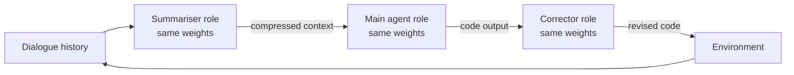

# Role Orchestration on a Single Model

> Invoke the same frozen small model in three distinct roles — summariser, agent, corrector — to roughly double task-goal completion on constrained hardware without additional training.

## When This Applies

The technique targets a specific deployment constraint: an 8B-class model running on a single 24 GB GPU, where a larger model does not fit and additional training is not an option ([McClendon et al., 2026](https://arxiv.org/abs/2604.11465)). On unconstrained hardware, running a larger model once — or routing to heterogeneous models per role — is typically a stronger baseline. The result is a competitiveness claim for constrained deployments, not a general recommendation to stack roles on one model.

## The Three Roles

The same frozen weights are invoked three times with different conditioning, each role presenting a different action space ([McClendon et al., 2026](https://arxiv.org/abs/2604.11465)):

| Role | Input | Output | Purpose |
|------|-------|--------|---------|
| **Summariser** | Full dialogue history | Compressed summary preserving tokens, credentials, API responses | Keep critical artifacts across long trajectories |
| **Main agent** | Compressed context + task | Tool calls and reasoning | Drive the primary task loop |
| **Corrector** | Agent's code output only (no conversation) | Revised code | Break repetitive failure loops |

The corrector receives code without conversation history. This isolation is the mechanism that breaks loops: without seeing the main agent's prior failed attempts, the corrector is not primed to repeat them.

## Reported Results

On AppWorld ([Trivedi et al., 2024](https://arxiv.org/abs/2407.18901)) with Qwen3-8B on a 24 GB GPU ([McClendon et al., 2026](https://arxiv.org/abs/2604.11465)):

| Configuration | Baseline | Scaffolded |
|---|---|---|
| FP16 (12K context) | 5.4% | 8.9% |
| AWQ 4-bit (32K context) | 3.0% | 5.9% |
| Difficulty-1 tasks (FP16) | 15.8% | 26.3% |

The scaffolded 8B surpassed DeepSeek-Coder 33B Instruct (7.1% on FP16) from the original AppWorld evaluation ([McClendon et al., 2026](https://arxiv.org/abs/2604.11465)). Absolute completion remains far below GPT-4o's ~49% on AppWorld normal tasks ([Trivedi et al., 2024](https://arxiv.org/abs/2407.18901)) — the result is a small-model competitiveness gain, not a production threshold.

## Why It Works

Each role presents a different action space to the same weights — different instructions, inputs, and output formats. The paper frames this as "a scaffolded policy over a frozen base model, three invocations of the same weights with different conditioning," drawing explicit connections to test-time compute scaling and action-space shaping in reinforcement learning ([McClendon et al., 2026](https://arxiv.org/abs/2604.11465)).

Diversity here comes from conditioning, not from heterogeneous weights. That distinguishes the technique from ensemble approaches and from dual-model [critic agents](critic-agent-plan-review.md) that use a different model to avoid the [self-correction blind spot](https://arxiv.org/abs/2507.02778) measured at 64.5% across 14 LLMs.

## Limits and Counter-Evidence

**Same-weight review inherits shared failure modes.** The corrector's isolation from conversation history mitigates loop repetition but does not eliminate the self-correction blind spot — the same weights still share representational biases ([arXiv:2507.02778](https://arxiv.org/abs/2507.02778)).

**Role boundaries are prompt-level, not architectural.** A frozen-weights scaffold cannot enforce role scope via permissions; agents frequently disobey role specifications when under-conditioned ([Cemri et al., 2025](https://arxiv.org/html/2503.13657v1)).

**The gain is task-dependent.** The corrector role specifically addresses repetitive failure loops. Tasks that fail in novel ways each time show less benefit. Short-context tasks gain less from summarisation than long-trajectory tasks.

## When This Backfires

- **Unconstrained hardware** — running a larger model once, or routing different models per role as in [cost-aware agent design](cost-aware-agent-design.md), usually outperforms three invocations of one 8B model.
- **Weak base models** — if the model cannot follow role-conditioned prompts consistently, the three invocations collapse to "same weights doing the same thing" with triple the latency.
- **No long dialogue history** — the summariser role adds overhead when naive truncation or prompt caching would suffice.

## Key Takeaways

- Same frozen weights, three conditioning regimes (summarise, reason, correct) — a scaffolded policy, not an ensemble.
- The corrector's isolation from dialogue history is the specific mechanism that breaks repetitive failure loops.
- Scoped to constrained-hardware small-model deployments; larger models or heterogeneous role routing remain stronger on unconstrained hardware.

## Related

- [Critic Agent Pattern: Dual-Model Plan Review](critic-agent-plan-review.md) — contrast: different model for review, not same-weights-different-role
- [Cost-Aware Agent Design](cost-aware-agent-design.md) — heterogeneous models per role (action/thinking/critique/vision/compact)
- [Specialized Agent Roles](specialized-agent-roles.md) — parallel role specialization across agents
- [Cognitive Reasoning vs Execution](cognitive-reasoning-execution-separation.md) — two-layer split, typically across different models
- [Context Compression Strategies](../context-engineering/context-compression-strategies.md) — summarisation-as-compression in the main agent loop
- [Temporary Compensatory Mechanisms](temporary-compensatory-mechanisms.md) — the summariser and corrector roles as removable scaffolding once models close the capability gap
- [Scaffold Architecture Taxonomy](scaffold-architecture-taxonomy.md) — where role orchestration fits in the control-architecture layer
