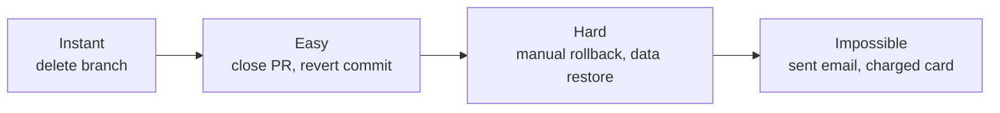

# Rollback-First Design: Every Agent Action Should Be Reversible

> Before choosing how an agent will perform an action, choose how you will undo it — if recovery costs more than one command, reconsider the approach.

## The Premise

Agents produce bad output. This is a property of probabilistic systems in complex environments. The question is not whether an agent will make a mistake, but what the recovery cost is when it does.

Rollback-first design treats recovery cost as a first-class constraint. For every agent action, ask: "how hard is this to undo?" If the answer is "very," choose an approach that produces a reversible result.

## The Undo Cost Spectrum

Design agent workflows to stay in the left half. When a step must land in the right half (external side effects, irreversible state changes), add a human gate before it — see [Human-in-the-Loop Placement](../workflows/human-in-the-loop.md).

## Reversible Primitives

**Git branches.** Agent work on a branch is completely reversible: delete the branch. Nothing on main is affected. This is the foundational primitive — agent file changes should always happen on a branch.

**Draft PRs.** A draft PR is visible and reviewable but not merged. Closing it discards the changes without affecting the main branch. Use draft PRs instead of direct pushes to main.

**Labels over status.** Changing an issue label is reversible (change it back). Closing an issue is less reversible (history is muddied). Deleting an issue is irreversible on most platforms.

**Comments over edits.** Appending a comment is reversible (delete it). Editing a body is harder to undo because the original is overwritten. Prefer comments for agent-generated observations; reserve body edits for structured fields.

**Checkpoints.** [Claude Code checkpoints](https://code.claude.com/docs/en/checkpointing) capture file state before each user prompt. Restoration is selective — revert code only, conversation only, or both — so you choose the rollback scope.

**Staging environments.** Agent output affecting live systems should go through staging before production. A bad draft in staging costs nothing to discard; a bad production deployment costs recovery time.

## What Cannot Be Made Reversible

Some actions have inherent irreversibility:

- Sending external notifications (email, Slack, webhooks)
- Charging or refunding payment instruments
- Deleting external resources without snapshots
- Pushing to a CDN or cache that propagates globally

For these, apply human gates before the action, not after. There is no rollback; the gate is the only defense.

## Designing for Reversibility

Checklist for each agent action:

1. Can this be done on a branch instead of main?
2. Can the artifact be a draft before it becomes final?
3. Is there a checkpoint before this action?
4. If this action fails or is wrong, what is the one-command undo?

If the one-command undo does not exist, redesign the step before shipping the workflow.

## Example

An agent refactors a module across 40 files. Halfway through, it makes a wrong assumption about the interface and produces broken code in 15 files.

**Without rollback-first design:**

- The agent pushed directly to main
- Recovery requires reverting individual commits or manually fixing 15 files
- CI is broken; other developers are blocked

**With rollback-first design:**

- All changes happened on a branch (`agent/refactor-module-xyz`)
- A draft PR was opened for human review before any merge
- Recovery is one command: `git branch -D agent/refactor-module-xyz`
- Main is untouched; CI is unaffected; no one is blocked

The design choice was made before execution: work on a branch, open a draft PR, require human approval before merge. Each step has a one-command undo at the point it was created.

## Key Takeaways

- Treat undo cost as a design constraint, not an afterthought
- Git branches, draft PRs, and checkpoints are the core reversible primitives
- Comments are reversible; body edits less so — prefer comments for agent-generated content
- External side effects (emails, webhooks, payments) cannot be made reversible — gate them instead
- If recovery requires more than one command, reconsider the approach

## Related

- [Human-in-the-Loop Placement: Where to Gate Agent Pipelines](../workflows/human-in-the-loop.md)
- [Idempotent Agent Operations: Safe to Retry](idempotent-agent-operations.md)
- [Worktree Isolation](../workflows/worktree-isolation.md)
- [Agent Loop Middleware](agent-loop-middleware.md)
- [Agent Pushback Protocol](agent-pushback-protocol.md)
- [Classical SE Patterns as Agent Design Analogues](classical-se-patterns-agent-analogues.md)
- [Exception Handling and Recovery Patterns](exception-handling-recovery-patterns.md)
- [The Think Tool](think-tool.md)
- [Execution-First Delegation](execution-first-delegation.md)
- [Wink: Agent Misbehavior Correction](wink-agent-misbehavior-correction.md)
- [Steering Running Agents](steering-running-agents.md)
