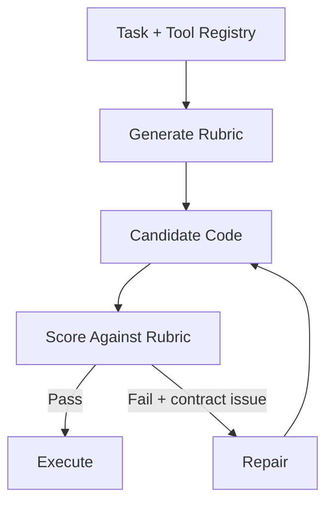

# RubricRefine: Pre-Execution Rubric Refinement

> Generate a task- and registry-specific rubric, score candidate tool-use code against explicit contract checks, and repair failures before any execution — for multi-step tool sequences where contract violations run silently to completion.

## When This Pattern Applies

The pattern is conditioned on **code-mode tool use with multi-step inter-tool contracts**. On predominantly single-step benchmarks (API-Bank), RubricRefine is flat — the lift comes from inter-tool contract structure, not from refinement itself ([LeVine et al., 2026](https://arxiv.org/abs/2605.09730)).

Apply when all three hold:

- The agent emits **code** that calls several tools in sequence, threading values between them
- Tools have **typed shapes** at their boundaries — a registry the rubric can reference
- The dominant failures are **silent** at runtime — wrong output shape passed downstream, wrong tool routed, or argument values fabricated rather than threaded from prior calls

Skip when calls are single-step, tool shapes are ad-hoc, or tools raise hard errors on misuse — runtime feedback already catches those failures.

## Where the Review Happens



The refinement loop closes **before any execution attempt**. The rubric is generated once per task from the task spec and the tool registry; each candidate is scored against explicit contract checks; repairs are issued without invoking the tools ([LeVine et al., 2026](https://arxiv.org/abs/2605.09730)).

This is a different review slot from neighbouring patterns:

| Pattern | What it reviews | When |
|---------|----------------|------|
| [Critic Agent](critic-agent-plan-review.md) | Plan | Before execution |
| [Inference-Time Tool-Call Reviewer](inference-time-tool-call-reviewer.md) | Each tool call | Per call, before dispatch |
| [Evaluator-Optimizer](evaluator-optimizer.md) | Output | After generation, in refinement loop |
| **RubricRefine** | Code-mode tool-use sequence | Pre-execution, against task-specific rubric |

## Why Runtime Feedback Is Not Enough

Unstructured self-critique improves output on diverse tasks by ~20% ([Madaan et al., 2023](https://arxiv.org/abs/2303.17651)), and adding real execution feedback lifts M3ToolEval performance from 0.65 to 0.75 — a real but modest gain ([LeVine et al., 2026](https://arxiv.org/abs/2605.09730)). The remaining errors are inter-tool contract violations that **do not raise**:

- Wrong output shape passed to the next tool
- Incorrect tool routing for a sub-step
- Broken argument provenance — values fabricated by the agent rather than threaded from upstream results

A typed-shape failure that produces a syntactically-valid call runs to completion. The runtime cannot tell that the next tool received an object the prior tool never produced.

## What the Rubric Encodes

The rubric is **task- and registry-specific**, not a generic style checklist ([LeVine et al., 2026](https://arxiv.org/abs/2605.09730)). It encodes:

- The **task spec** — what the multi-step sequence must accomplish
- The **tool registry shape** — input and output types for each tool the candidate is allowed to call
- **Contract checks** — explicit predicates the candidate code must satisfy (each upstream output must be the source of a downstream input; tool selected must produce the type the next step consumes; argument values must trace to a prior call or to the task input)

Each candidate is scored against these checks; failures are surfaced to the repair step with the specific predicate that did not hold.

## Reported Results

On M3ToolEval averaged across seven models, with zero execution attempts ([LeVine et al., 2026](https://arxiv.org/abs/2605.09730)):

| Approach | Score |
|----------|-------|
| Baseline | 0.65 |
| Revision with execution feedback | 0.75 |
| RubricRefine (pre-execution) | 0.86 |

RubricRefine improves on every model tested and runs at **2.6× lower latency** than the strongest non-iterative alternative. On API-Bank — predominantly single-step calls — RubricRefine is flat, consistent with the method's reliance on inter-tool contract structure.

## Operational Trade-offs

- **Rubric authoring cost** — the rubric is generated per task from the registry, so the cost scales with task complexity, not with execution count. Registries that change frequently force rubric regeneration.
- **Coverage is contract-shaped** — rubric checks catch contract violations; they will not catch semantic errors that satisfy the contract (a correct-shaped object containing wrong data).
- **Flat on single-step workloads** — pre-execution refinement does no useful work when there are no inter-step contracts; runtime feedback dominates on simplicity for those workloads ([LeVine et al., 2026](https://arxiv.org/abs/2605.09730)).
- **Discriminative signal vs runtime signal** — runtime feedback is precise on hard failures and silent on contract violations; the rubric is the opposite. The two are complementary, not interchangeable.

## Example

A multi-step task: fetch a user record, derive a subscription tier from one of its fields, then schedule a renewal notice. The registry types:

```text
get_user(id: str) -> User { tier_code: int, email: str }
lookup_tier(code: int) -> Tier { name: str, days: int }
schedule_notice(email: str, in_days: int) -> Notice
```

**Without rubric refinement** — silent contract violation:

```python
user = get_user(id="42")
tier = lookup_tier(code=user.email)         # wrong field — type mismatch
schedule_notice(email=user.email, in_days=30)  # in_days fabricated, not from tier
```

Both calls succeed at the boundary checks the runtime can perform: `lookup_tier` accepts an `int` but the model wrote `user.email`, which a permissive runtime coerces; `schedule_notice` runs with a hard-coded `30`. The task completes wrong.

**With rubric refinement** — the rubric encodes "argument to `lookup_tier.code` must trace to `get_user.tier_code`" and "`schedule_notice.in_days` must trace to `lookup_tier.days`". The pre-execution scorer flags both predicates, and the repair step rewrites:

```python
user = get_user(id="42")
tier = lookup_tier(code=user.tier_code)
schedule_notice(email=user.email, in_days=tier.days)
```

The contract holds before any tool runs.

## Key Takeaways

- Use pre-execution rubric refinement when multi-step tool use has inter-tool contracts and the dominant failures are silent at runtime
- Skip it for single-step or hard-failing tool workloads — runtime feedback already covers those cases
- The rubric must be task- and registry-specific; generic critique does not catch contract violations
- Rubric checks and runtime feedback are complementary signals, not substitutes

## Related

- [Critic Agent Pattern](critic-agent-plan-review.md)
- [Inference-Time Tool-Call Reviewer](inference-time-tool-call-reviewer.md)
- [Evaluator-Optimizer Pattern](evaluator-optimizer.md)
- [Agent Self-Review Loop](agent-self-review-loop.md)
- [Structured Output Constraints](../verification/structured-output-constraints.md)
