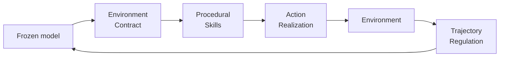

# Runtime Harness Adaptation

> On deterministic, rule-governed environments, evolve a four-layer harness — environment contracts, procedural skills, action realization, trajectory regulation — from interaction-failure trajectories. The frozen model gets the lift; the layers transfer across backbones to the extent the encoded structure is environment-side, not model-side.

Runtime harness adaptation fixes recurring LLM-agent failures by editing the model-environment interface, not the model. Each recurring failure in a training trajectory becomes a rule, skill, validator, or monitor at one of four layers; the harness is held fixed at evaluation. [Xu et al. (2026)](https://arxiv.org/abs/2605.22166) report 116 of 126 model-environment settings improved across 18 backbones — average +88.5% relative — with harnesses evolved from a single 4B model transferring to 17 others.

## When the Qualifier Holds

The technique only generalises in **deterministic, rule-governed environments** with stable tool interfaces and stable success criteria. The authors flag fully open-ended tasks as outside scope ([Xu et al., 2026](https://arxiv.org/html/2605.22166v1)). The seven benchmark environments — Airline, Retail, Telecom (τ-bench / τ²-bench), ALFWorld, WebShop, OS Interaction, DBBench (AgentBench) — share fixed APIs, stable policy documents, reproducible grading.

Coding-agent work sits *between*: refactoring a typed codebase with linters and tests is rule-governed; building a novel feature from a vague prompt is not. Use the four-layer surface for the rule-governed slices.

## The Four Adaptation Layers

| Layer | What it does | Failure mode it catches |
|-------|--------------|-------------------------|
| **Environment contract** | Makes stable constraints, policy clauses, tool-use rules, and known pitfalls explicit before the first turn | Valid syntax, wrong tool usage — model never saw the rule |
| **Procedural skill** | Skill library distilled from training trajectories; retrieves task-relevant skills as non-parametric guidance | Reasoning gaps the model could fill if shown the right procedure once |
| **Action realization** | Gate between model output and environment; verifies executability, canonicalises interface errors, blocks deterministically failing actions | Action intent unclear in executable form, repeated bad-argument calls |
| **Trajectory regulation** | Post-execution monitor for repetition, stagnation, budget exhaustion; triggers recovery | Degenerate loops, premature termination, runaway budgets |

Each layer is sourced from observed trajectory failures, not from a priori design. The harness evolves: new failure → new rule, skill, validator, or monitor at the matching layer ([Xu et al., 2026](https://arxiv.org/html/2605.22166v1)).

## Why It Works

Deterministic, rule-governed environments expose a stable interface the model has not memorised but the harness can encode externally. Failures here cluster at the model-environment seam — invalid tool arguments, wrong API format, repetition loops from ambiguous feedback — not at reasoning ability. Encoding the interface once and gating execution against it converts per-call inference into retrieval and gating, which LLMs perform more consistently than reconstruction from weights ([Zhou et al., 2026 — externalization survey](https://arxiv.org/pdf/2604.08224); [Xu et al., 2026](https://arxiv.org/abs/2605.22166)). Cross-backbone transfer holds only to the extent that what is encoded is environment-side, not model-side — when an "environment" rule is actually a quirk of the source model's tool-call style, transfer collapses ([Cursor](https://cursor.com/blog/codex-model-harness)).

## When This Backfires

- **Open-ended tasks.** When tool interfaces, success criteria, or contracts shift per task — research agents, exploratory coding, novel-feature builds — the four layers have no stable surface to encode. Authors flag this directly ([Xu et al., 2026](https://arxiv.org/html/2605.22166v1)). Reach for [harness impermanence](harness-impermanence.md) instead.
- **Frontier model migrations.** When the next model handles an action natively — structured output, native tool-call repair, internal stopping — action-realization and trajectory-regulation layers become depreciating capital. Cursor measured a 30% drop on GPT-5-Codex when reasoning summaries were stripped by a harness rule designed for a prior model ([Cursor](https://cursor.com/blog/codex-model-harness)).
- **Provider-specific overfit.** Skills or contracts distilled from one model's trajectories can mask model-specific bias. Procedural-skill retrieval can fire a skill that contradicts the deployed model's preferred pattern ([per-model harness tuning](per-model-harness-tuning.md); [Cursor](https://cursor.com/blog/codex-model-harness)).
- **No eval loop.** Evolution assumes a deterministic benchmark that can credibly score interventions. Without one, layers accumulate without falsification — see [observability-driven harness evolution](observability-driven-harness-evolution.md).

## Practical Application

1. **Confirm the qualifier.** Deterministic and rule-governed? If not, prefer the [five-failure-layers diagnostic](five-failure-layers-diagnostic.md).
2. **Mine failure trajectories.** Collect runs that miss the success criterion; cluster by failure category.
3. **Place each fix at the right layer.** Policy violation → environment contract. Reasoning skip → procedural skill. Bad argument → action realization. Loop or stall → trajectory regulation. Mis-placement is a transferability bug.
4. **Hold the harness fixed at evaluation.** Adapt from training trajectories; evaluate the frozen harness on held-out tasks.
5. **Re-ablate on model swap.** Reported transfer can hide model-side rules. Run [isometric harness ablation](isometric-harness-ablation.md) per backbone; drop rules whose lift evaporates.

## Key Takeaways

- The four-layer surface — environment contract, procedural skills, action realization, trajectory regulation — is the unit of harness adaptation; place each fix at the matching layer.
- Cross-model transfer holds only to the extent the encoded structure is environment-side. Re-ablate on every model swap.
- The technique is scoped to deterministic, rule-governed environments. Open-ended tasks defeat the assumption — use [harness impermanence](harness-impermanence.md) and [per-model harness tuning](per-model-harness-tuning.md) instead.
- Evolution from failure trajectories assumes a deterministic eval loop. Without one, layers accumulate without falsification.

## Related

- [Harness Engineering](harness-engineering.md) — the broader discipline of designing agent environments
- [Per-Model Harness Tuning](per-model-harness-tuning.md) — when transfer breaks, declare model-keyed overrides
- [Isometric Harness Ablation](isometric-harness-ablation.md) — quantify which layer earns its weight on each backbone
- [Five-Failure-Layers Diagnostic](five-failure-layers-diagnostic.md) — attribute failures before reaching for a model swap
- [Harness Impermanence](harness-impermanence.md) — design layers for removal when the next model subsumes them
