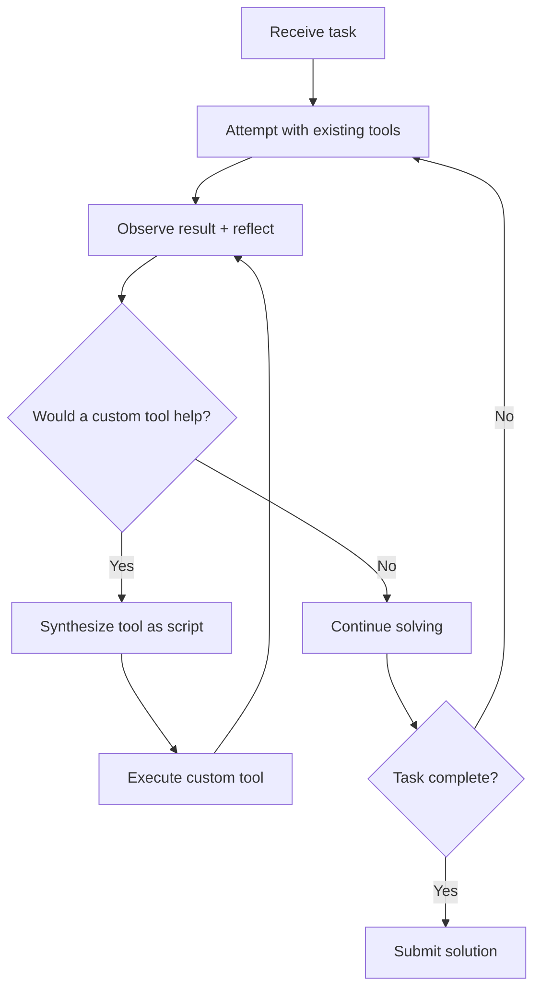

# Runtime Scaffold Evolution

> Treat the agent scaffold as mutable software the agent itself can modify at runtime. A lightweight reflection prompt — "would creating a tool help here?" — lets capable agents synthesize domain-specific tools during active problem-solving, outperforming fixed toolkits.

## The Core Insight

A sufficiently capable LLM already knows how to write code and reason about tooling. The missing piece is *permission and prompting* — explicitly asking the agent to consider tool creation as a first-class action alongside tool use.

Live-SWE-agent demonstrated this by starting with bash-only access and autonomously evolving its toolkit — achieving 77.4% on SWE-bench Verified and 45.8% on SWE-Bench Pro without offline training or pre-built tool libraries ([Xia et al., 2025](https://arxiv.org/abs/2511.13646)).

## How It Works



The mechanism is simple:

1. **Minimal start** — the agent begins with only bash access, no specialized tools
2. **Step-reflection prompt** — after each action, a prompt asks: "Would creating or revising a tool accelerate progress?"
3. **Tool synthesis** — the agent writes a script with clear inputs, outputs, and error handling
4. **Iterative refinement** — tools are modified as understanding deepens, not designed upfront

No changes to the agentic loop. Just a reflection prompt and permission to create scripts.

## What the Agent Builds

Runtime tools consolidate multi-step bash sequences into single domain-specific operations:

| Scenario | Bash approach | Runtime-synthesized tool |
|----------|--------------|------------------------|
| Code search | `grep -r` with manual filtering | Context-aware search excluding test fixtures and vendored code |
| Binary parsing | Chained `xxd`, `awk`, `sed` | Dedicated parser with structured output |
| Multi-file edits | Sequential `sed` commands | Batch editor with AST awareness and rollback |

Tool-creation opportunities emerge from encountering friction, not from upfront design.

## The Model-Capability Threshold

This is **not a universal technique**. It requires frontier-class models:

| Model tier | Effect | Mechanism |
|-----------|--------|-----------|
| **Frontier** | Significant improvement [unverified] | Synthesizes useful, targeted tools that reduce step count |
| **Mid-tier** | Modest improvement [unverified] | Creates tools but sometimes over-engineers them |
| **Small** | **Performance degrades** [unverified] | Gets stuck in tool-creation loops, never solves the actual problem |

Weaker models lack the meta-reasoning to judge when tool creation is worthwhile, turning the reflection prompt into a distraction trap ([Xia et al., 2025](https://arxiv.org/abs/2511.13646)).

## Runtime vs Offline Evolution

| Approach | Timescale | Persistence | Human involvement |
|----------|-----------|-------------|-------------------|
| **Runtime scaffold evolution** | Single session | Ephemeral | None |
| [Introspective skill generation](../workflows/introspective-skill-generation.md) | Across sessions | Persisted to library | Validation gate |
| [Continuous agent improvement](../workflows/continuous-agent-improvement.md) | Weeks/months | Config updates | Human-driven |
| [Agentic flywheel](agentic-flywheel.md) | Continuous | Harness modifications | Tiered approval |

Tools vanish when the session ends. Promoting useful ones to a [skill library](../tool-engineering/skill-library-evolution.md) bridges ad-hoc creation and governed reuse.

## Cost and Context Trade-offs

Token overhead is ~$0.12 per issue [unverified — tested on SWE-bench tasks], negligible relative to overall agent cost.

The hidden cost is context pressure. Each synthesized tool definition consumes tokens. In long sessions, accumulated definitions may crowd out problem-relevant context. Active tool pruning remains an open area [unverified].

## When to Use

**Good fit:** complex unfamiliar codebases, domain-specific file formats, frontier-class models with large context windows.

**Poor fit:** well-defined workflows with known tool sets (use a [fixed skill library](../tool-engineering/skill-library-evolution.md)), smaller models, short tasks where tool creation overhead exceeds time saved.

## Example

A SWE-bench agent receives a bug report about incorrect CSV parsing. The system prompt includes a reflection hook:

```
After each tool result, reflect: would creating a reusable script
accelerate the remaining work? If yes, write it to /tmp/tools/ and
invoke it in subsequent steps.
```

**Turn 1** — The agent runs `grep -r "csv" src/` and gets 200+ matches across test fixtures and vendored code.

**Turn 2 (reflection fires)** — The agent creates `/tmp/tools/search_src.py`:

```python
#!/usr/bin/env python3
"""Search source files, excluding tests and vendored directories."""
import sys, pathlib, re

pattern = re.compile(sys.argv[1])
for p in pathlib.Path("src").rglob("*.py"):
    if any(skip in p.parts for skip in ("tests", "vendor", "__pycache__")):
        continue
    for i, line in enumerate(p.read_text().splitlines(), 1):
        if pattern.search(line):
            print(f"{p}:{i}: {line.strip()}")
```

**Turn 3** — The agent calls `python /tmp/tools/search_src.py "csv.*parse"` and immediately narrows to 4 relevant files, then locates and fixes the bug.

The tool was created in response to friction (noisy grep results), used for the remainder of the session, and discarded on completion.

## Key Takeaways

- The mechanism is a single reflection prompt — simplicity is the point
- Requires frontier-class models; weaker models get trapped in tool-creation loops
- Ephemeral by default — combine with [skill library persistence](../tool-engineering/skill-library-evolution.md) for cross-session reuse
- Gate behind model capability routing: enable for strongest model, disable for cost-optimized paths

## Related

- [Introspective Skill Generation](../workflows/introspective-skill-generation.md) — offline pattern mining across sessions
- [Agentic Flywheel](agentic-flywheel.md) — closed-loop harness self-improvement
- [Skill Library Evolution](../tool-engineering/skill-library-evolution.md) — lifecycle governance for persisted skills
- [Harness Engineering](harness-engineering.md) — designing agent environments
- [Continuous Agent Improvement](../workflows/continuous-agent-improvement.md) — human-driven observation-to-update loop
- [The Think Tool](think-tool.md) — mid-stream reasoning checkpoint
- [Temporary Compensatory Mechanisms](temporary-compensatory-mechanisms.md) — runtime tools as removable scaffolding
- [Agent Self-Review Loop](agent-self-review-loop.md) — self-evaluation of output quality
- [Tool Minimalism](../tool-engineering/tool-minimalism.md) — counterpoint: fewer tools can outperform more
