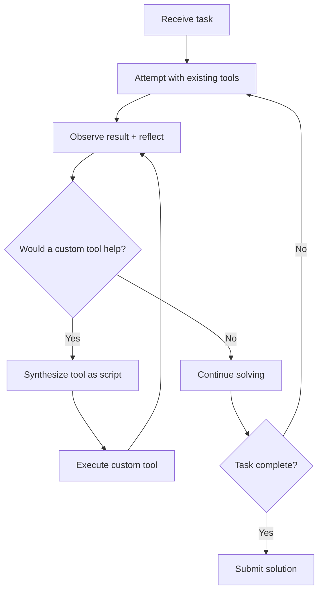

# Runtime Scaffold Evolution

> Treat the agent scaffold as mutable software the agent itself can modify at runtime. A lightweight reflection prompt — "would creating a tool help here?" — lets capable agents synthesize domain-specific tools during active problem-solving, outperforming fixed toolkits.

## The Core Insight

Software agents are themselves software systems. A sufficiently capable LLM already knows how to write code, create scripts, and reason about tooling. The missing piece is not capability but *permission and prompting* — explicitly asking the agent to consider tool creation as a first-class action alongside tool use.

Live-SWE-agent demonstrated this by starting with a minimal bash-only scaffold and autonomously evolving its own toolkit while solving real-world software issues — achieving 77.4% on SWE-bench Verified and 45.8% on SWE-Bench Pro without offline training or pre-built tool libraries ([Xia et al., 2025](https://arxiv.org/abs/2511.13646)).

## How It Works

The mechanism is remarkably simple:

1. **Minimal start** — the agent begins with only bash access, no specialized tools
2. **Step-reflection prompt** — after each action's feedback, a lightweight prompt asks: "Reflect on the past steps. Would creating or revising a tool accelerate progress?"
3. **Tool synthesis** — the agent writes a Python script with clear inputs, outputs, and error messages
4. **Iterative refinement** — tools are modified as problem understanding deepens, not designed upfront

No changes to the agentic loop. No workflow modifications. No offline training. Just a reflection prompt and permission to create scripts.

## What the Agent Builds

Tools created at runtime consolidate multi-step bash sequences into single domain-specific operations:

| Scenario | Bash approach | Runtime-synthesized tool |
|----------|--------------|------------------------|
| Code search | `grep -r` with manual filtering | Context-aware search that auto-excludes test fixtures, vendored code, and build artifacts |
| Binary parsing | Chained `xxd`, `awk`, and `sed` | Dedicated parser (e.g., MARC record reader) with structured output |
| Multi-file edits | Sequential `sed` commands | Batch editor with AST awareness and rollback on failure |

The agent identifies tool-creation opportunities through the same iterative understanding that drives manual problem-solving — needs emerge from encountering friction, not from upfront design.

## The Model-Capability Threshold

Runtime scaffold evolution is **not a universal technique**. It requires frontier-class models:

| Model tier | Effect | Mechanism |
|-----------|--------|-----------|
| **Frontier** (Claude Opus 4.5, Gemini 3 Pro) | +15-22% improvement | Synthesizes useful, targeted tools that reduce step count |
| **Mid-tier** (Claude Sonnet) | Modest improvement | Creates tools but sometimes over-engineers them |
| **Small** (GPT-5-Nano) | **Performance degrades** | Gets stuck in tool-creation loops, never solves the actual problem |

This is a critical design constraint: the reflection prompt that enables self-evolution in capable models becomes a distraction trap for weaker ones. Weaker models lack the meta-reasoning to judge when tool creation is worthwhile versus when to just solve the problem directly ([Xia et al., 2025](https://arxiv.org/abs/2511.13646)).

**Practical implication**: gate this pattern behind model capability. Use it with your most capable model; disable it for cost-optimized routing to smaller models.

## Runtime vs Offline Evolution

This pattern operates on a different timescale than related approaches:

| Approach | Timescale | Persistence | Human involvement |
|----------|-----------|-------------|-------------------|
| **Runtime scaffold evolution** | Within a single session | Tools exist only for the current task | None |
| [Introspective skill generation](../workflows/introspective-skill-generation.md) | Across sessions | Skills persisted to library | Validation gate |
| [Continuous agent improvement](../workflows/continuous-agent-improvement.md) | Across weeks/months | Config and instruction updates | Human-driven |
| [Agentic flywheel](agentic-flywheel.md) | Continuous | Harness modifications | Tiered approval |

Runtime evolution is ephemeral — tools vanish when the session ends. Combining it with skill persistence (promoting useful runtime tools to a [skill library](../tool-engineering/skill-library-evolution.md)) creates a pipeline from ad-hoc creation to governed reuse.

## Cost and Context Trade-offs

Runtime tool creation adds ~$0.12 per issue in additional token spend for the reflection prompts and tool-writing steps [unverified — tested primarily with Claude and Gemini models on SWE-bench tasks]. This is negligible relative to the overall agent cost per issue.

The hidden cost is context window pressure. Each synthesized tool definition consumes context tokens. In long sessions with many tool creations, accumulated definitions may crowd out problem-relevant context. The Live-SWE-agent paper does not address active tool pruning — an open area for improvement [unverified].

## When to Use

**Good fit:**

- Complex, unfamiliar codebases where the agent cannot predict what tools it will need
- Tasks involving domain-specific file formats, custom protocols, or non-standard tooling
- Sessions using frontier-class models with large context windows

**Poor fit:**

- Well-defined workflows where the optimal tool set is known upfront — use a [fixed skill library](../tool-engineering/skill-library-evolution.md) instead
- Cost-sensitive routing through smaller models — the reflection prompt causes loops
- Short, simple tasks where tool creation overhead exceeds the time saved

## Key Takeaways

- The self-evolution mechanism is a single reflection prompt, not a complex meta-learning system — simplicity is the point
- Runtime tool creation requires frontier-class models; weaker models get trapped in tool-creation loops instead of solving problems
- Ephemeral by default — combine with [skill library persistence](../tool-engineering/skill-library-evolution.md) to convert session-local tools into reusable assets
- Gate this pattern behind model capability routing: enable for your strongest model, disable for cost-optimized paths

## Unverified Claims

- Whether runtime-created tools degrade performance in very long sessions due to context window pressure from accumulated tool definitions — not addressed in the source paper
- The ~$0.12 cost overhead figure may vary significantly with model choice and problem complexity
- Whether combining runtime scaffold evolution with persistent skill libraries produces compounding improvement across sessions — theoretically sound but not empirically demonstrated in the literature

## Related

- [Introspective Skill Generation](../workflows/introspective-skill-generation.md) — offline pattern mining across sessions, complementary timescale
- [Agentic Flywheel](agentic-flywheel.md) — closed-loop self-improvement targeting the harness, not individual tools
- [Skill Library Evolution](../tool-engineering/skill-library-evolution.md) — lifecycle governance for persisted skills
- [Harness Engineering](harness-engineering.md) — the discipline of designing agent environments
- [Continuous Agent Improvement](../workflows/continuous-agent-improvement.md) — human-driven observation-to-update loop
- [The Think Tool](think-tool.md) — mid-stream reasoning checkpoint, related to the reflection mechanism
- [Temporary Compensatory Mechanisms](temporary-compensatory-mechanisms.md) — runtime tools as removable scaffolding
- [Agent Self-Review Loop](agent-self-review-loop.md) — self-evaluation of output quality
- [Tool Minimalism](../tool-engineering/tool-minimalism.md) — counterpoint: fewer tools can outperform more tools when the right ones are chosen
