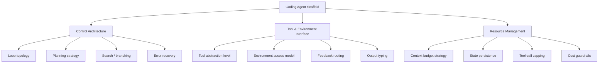

# Scaffold Architecture Taxonomy for Coding Agents

> The code surrounding an LLM — control loop, tool definitions, state management, context strategy — determines agent behavior as much as the model itself. A three-layer taxonomy makes scaffold choices explicit and comparable.

## Why Scaffold Architecture Matters

Coding agents are usually evaluated by what they do — pass tests, fix bugs, generate patches — not *how* they are built. [Source-code analysis of 13 open-source coding agent scaffolds](https://arxiv.org/abs/2604.03515) finds architecturally distinct systems produce identical surface capabilities; trajectory studies observe outputs without explaining differences.

LangChain confirms the leverage: pure harness changes — no model upgrade — improved Terminal Bench 2.0 scores from 52.8% to 66.5% ([LangChain](https://blog.langchain.com/improving-deep-agents-with-harness-engineering/)). The scaffold is a primary determinant of outcomes, not boilerplate.

## Three-Layer Taxonomy

[arXiv:2604.03515](https://arxiv.org/abs/2604.03515) characterizes coding agent scaffolds across 12 dimensions grouped in three layers:

### Layer 1: Control Architecture

How the scaffold decides what to do next and when to stop.

**Loop topology** is a spectrum, not discrete categories. Fixed pipelines run a predetermined sequence. Adaptive loops react to tool output before the next action. MCTS scaffolds build a search tree, exploring branches and backtracking on failure — Moatless Tools implements full MCTS with numeric reward and backpropagation ([arXiv:2604.03515](https://arxiv.org/abs/2604.03515)).

| Topology | Predictability | Compute | Best for |
|----------|---------------|---------|----------|
| Fixed pipeline | High | Low | Well-defined, repeatable tasks |
| Adaptive loop | Medium | Medium | Observation-reaction cycles |
| MCTS / search | Low | High | Unknown solution paths |

**Planning strategy** decides whether the scaffold reasons about future steps before acting. Planning-first emits a plan then executes — auditable but rigid when reality diverges. Interleaved planning adapts more readily at the cost of less inspectable reasoning.

**Error recovery** ranges from aborting on first failure to retry loops, exception-specific handlers, and rollback to checkpoints. It decides whether a scaffold degrades gracefully or fails catastrophically. See [Exception Handling and Recovery Patterns](exception-handling-recovery-patterns.md).

### Layer 2: Tool and Environment Interface

How the scaffold exposes capabilities to the model and receives environment feedback.

**Tool abstraction level** varies from direct shell to typed registries with schema-validated arguments. Shell maximizes flexibility but provides no boundary for testing or auditing. Typed interfaces reject malformed calls before execution and enable [reasoning/execution separation](cognitive-reasoning-execution-separation.md).

**Environment access model** sets what the agent can observe and modify. Read-only access prevents side effects during exploration; sandboxes give a recoverable surface for destructive operations.

**Feedback routing** controls where tool results go. Returning all output to context is simple but expensive. Routing large outputs to disk with a summary preserves budget; post-processing filters results before they enter context ([Anthropic: Context Engineering](https://www.anthropic.com/engineering/effective-context-engineering-for-ai-agents)).

### Layer 3: Resource Management

How the scaffold handles the bounded resources of a model-in-a-loop: context, time, and cost.

**Context budget strategy** decides what enters context and when it is pruned. Accumulated-context scaffolds let context grow until compaction or window limits force action; fresh-context resets per iteration; compression summarizes at thresholds. See [Loop Strategy Spectrum](loop-strategy-spectrum.md) for the trade-offs.

**State persistence** decides what survives between iterations or sessions. In-memory state is lost on failure. File-backed state enables resumption — the approach in [Agent Harness](agent-harness.md). Structured artifacts like [progress files](../observability/trajectory-logging-progress-files.md) and [feature list files](../instructions/feature-list-files.md) serve as both human-readable state and agent-readable context.

**Tool-call capping** and **cost guardrails** bound unbounded loops. Without caps, adaptive and MCTS scaffolds can exhaust budgets before finishing. Caps apply per session (max turns), per tool (max calls per type), or per cost (max token spend).

## The Classification Problem

Scaffold architectures **resist discrete classification** ([arXiv:2604.03515](https://arxiv.org/abs/2604.03515)). Real systems blend strategies — a fixed outer pipeline with an adaptive inner loop, or fresh-context resets only above a threshold. Treat dimensions as continuous scales, not binary choices.

Interrogating each dimension independently gives more useful signal than assigning a categorical label. Ask "where does this scaffold sit on the control strategy spectrum?" rather than "is this a pipeline or an agent?"

## Example

Choosing between two open-source scaffolds for automated bug fixing:

**Scaffold A** uses a fixed pipeline (locate → reproduce → patch → verify), direct shell access, and accumulated context with no compaction. Predictable, auditable, cheap to run. Degrades when reproduction requires exploration or context fills before the verify step.

**Scaffold B** uses an adaptive loop with typed tool registry, feedback routed to disk summaries, and per-session turn caps. More robust to unexpected paths; higher per-run cost; easier to test tool calls in isolation.

Neither is universally better. The taxonomy surfaces the trade-offs so the choice is deliberate.

## When This Backfires

The taxonomy adds overhead without value in several conditions:

- **Simple, bounded tasks**: A single-tool linter script has no meaningful control architecture to classify. A 12-dimension framework adds vocabulary without insight.
- **Hybrid systems that defy placement**: 11 of 13 agents analyzed compose multiple loop primitives rather than implementing one ([arXiv:2604.03515](https://arxiv.org/abs/2604.03515)). Forcing a blended system into a single value produces a misleading label.
- **Retrospective audits**: Classifying an existing scaffold tells you what was built, not whether the design was right. The taxonomy is most useful before committing to an architecture.

## Key Takeaways

- Scaffold architecture — control loop, tool interface, resource management — determines agent outcomes independently of the underlying model.
- The three layers give practitioners a vocabulary to read, compare, and select scaffold designs rather than treating systems as opaque.
- Control strategies form a spectrum from fixed pipelines to MCTS; classifying a scaffold as "a pipeline" or "an agent" loses the resolution needed to predict behavior.
- Resource management (context budget, state persistence, cost caps) is a first-class design layer, not an afterthought.

## Related

- [Loop Strategy Spectrum: Accumulated, Compressed, and Fresh Context](loop-strategy-spectrum.md)
- [Agent Harness: Initializer and Coding Agent](agent-harness.md)
- [Harness Engineering](harness-engineering.md)
- [Cognitive Reasoning vs Execution: A Two-Layer Agent Architecture](cognitive-reasoning-execution-separation.md)
- [Agent Loop Middleware](agent-loop-middleware.md)
- [Exception Handling and Recovery Patterns](exception-handling-recovery-patterns.md)
- [Cost-Aware Agent Design: Route by Complexity, Not Habit](cost-aware-agent-design.md)
- [Agentic AI Architecture: From Prompt-Response to Goal-Directed Systems](agentic-ai-architecture-evolution.md)
- [Context Engineering: The Discipline of Designing Agent Context](../context-engineering/context-engineering.md)
