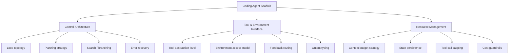

# Scaffold Architecture Taxonomy for Coding Agents

> The code surrounding an LLM — control loop, tool definitions, state management, context strategy — determines agent behavior as much as the model itself. A three-layer taxonomy makes scaffold choices explicit and comparable.

## Why Scaffold Architecture Matters

Coding agents are commonly evaluated by what they can do: pass tests, fix bugs, generate patches. Less attention goes to *how* they are built. [Source-code analysis of 13 open-source coding agent scaffolds](https://arxiv.org/abs/2604.03515) finds that architecturally distinct systems produce identical surface capabilities — trajectory studies observe outputs without explaining why they differ. The scaffolding code surrounding the model is the differentiating variable.

LangChain's harness engineering results confirm the leverage: pure harness changes — no model upgrade — improved Terminal Bench 2.0 scores from 52.8% to 66.5% ([LangChain](https://blog.langchain.com/improving-deep-agents-with-harness-engineering/)). The scaffold is not boilerplate around the model; it is a primary determinant of outcomes.

## Three-Layer Taxonomy

[arXiv:2604.03515](https://arxiv.org/abs/2604.03515) characterizes coding agent scaffolds across 12 dimensions grouped in three layers [unverified — exact dimension names and sub-groupings derived from paper abstract; full paper was inaccessible during research]:

### Layer 1: Control Architecture

How the scaffold decides what to do next and when to stop.

**Loop topology** spans a continuous spectrum — not discrete categories. Fixed linear pipelines execute a predetermined sequence of steps. Adaptive loops react to tool output before selecting the next action. At the far end, Monte Carlo Tree Search (MCTS) scaffolds build a search tree of possible action sequences, exploring branches and backtracking when paths fail ([arXiv:2604.03515](https://arxiv.org/abs/2604.03515)) [unverified — MCTS is referenced in the paper abstract as the upper end of the control strategy spectrum; specific agent implementations were not confirmed].

| Topology | Predictability | Compute | Best for |
|----------|---------------|---------|----------|
| Fixed pipeline | High — steps are known | Low | Well-defined, repeatable tasks |
| Adaptive loop | Medium — branches on tool output | Medium | Tasks requiring observation-reaction cycles |
| MCTS / search | Low — branches on speculation | High | Tasks where the solution path is unknown |

**Planning strategy** determines whether the scaffold reasons about future steps before acting. Planning-first scaffolds emit a plan then execute against it — easier to audit, but rigid when reality diverges. Interleaved scaffolds adapt more readily but produce less inspectable reasoning.

**Error recovery** ranges from aborting on first failure to retry loops, exception-specific handlers, and rollback to prior checkpoints. Recovery strategy determines whether a scaffold degrades gracefully or fails catastrophically. See [Exception Handling and Recovery Patterns](exception-handling-recovery-patterns.md).

### Layer 2: Tool and Environment Interface

How the scaffold exposes capabilities to the model and receives environment feedback.

**Tool abstraction level** varies from direct shell access (the model calls bash commands) to typed tool registries (the model calls named functions with schema-validated arguments). Direct shell access maximizes flexibility but provides no boundary for testing or auditing. Typed interfaces enforce a contract — malformed calls are rejected before execution — and enable [reasoning/execution separation](cognitive-reasoning-execution-separation.md).

**Environment access model** sets what the agent can observe and modify. Read-only access prevents side effects during exploration; read-write requires explicit safeguards; sandboxed environments (containers, isolated filesystems) provide a recoverable surface for destructive operations.

**Feedback routing** controls where tool results go. Returning all output to the context window is simple but expensive. Routing large outputs to disk with a summary preserves context budget; programmatic post-processing filters results before they enter context ([Anthropic: Context Engineering](https://www.anthropic.com/engineering/effective-context-engineering-for-ai-agents)).

### Layer 3: Resource Management

How the scaffold handles the bounded resources of a model-in-a-loop: context window, wall time, and cost.

**Context budget strategy** determines what enters the model's context window and when it is pruned. Accumulated-context scaffolds let context grow until compaction or window limits force action. Fresh-context scaffolds reset per iteration, persisting state to disk. Compression scaffolds apply summarization or offloading at configurable thresholds. See [Loop Strategy Spectrum](loop-strategy-spectrum.md) for the trade-offs.

**State persistence** determines what survives between iterations or sessions. In-memory state is lost on failure or context reset. File-backed state enables resumption across sessions — the approach in [Agent Harness](agent-harness.md). Structured artifacts (progress files, feature lists) serve as both human-readable state and agent-readable context.

**Tool-call capping** and **cost guardrails** bound unbounded loops. Without explicit caps, adaptive and MCTS scaffolds can exhaust budgets before completing a task. Caps apply at the session level (max turns), tool level (max calls per type), or cost level (max token spend).

## The Classification Problem

A key finding of the paper is that scaffold architectures **resist discrete classification** ([arXiv:2604.03515](https://arxiv.org/abs/2604.03515)). Real systems blend strategies: a scaffold may use a fixed outer pipeline with an adaptive inner loop, or apply fresh-context resets only when context exceeds a threshold. Treating taxonomy dimensions as continuous scales — not binary choices — reflects how real scaffolds are built.

This has a practical consequence: when evaluating or selecting a scaffold, interrogating each dimension independently gives more useful information than assigning a categorical label. Ask "where does this scaffold sit on the control strategy spectrum?" rather than "is this a pipeline or an agent?"

## Example

A developer choosing between two open-source scaffolds for automated bug fixing can apply the taxonomy directly:

**Scaffold A** uses a fixed pipeline (locate → reproduce → patch → verify), direct shell access, and accumulated context with no compaction. Predictable, auditable, cheap to run. Degrades when bug reproduction requires exploration or when context fills before the verify step.

**Scaffold B** uses an adaptive loop with typed tool registry, feedback routed to disk summaries, and per-session turn caps. More robust to unexpected reproduction paths; higher per-run cost; easier to test tool calls in isolation.

Neither is universally better. The taxonomy surfaces the trade-offs so the choice is deliberate.

## Key Takeaways

- Scaffold architecture — control loop, tool interface, resource management — determines agent outcomes independently of the underlying model.
- The three layers give practitioners a vocabulary to read, compare, and select scaffold designs rather than treating systems as opaque.
- Control strategies form a spectrum from fixed pipelines to MCTS; classifying a scaffold as "a pipeline" or "an agent" loses the resolution needed to predict behavior.
- Resource management (context budget, state persistence, cost caps) is a first-class design layer, not an afterthought.

## Unverified Claims

- The 12 dimensions and their sub-groupings are derived from the paper abstract; the primary source was inaccessible during research — exact dimension names may differ [unverified]
- Whether any specific named agent uses MCTS as its primary control strategy (vs. as a component) is not confirmed from accessible sources [unverified]

## Related

- [Loop Strategy Spectrum: Accumulated, Compressed, and Fresh Context](loop-strategy-spectrum.md)
- [Agent Harness: Initializer and Coding Agent](agent-harness.md)
- [Harness Engineering](harness-engineering.md)
- [Cognitive Reasoning vs Execution: A Two-Layer Agent Architecture](cognitive-reasoning-execution-separation.md)
- [Agent Loop Middleware](agent-loop-middleware.md)
- [Exception Handling and Recovery Patterns](exception-handling-recovery-patterns.md)
- [Cost-Aware Agent Design: Route by Complexity, Not Habit](cost-aware-agent-design.md)
- [Agentic AI Architecture: From Prompt-Response to Goal-Directed Systems](agentic-ai-architecture-evolution.md)
