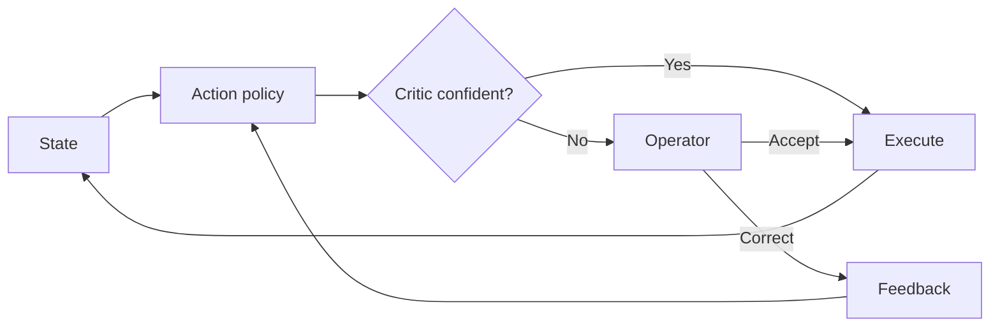

# Selective Autonomy from Copilot Feedback

> Decouple "what to do" from "when to act": a policy proposes the next action, a critic learned from operator accept/correct feedback decides whether to execute it or defer to a human.

## The Pattern

A staged pipeline runs two models against every step:

1. **Action policy** — proposes the next move (a UI action, a tool call, an edit).
2. **Critic** — scores confidence using operator feedback collected during normal work; abstains below a threshold.

Confident steps execute autonomously and the agent resumes from the updated state. Uncertain steps surface to an operator who either accepts the suggestion or supplies a correction. Both responses become new training labels for the critic.

[Borovkov et al. (2026)](https://arxiv.org/abs/2604.23855) deployed this design over an enterprise BPM platform and reported, in production, that it "automated 45% of sessions and reduced average handling time by 39% without degrading support quality level," reaching selective automation within two weeks for new processes.

## Why It Works

The pattern is a direct application of **selective classification with a reject option**, formalised by [Geifman and El-Yaniv (2017)](https://arxiv.org/abs/1705.08500): a model that may abstain trades coverage for guaranteed risk on the cases it does accept. Two consequences for agents:

- **Cheaper supervision.** A policy required to be correct everywhere needs exhaustive labelled traces. A policy that may abstain only needs enough confidence on a high-coverage subset; the critic absorbs residual uncertainty.
- **Already-paid labels.** Operator accept/correct decisions are produced by routine work, not a separate annotation pipeline. The critic trains on supervision the system was already generating.

This is structurally a more granular form of [on-the-loop placement](../workflows/human-in-the-loop.md): the agent is supervised continuously, but the gate fires only on uncertainty rather than on every action.

## How It Differs From Adjacent Patterns

| Pattern | What is gated | Signal |
|---------|--------------|--------|
| [Suggestion gating](../human/suggestion-gating.md) | Whether to *display* a completion | Typing dynamics, code context |
| [Human-in-the-loop](../workflows/human-in-the-loop.md) | Whether to *advance past* a checkpoint | Reversibility, blast radius |
| Selective autonomy | Whether to *execute* a proposed action | Learned critic on accept/correct feedback |

The defining move is the learned critic: confidence comes from a model that was trained on the operator's own past decisions, not from a static rule about action class.

## When This Backfires

The deferral budget is finite — once it is exhausted, the pattern's economics flip:

- **Reversible actions, low blast radius.** When undo is cheap, abstention is overhead. Execute and roll back instead — see [rollback-first design](rollback-first-design.md).
- **Sparse or skewed feedback.** A critic trained on a handful of operators or processes cannot calibrate; it over-abstains on novel states or over-acts in the operator's blind spots. The same generalisation gap shows up in code-completion classifiers, where per-language thresholds outperform a uniform setting ([JetBrains, 2025](https://blog.jetbrains.com/ai/2025/03/ai-code-completion-less-is-more/)).
- **Distribution shift.** A threshold set at deployment decays as the underlying process or UI evolves; production needs continuous recalibration the same way [risk-based shipping](../verification/risk-based-shipping.md) needs its risk matrix re-derived.
- **Operator throughput cap.** If deferrals exceed what the operator pool can absorb, queues form and the "one operator, many sessions" benefit reverses into a bottleneck — a worked example of [bottleneck migration](../human/bottleneck-migration.md).

The pattern earns its keep when actions are partially irreversible, feedback is dense, and the operator pool is large enough to absorb the abstention rate.

## Example

The deployed system in [Borovkov et al. (2026)](https://arxiv.org/abs/2604.23855) operates over a schema-driven view of a BPM customer-support interface — each workflow step is a UI action the policy proposes from the current schema state.

**Without selective autonomy** — every proposed action is either fully automated (and the rare wrong action reaches the customer) or fully manual (the operator handles every step of every session).

**With selective autonomy** — the critic, trained on operators' prior accept and correct decisions over UI traces, scores each proposed action. Confident steps run in the background; the agent resumes from the updated UI state. Uncertain steps surface to an operator, whose accept-or-correct response feeds back as a fresh training label. The reported result: 45% of sessions automated end-to-end and average handling time reduced 39%, with one operator supervising multiple concurrent sessions and interrupted only on uncertain steps.

## Key Takeaways

- Split the agent into a policy that proposes and a critic that decides whether to execute or defer
- Train the critic on accept/correct feedback the operator was already producing — no new annotation pipeline
- Selective classification gives bounded risk on accepted actions in exchange for reduced coverage
- The pattern earns its keep when actions are hard to reverse and feedback is dense; otherwise rollback-first is cheaper

## Related

- [Human-in-the-Loop Placement](../workflows/human-in-the-loop.md) — where deferrals land and how supervision modes evolve
- [Developer Control Strategies for AI Coding Agents](../human/developer-control-strategies-ai-agents.md) — the human-side analogue: plan, supervise, validate
- [Suggestion Gating](../human/suggestion-gating.md) — the same selective-classification idea applied to displaying completions rather than executing actions
- [Grade Agent Outcomes, Not Execution Paths](../verification/grade-agent-outcomes.md) — the eval signal that calibrates the critic
- [Rollback-First Design](rollback-first-design.md) — the alternative when actions are cheap to reverse
- [Risk-Based Shipping](../verification/risk-based-shipping.md) — risk-matrix framing that complements a learned abstention threshold
- [Critic Agent Plan Review](critic-agent-plan-review.md) — a related critic role applied at plan time rather than action time
- [Progressive Autonomy and Model Evolution](../human/progressive-autonomy-model-evolution.md) — how the abstention threshold evolves as trust is calibrated
