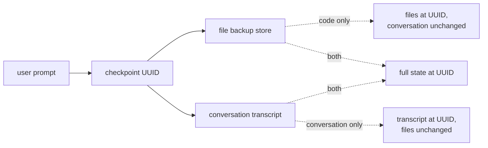

# Selective Checkpoint Restore Across Code and Conversation State

> When code state and conversation state are stored separately, restore is three actions — keep the mental model, keep the edits, or full reset.

Selective checkpoint restore is the affordance a harness exposes when its checkpoint primitive captures **code state** and **conversation state** in separate stores: the user (or the agent) can rewind one without the other. Claude Code's `/rewind` menu names three: "Restore code and conversation", "Restore conversation" (keep current code), and "Restore code" (keep the conversation) ([Claude Code: Checkpointing](https://code.claude.com/docs/en/checkpointing)). Each axis matches a different failure mode; conflating them wastes the affordance.

## When Each Restore Action Fits

| Restore | What it keeps | Use when |
|---|---|---|
| **Code only** | The conversation (the agent's analysis, the plan, your back-and-forth) | The agent's reasoning is still useful but the edits are wrong — try the same plan again with the agent's accumulated context. |
| **Conversation only** | The files on disk | The edits landed correctly but the next planning step poisoned itself — drop the bad reasoning, keep the work. |
| **Both** | Nothing from the restored range | Full reset of a short, low-value detour. For longer side-quests, [fork the session](https://code.claude.com/docs/en/checkpointing) instead so the dead-end is preserved off-thread. |

The three actions map to three recovery goals — preserve debugging context, preserve partial work, or clean slate — and conflating them is worse than not having the feature.

## How It Works

Claude Code keys file backups by the UUID of each user message ([Claude Agent SDK: File Checkpointing](https://code.claude.com/docs/en/agent-sdk/file-checkpointing)). The transcript and the file backups are independent stores with independent identifiers, so the harness composes three restore actions from two operations:



Granularity is per user prompt — "Every user prompt creates a new checkpoint" ([Claude Code: Checkpointing](https://code.claude.com/docs/en/checkpointing)) — with no sub-prompt rewind. The SDK exposes only the code-only axis: `rewind_files()` (Python) / `rewindFiles()` (TypeScript) restore files but "does not rewind the conversation itself" ([Claude Agent SDK: File Checkpointing](https://code.claude.com/docs/en/agent-sdk/file-checkpointing)). No primitive rewinds conversation alone, so agent-driven selective restore is one-sided today.

## Why It Works

Selective restore is possible because the two state stores carry independent identifiers and independent restore operations. Where a harness serialises checkpoint state as a single transaction — Cursor zips the pre-change files and treats the chat as a forward-only continuation thread ([Steve Kinney: Cursor Checkpoints](https://stevekinney.com/courses/ai-development/cursor-checkpoints)) — the selective axis is architecturally unavailable. The unit of restorable state is a harness design decision; the three-way split is what that decision unlocks. [Rollback-First Design](rollback-first-design.md) lists checkpoints as one reversible primitive, and selective restore is what makes them *more* reversible than an all-or-nothing snapshot.

## When This Backfires

The three-way affordance carries costs the docs do not surface.

- **Rewind always forks the session.** Every restore creates a new conversation branch in Claude Code, so heavy use accumulates dead-end branches that clutter `--resume` history; the request for a fourth "rewind without fork" option was closed not-planned ([anthropics/claude-code #9279](https://github.com/anthropics/claude-code/issues/9279)). For short sessions the fork tax dominates the benefit.
- **Bash edits are outside the safety net.** "Checkpointing does not track files modified by bash commands" ([Claude Code: Checkpointing](https://code.claude.com/docs/en/checkpointing)). A code-only restore on a session where `make`, `sed -i`, or `mv` did the real work produces silent inconsistency — the backup restores some files, the bash-side changes survive untouched.
- **Code-only restore can desync the agent's mental model.** When files revert but the conversation still references the rewound edits, the agent operates against state it only thinks exists — the drift surface Cursor's single restorable unit avoids by design.
- **Short sessions where nothing was learned.** Picking among three options is overhead; `/clear` or `claude --continue --fork-session` is cheaper when the rewound range held no useful context.
- **Teams that commit every agent turn.** Git already gives per-file restore (`git restore --source=<sha>`) with the same selectivity; the harness checkpoint adds a parallel rollback channel, doubling cognitive load for the same capability.
- **Code-only restore plus re-execution can replay irreversible side effects.** A code-only restore invites the agent to retry the failed step — but an LLM agent re-synthesises a *subtly different* request rather than replaying the identical call a deterministic program would. When that retry hits an external system, the restore can produce duplicate charges or reused credentials instead of a clean rollback — the "semantic rollback attack" of [ACRFence: Preventing Semantic Rollback Attacks in Agent Checkpoint-Restore](https://arxiv.org/abs/2603.20625). Gate restore-then-retry behind idempotency keys when the rewound range touched a stateful external call.

The pattern earns its keep when the session is long enough that learned context is genuinely valuable, the harness separates the two state stores, and bash-driven file modification is bounded.

## Example

A common selective-restore flow: the agent spent an hour analysing a flaky integration test, identified the race condition correctly, then proposed a fix that broke a different invariant.

**Restore code only.** The diagnosis is correct; only the patch was wrong.

```text
/rewind
→ Select the prompt where the fix was proposed
→ Choose: Restore code
→ Files revert; the conversation still contains the diagnosis
→ Type: "That fix broke X. Try a different patch that preserves Y."
```

The agent re-attempts the fix with the analysis still loaded — no re-investigation from scratch.

**Restore conversation only.** The patch was right but the agent then proposed a follow-up refactor based on a misread of an unrelated file.

```text
/rewind
→ Select the prompt where the bad refactor proposal started
→ Choose: Restore conversation
→ Conversation rewinds; the patch files stay edited
→ Type: "Don't refactor that module — it's owned by another team."
```

The work is preserved; only the planning thread is rewound.

## Key Takeaways

- Three restore actions match three recovery goals — code-only keeps the mental model, conversation-only keeps the work, both is full reset.
- The split exists because Claude Code stores file backups and the conversation transcript as independent UUID-keyed stores; harnesses that don't separate them (Cursor) cannot offer it.
- The SDK exposes code-only restore programmatically (`rewind_files()`); conversation-only restore has no SDK primitive today.
- Every rewind forks the session — heavy selective use clutters `--resume` history.
- Bash-edited files are not checkpointed; selective restore on a bash-heavy session produces silent inconsistency.

## Related

- [Rollback-First Design: Every Agent Action Should Be Reversible](rollback-first-design.md)
- [Delta Channels: Bounded Checkpoint Storage for Append-Only Agent State](delta-channels-checkpoint-storage.md)
- [Session Recap](session-recap.md)
- [ACID for Agent Repository State](acid-for-agent-repository-state.md)
