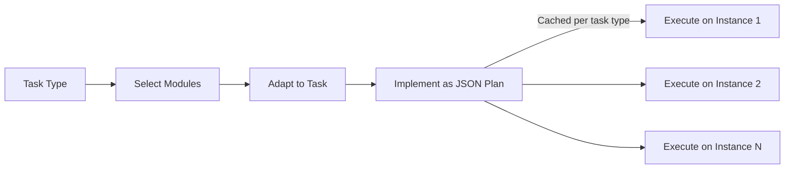

<!-- source: nibzard/awesome-agentic-patterns (Apache 2.0, https://github.com/nibzard/awesome-agentic-patterns) — retain attribution per license -->

# Self-Discover Reasoning: LLM-Composed Reasoning Structures

> Enable the model to compose a task-specific reasoning plan from a library of atomic modules before solving — instead of applying a fixed strategy regardless of problem type.

## The Technique

Fixed reasoning strategies — CoT, ReAct, Chain-of-Thought Self-Consistency — apply the same cognitive approach to every problem. SELF-DISCOVER ([Wang et al., 2024](https://arxiv.org/abs/2402.03620)) inverts this: the model first identifies which reasoning primitives fit the task, composes them into an explicit JSON plan, then executes that plan.

The key architectural insight is that Stage 1 (structure composition) runs **once per task type**, not per instance. The composed plan is then reused across all instances of that task, making the approach 10–40x more compute-efficient than CoT-Self-Consistency while exceeding its accuracy.

## The Three-Stage Process

**Stage 1: Self-Discovery** — run once per task type, produces a reusable reasoning structure.

1. **Select** — identify 3–5 relevant reasoning modules from a library of 39 atomic primitives (critical thinking, step-by-step analysis, analogical reasoning, backward reasoning, constraint identification, risk analysis, and others)
2. **Adapt** — rephrase selected modules from generic descriptions into concrete, task-specific instructions
3. **Implement** — convert the adapted descriptions into a structured JSON reasoning plan

**Stage 2: Structured Execution** — run per instance using the cached plan.

The model follows the JSON plan: `"Follow the step-by-step reasoning plan in JSON to correctly solve the task. Fill in the values following the keys by reasoning specifically about the task given."` Each key in the JSON corresponds to an adapted reasoning module, producing an explicit, inspectable trace.



## Benchmark Results

On PaLM 2-L ([Wang et al., 2024](https://arxiv.org/abs/2402.03620)):

| Benchmark | SELF-DISCOVER | Chain-of-Thought | Direct |
|-----------|--------------|-----------------|--------|
| BigBench-Hard (23 tasks) | **67%** | 60% | 56% |
| Grounded Agent Reasoning (T4D) | **69%** | 40% | 30% |
| MATH (200 samples) | **50.5%** | 42% | 45% |

The grounded agent reasoning gain (+29pp over CoT) is the strongest signal: tasks requiring multi-step planning over structured state benefit most from explicit reasoning scaffolds.

On MATH, 74.7% of remaining failures are computational errors, not reasoning errors — a ceiling this approach cannot address. For numerical computation, the bottleneck shifts from reasoning quality to arithmetic accuracy.

Structures transfer across model families: a plan discovered with PaLM 2-L applies to GPT-4, and vice versa — the JSON format is model-agnostic.

## When to Apply

Use SELF-DISCOVER when reasoning quality is the bottleneck:

- Complex analytical tasks with multiple interdependent sub-problems
- Mathematical problem-solving where the reasoning path is non-obvious
- Strategic planning over structured state (game-playing, agent task graphs)
- Multi-step code generation where architecture decisions chain forward

Skip it when:

- CoT already performs well — the overhead is not justified
- Tasks are straightforward lookups or single-step transformations
- Failures are computational (arithmetic errors) rather than reasoning failures — structure won't help
- Per-query latency is the primary constraint and caching is not applicable

## Compute Trade-offs

Stage 1 costs 3 additional LLM calls (Select, Adapt, Implement) per task type. Once composed, the plan is reused at no extra overhead per instance — one inference call per instance, same as plain CoT.

The meaningful comparison is SELF-DISCOVER vs. CoT-Self-Consistency (which runs multiple CoT passes per instance): SELF-DISCOVER requires 10–40x fewer inference calls while exceeding CoT-SC accuracy ([Wang et al., 2024](https://arxiv.org/abs/2402.03620)).

For a task type processed only once, the Stage 1 overhead is pure cost. For any recurring task type, amortization quickly makes it favorable.

## Key Takeaways

- SELF-DISCOVER composes a task-specific JSON reasoning plan once per task type, then reuses it across instances — amortizing discovery cost
- Stage 1 has three actions: Select modules from a 39-primitive library, Adapt them to the task, Implement as a JSON plan
- Gains are largest on multi-step reasoning tasks: +29pp over CoT on grounded agent reasoning benchmarks
- MATH failures (74.7% computational errors) mark a hard ceiling — structure cannot substitute for arithmetic accuracy
- Composed structures transfer across model families without modification
- 10–40x fewer inference calls than CoT-Self-Consistency with higher accuracy — the relevant compute comparison

## Example

A SELF-DISCOVER workflow for analyzing a failing CI pipeline:

**Stage 1 — compose plan (once, reused for all pipeline failures):**

```json
{
  "decompose_failure": "Break the pipeline into stages. Identify which stage failed and what its inputs and outputs are.",
  "root_cause_analysis": "For the failing stage, trace backward from the symptom to the likely root cause using available logs and configuration.",
  "constraint_check": "Verify that the fix satisfies all constraints: does not break other stages, does not introduce new dependencies, passes existing tests.",
  "verify_reasoning": "Check that the proposed fix is logically consistent with the root cause identified."
}
```

**Stage 2 — execute on each instance:**

The model fills in each key with instance-specific reasoning, producing a structured trace that maps directly to the plan. When the diagnosis is wrong, the trace shows exactly which step introduced the error.

## Related

- [Reasoning Budget Allocation: The Reasoning Sandwich](reasoning-budget-allocation.md) — Allocate extra reasoning compute to planning and verification phases; complements SELF-DISCOVER's structured planning stage
- [Petri Net of Thoughts: Formal Process Models as Prompting Scaffolds](petri-net-of-thoughts.md) — Derive reasoning structure from process models rather than module selection; strongest when the process is fully known upfront
- [The Think Tool](think-tool.md) — Mid-stream reasoning checkpoints between tool calls; lighter-weight alternative when task structure is simple
- [Indiscriminate Structured Reasoning](../anti-patterns/reasoning-overuse.md) — When structured reasoning adds cost without benefit
- [Evaluator-Optimizer Pattern](evaluator-optimizer.md) — Pair a generator with a structured critic; shares the explicit-structure philosophy
- [Three Reasoning Spaces: Plan, Bead, and Code](three-reasoning-spaces.md) — Explicit gates between planning, task decomposition, and implementation
