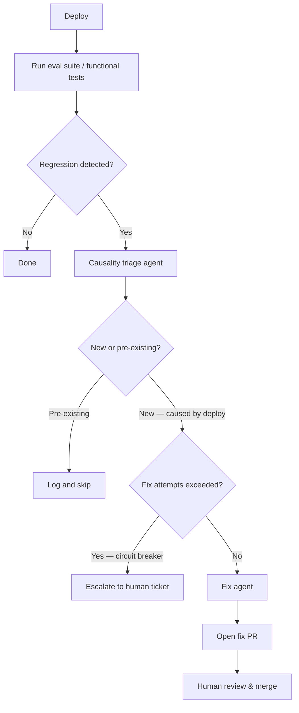

# Self-Healing Production Agent

> A production pipeline that detects regressions after every deploy, determines whether the current change caused them, and dispatches a sub-agent to open a fix PR — reducing MTTR without removing human review.

## The Loop

The classic incident cycle — detect → ticket → triage → fix → review — requires human attention at every hand-off. The self-healing loop automates the first three steps, preserving human judgment only at the merge gate.

LangChain applied this to their GTM Agent: after every deploy, the system compares eval scores pre- and post-deploy, triages causality, and kicks off a fix PR ([LangChain: How My Agents Self-Heal in Production](https://blog.langchain.com/production-agents-self-heal/), April 2026).

## Four Components

### 1. Regression Detection

Compare a fixed eval suite or functional test results before and after each deploy. A score drop or new failure triggers the loop. Use the same deterministic graders used for [harness hill-climbing](harness-hill-climbing.md) — test suite pass/fail and schema checks are more reliable than LLM-as-judge for repeated automated runs.

Trigger condition: post-deploy score falls below a threshold or one or more test cases that previously passed now fail.

### 2. Causality Triage

Not every regression is caused by the current deploy. A triage agent compares the failure against pre-deploy baselines to determine attribution:

| Outcome | Action |
|---|---|
| Regression present before deploy | Log as pre-existing; skip fix dispatch |
| Regression appeared after deploy | Attribute to current change; dispatch fix agent |
| Ambiguous | Escalate to human; do not dispatch |

The causal diff — the changes in the deploy that correlate with the failure — becomes part of the fix agent's input. Without triage, every test flake generates a fix PR, burning tokens and review capacity.

### 3. Fix Agent Dispatch

The fix agent receives three inputs: the failing test, the causal diff, and a fix-PR instruction. It writes the minimal change to make the test pass without broadening scope, then opens a PR against the main branch.

Scope constraints:
- Fix is limited to the failing test's coverage area
- No refactoring unless directly required by the fix
- PR description includes the triggering eval result and the causal diff for reviewer context

### 4. Circuit Breaker

Repeated fix attempts on the same regression — each failing — indicate the agent cannot self-resolve the issue. A circuit breaker stops dispatch after N consecutive failed attempts for a given regression identifier and escalates to a human ticket instead.

Without this gate, the loop generates unbounded fix PRs on an unfixable regression, consuming tokens and polluting the PR queue. The same principle underlies [per-tool circuit breakers](agent-circuit-breaker.md); here it applies at the fix-dispatch level.

## Human Gate

Fix PRs go to human review; no auto-merge without approval. This is a structural requirement, not a configuration option. The fix agent operates on a branch, leaving main unchanged until a human confirms — consistent with [rollback-first design](rollback-first-design.md).

Auto-merge without review converts a reliability pattern into a liability: an agent with write access to production and no approval step.

## Scope Boundaries

This pattern handles *post-deploy regression detection and remediation*. It does not:

- Improve overall agent quality offline (see [Agentic Flywheel](agentic-flywheel.md))
- Tune harness configuration against an eval suite (see [Harness Hill-Climbing](harness-hill-climbing.md))
- Catch regressions introduced by the fix PR itself — the same pipeline re-runs after the fix PR merges

## Key Takeaways

- Trigger on deploy events, not scheduled runs — the loop is reactive, not periodic
- Causality triage is mandatory; without it, pre-existing failures generate spurious fix PRs
- The fix agent's scope must be bounded to the failing test — broad fixes increase review burden and risk
- Circuit-break after repeated failures on the same regression; unbounded dispatch wastes tokens and review capacity
- Human review at merge is non-negotiable — auto-merge without approval is not a variant of this pattern

## Related

- [Agentic Flywheel](agentic-flywheel.md) — offline loop that improves the harness itself, not individual regressions
- [Harness Hill-Climbing](harness-hill-climbing.md) — eval-driven iterative tuning of agent harness configuration
- [Agent Circuit Breaker](agent-circuit-breaker.md) — per-tool failure tracking; the same stopping concept applied at loop level here
- [Rollback-First Design](rollback-first-design.md) — every fix runs on a branch; main is only updated via human-approved merge
- [Exception Handling and Recovery Patterns](exception-handling-recovery-patterns.md) — broader taxonomy of agent failure modes
- [Evaluator-Optimizer Pattern](evaluator-optimizer.md) — two-role LLM loop for iterative output refinement
