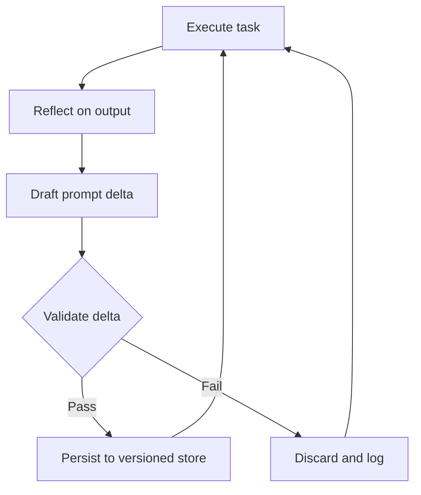

<!-- source: nibzard/awesome-agentic-patterns (Apache 2.0, https://github.com/nibzard/awesome-agentic-patterns) — retain attribution per license -->
---
title: "Self-Rewriting Meta-Prompt Loop"
description: "Agents that improve their own system prompts through a reflect-draft-validate-persist cycle, without weight updates or human intervention between runs."
tags:
  - agent-design
  - tool-agnostic
aliases:
  - autonomous prompt improvement
  - self-improving prompt loop
---

# Self-Rewriting Meta-Prompt Loop

> An agent evaluates its own outputs, drafts a targeted edit to its system prompt, validates the change against a quality gate, and persists the revision — tightening its own instructions without human edits between runs.

## The Mechanism

The loop has four steps that repeat across task executions:

1. **Reflect** — after completing a task, the agent examines its output against the task objective and identifies where its instructions led to suboptimal behavior (verbosity, format drift, missed constraints)
2. **Draft** — the agent generates a targeted delta to its own system prompt: a specific addition, deletion, or rewrite of the underperforming instruction
3. **Validate** — the proposed change is scored against a quality gate before adoption. The gate may be a held-out eval suite, a separate [critic agent](critic-agent-plan-review.md), or a programmatic check
4. **Persist** — changes that pass the gate are written to the versioned system prompt store; changes that fail are discarded and logged

This maps onto [Reflexion](https://arxiv.org/abs/2303.11366) (Shinn et al., 2023), which stores verbal reflections in an episodic memory buffer without weight updates and reaches 91% pass@1 on HumanEval. [Self-Refine](https://arxiv.org/abs/2303.17651) (Madaan et al., 2023) achieves ~20% absolute improvement via iterative self-feedback, no training required. [APE](https://arxiv.org/abs/2211.01910) (Zhou et al., 2022) shows LLMs can generate instructions that outperform human-written prompts on 19 of 24 NLP tasks.

The [nibzard/awesome-agentic-patterns catalog](https://github.com/nibzard/awesome-agentic-patterns/blob/main/patterns/self-rewriting-meta-prompt-loop.md) rates academic evidence as High and direct production adoption as Low — deployment constraints, not mechanism validity, are the bottleneck.

## When to Apply

Apply the self-rewriting meta-prompt loop when:

- The task type is high-volume and repetitive — enough runs to accumulate a reliable reflection signal
- Outputs have measurable quality (a scoring function exists, not just human preference)
- Failures are attributable to instruction gaps rather than model capability ceilings
- A rollback path exists — a versioned prompt store with tested restore

Avoid it when:

- The system prompt is exposed to adversarial inputs — crafted task outputs can poison the reflection step and rewrite instructions maliciously
- The task is safety-critical — prompt drift in production without human sign-off is a hard no
- The quality gate is weak or vague — undefined success criteria turn the loop into a random walk

## Dual-Agent Architecture

The loop is safer when executor and critic are separate agents in separate contexts. A single agent reflecting on its own output tends to rationalize rather than critique — the same assumptions that shaped the output also shape the reflection.

The recommended form:

- **Executor** — runs the task using the current system prompt, produces output
- **Critic** — receives only the task specification, the output, and the current system prompt; produces a structured assessment of which instruction caused the observed failure
- **Validator** — scores the proposed delta against a held-out benchmark before writing to the prompt store

This matches the [Evaluator-Optimizer](evaluator-optimizer.md) pattern but applied to the prompt layer rather than task output.

## Safety Constraints

Version control on the system prompt is a hard prerequisite — without a rollback path, a single bad update degrades all subsequent tasks silently.

Additional constraints that reduce risk:

- **Change magnitude limits** — cap each delta to a maximum token change per cycle. Small token-level perturbations can still alter the model's high-dimensional output space substantially ([Salinas & Morstatter, 2024](https://aclanthology.org/2024.findings-acl.275/)), so small targeted edits are easier to attribute and revert than large rewrites.
- **Canary rollouts** — deploy the updated prompt to a fraction of traffic and compare quality metrics against the current baseline before full promotion, mirroring the prompt-version rollout patterns now supported by platforms like [Langfuse A/B testing](https://langfuse.com/docs/prompt-management/features/a-b-testing).
- **Reflection input sanitization** — treat task output as untrusted before feeding it into the reflection step; strip or validate content that could include prompt-injection payloads

## Contrast with Human-Driven Refinement

[Harness Hill-Climbing](harness-hill-climbing.md) and [Skill Library Refinement Loops](../workflows/skill-library-refinement-loops.md) both improve prompts iteratively — but require a human to approve each change. The self-rewriting meta-prompt loop removes that approval step entirely: faster iteration, but unreviewed drift and adversarial exposure are the tradeoff.

A 2026 study found that reflective APO with a defective seed can degrade accuracy sharply — from 23.81% to 13.50% on GSM8K — with uninterpretable optimization trajectories ([Reflection in the Dark](https://arxiv.org/abs/2603.18388), Gao et al., 2026). A quality gate on the initial seed prompt, not just each delta, is a prerequisite.

## Key Takeaways

- The four-step cycle (reflect → draft → validate → persist) is supported by Reflexion, Self-Refine, and APE — each achieves measurable quality gains without weight updates, though gains depend on a sound quality gate and non-defective seed prompt
- Dual-agent architecture (executor + separate critic) reduces confirmation bias in the reflection step
- Version control and a validated quality gate are non-negotiable prerequisites — without them the loop has no floor
- Direct production adoption remains low; safety-critical and adversarially-exposed environments are hard exclusions
- Reflective APO methods can degrade performance when the seed prompt is defective — a quality gate on the seed, not just on each delta, is required ([Reflection in the Dark](https://arxiv.org/abs/2603.18388), Gao et al., 2026)
- Change magnitude limits and canary rollouts reduce the blast radius of prompt drift; apply the same staged-deployment discipline used for any production configuration change

## Related

- [Evaluator-Optimizer Pattern](evaluator-optimizer.md)
- [Agent Self-Review Loop](agent-self-review-loop.md)
- [Harness Hill-Climbing](harness-hill-climbing.md)
- [Loop Strategy Spectrum](loop-strategy-spectrum.md)
- [Convergence Detection](convergence-detection.md)
- [Runtime Scaffold Evolution](runtime-scaffold-evolution.md)
- [DSPy: Programmatic Prompt Optimization](dspy-programmatic-prompt-optimization.md)
- [Skill Library Refinement Loops](../workflows/skill-library-refinement-loops.md)
- [Rollback-First Design](rollback-first-design.md)
