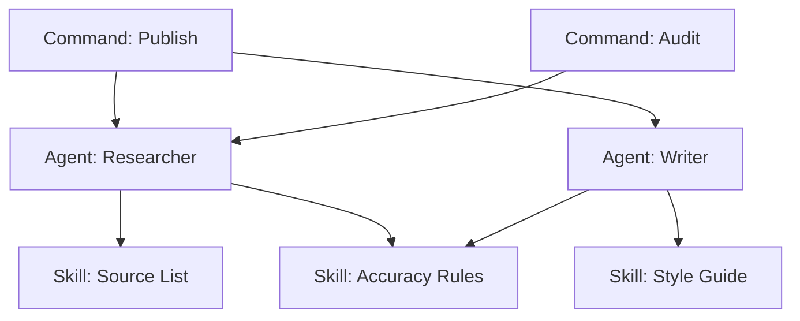

# Separation of Knowledge and Execution

> Structure agent systems in three layers — skills (knowledge), agents (execution), and commands (orchestration) — so each layer changes independently.

## The Three Layers

Agent systems that mix knowledge, execution, and orchestration into monolithic definitions become hard to maintain. The separation pattern assigns each concern to its own layer:

| Layer | Contains | Changes when |
|-------|----------|--------------|
| Skills | Domain knowledge — URL patterns, writing rules, accuracy frameworks | The domain changes |
| Agents | Execution logic — task-specific workers that compose skills | The process changes |
| Commands | Orchestration — pipeline steps, user-facing triggers | The workflow changes |

The [Agent Skills Standard](../standards/agent-skills-standard.md) defines skills as portable knowledge units shared across agents and tools. The [Claude Code sub-agents documentation](https://code.claude.com/docs/en/sub-agents) describes agents as workers that compose skills to complete tasks.

## Why Each Layer is Distinct

**Skills carry knowledge, not behavior.** A skill describing how to navigate GitHub documentation remains stable when the agent using it changes. Embedding that knowledge directly in agents duplicates it — and when the knowledge drifts, you have multiple places to update.

**Agents carry execution, not knowledge.** An agent that knows "how to research a topic" should not also encode "what URLs are authoritative for this domain." Separating these allows the same agent logic to work across different domains by swapping skills.

**Commands carry orchestration, not logic.** A command that runs the [content pipeline](../workflows/content-pipeline.md) triggers agents in sequence but doesn't implement the steps itself. You can change the workflow — add a review step, reorder stages — without touching the agents.

## Reuse and Composability



Shared skills mean a single update propagates everywhere. Shared agents mean orchestration changes don't require agent rewrites.

## Independent Testability

Each layer can be validated without the others:

- **Skills**: Are the URLs still live? Is the knowledge current? [unverified]

- **Agents**: Given a skill, does the agent produce correct output for a known input?
- **Commands**: Given working agents, does the command sequence produce the expected pipeline behavior?

This mirrors the layered architecture pattern in software — data layer, business logic, API layer — each testable and replaceable independently.

## Anti-Pattern: Embedded Knowledge

The failure mode is embedding domain knowledge directly in agent definitions. Knowledge drifts independently in each agent, verification becomes ad-hoc, and new agents require duplicating knowledge from existing ones.

## Example

The following shows a content pipeline structured across all three layers. The skill holds domain knowledge, the agent composes it with execution logic, and the command provides the orchestration trigger.

`.claude/skills/source-list.md` — the skill carries URL patterns and authority rules, not behavior:

```markdown
# Skill: Source List

## Authoritative sources for AI engineering content
- Research papers: arxiv.org (cs.AI, cs.SE sections)
- Vendor docs: docs.anthropic.com, code.claude.com, docs.github.com/copilot
- Engineering blogs: anthropic.com/engineering, blog.langchain.com

## Source quality rules
- Primary source required for all empirical claims
- Do not cite vendor marketing pages as technical evidence
- Prefer arXiv preprints over secondary summaries
```

`.claude/agents/researcher.md` — the agent composes the skill with task-specific execution logic:

```markdown
# Agent: Researcher

## Skills
@.claude/skills/source-list.md
@.claude/skills/accuracy-rules.md

## Behavior
Given a topic, search for primary sources using the source list.
Return: source URL, direct quote, and a one-sentence relevance note.
Do not summarize or interpret — return raw evidence only.
```

`.claude/commands/publish.md` — the command orchestrates agents in sequence without implementing their logic:

```markdown
# Command: Publish

## Pipeline
1. Run Researcher agent with the topic from $ARGUMENTS
2. Pass Researcher output to Writer agent
3. Pass Writer output to Reviewer agent
4. If Reviewer returns PASS, commit the file to docs/
```

With this structure, updating the source list in `source-list.md` propagates immediately to both the Researcher and any other agent that imports the skill — no agent definitions change. Swapping the Researcher for a different implementation does not require touching the command or the skill.

## Key Takeaways

- Skills hold domain knowledge; agents hold execution logic; commands hold orchestration.
- Updating a skill propagates to all agents that use it without changing agent definitions.
- Each layer can be tested and replaced independently of the others.
- Embedding knowledge in agents causes duplication, drift, and coupling.

## Unverified Claims

- Skills can be independently validated (e.g., checking if URLs are still live and knowledge is current) `[unverified]`

## Related

- [Agents vs Commands](agents-vs-commands.md)
- [Cognitive Reasoning vs Execution](cognitive-reasoning-execution-separation.md)
- [Context Priming](../context-engineering/context-priming.md)
- [Agent Handoff Protocols](../multi-agent/agent-handoff-protocols.md)
- [Worktree Isolation](../workflows/worktree-isolation.md)
- [Task-Specific vs Role-Based Agents](task-specific-vs-role-based-agents.md) — how task-specific design applies at the agent level
- [Agent Composition Patterns](agent-composition-patterns.md) — how agents compose skills and tools at different scales
- [Progressive Disclosure for Layered Agent Definitions](progressive-disclosure-agents.md) — keeping agent definitions minimal by loading task knowledge through skills on demand
- [Cost-Aware Agent Design](cost-aware-agent-design.md) — composing skills across model tiers to match capability to task complexity
- [Agentic AI Architecture: From Prompt to Goal-Directed](agentic-ai-architecture-evolution.md) — reference architecture showing how knowledge-execution separation fits into multi-agent topologies
