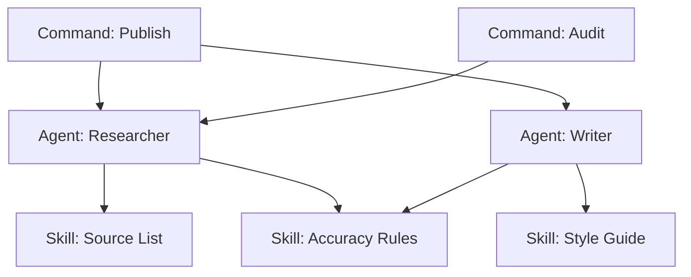

# Separation of Knowledge and Execution

> Structure agent systems in three layers — skills (knowledge), agents (execution), and commands (orchestration) — so each layer changes independently.

Related lesson: [Commands vs Agents](https://learn.agentpatterns.ai/harness-engineering/commands-vs-agents/) — this concept features in a hands-on lesson with quizzes.

## The three layers

Agent systems become hard to maintain when they mix knowledge, execution, and orchestration into one definition. The separation pattern gives each concern its own layer:

| Layer | Contains | Changes when |
|-------|----------|--------------|
| Skills | Domain knowledge — URL patterns, writing rules, accuracy frameworks | The domain changes |
| Agents | Execution logic — task-specific workers that compose skills | The process changes |
| Commands | Orchestration — pipeline steps, user-facing triggers | The workflow changes |

The [Agent Skills Standard](../standards/agent-skills-standard.md) defines skills as portable knowledge units shared across agents and tools. The [Claude Code sub-agents documentation](https://code.claude.com/docs/en/sub-agents) describes agents as workers that compose skills to complete tasks.

## Why each layer is distinct

Skills carry knowledge, not behavior. A skill describing how to navigate GitHub documentation stays stable when the agent using it changes. Embedding that knowledge directly in agents duplicates it — and when the knowledge drifts, you have several places to update.

Agents carry execution, not knowledge. An agent that knows "how to research a topic" should not also encode "what URLs are authoritative for this domain." Separate the two, and the same agent logic works across different domains: you swap the portable knowledge units the [Agent Skills Standard](../standards/agent-skills-standard.md) defines.

Commands carry orchestration, not logic. A command that runs the content pipeline triggers agents in sequence but does not implement the steps itself. You can change the workflow — add a review step, reorder stages — without touching the agents.

## Reuse and composability


```mermaid
graph TD
    C1[Command: Publish] --> A1[Agent: Researcher]
    C1 --> A2[Agent: Writer]
    C2[Command: Audit] --> A1
    A1 --> S1[Skill: Source List]
    A1 --> S2[Skill: Accuracy Rules]
    A2 --> S2
    A2 --> S3[Skill: Style Guide]
```

Shared skills mean a single update propagates everywhere. Shared agents mean orchestration changes do not require agent rewrites. Anthropic's [Building Effective Agents](https://www.anthropic.com/engineering/building-effective-agents) presents these composable patterns as the recommended building blocks for agent systems, and favours reuse over monolithic design — see [Anthropic's Effective Agents Framework](anthropic-effective-agents-framework.md) for a full taxonomy.

## Independent testability

You can validate each layer without the others:

- Skills: are the referenced URLs still live, and does the knowledge match the current tool behavior?
- Agents: given a skill, does the agent produce correct output for a known input — the validation step the [agent development lifecycle](agent-development-lifecycle.md) formalizes?
- Commands: given working agents, does the command sequence produce the expected pipeline behavior?

This mirrors the layered architecture pattern in software — data layer, business logic, API layer — each one testable and replaceable on its own.

## Anti-pattern: embedded knowledge

The failure mode is embedding domain knowledge directly in agent definitions. Knowledge then drifts on its own in each agent, verification turns ad hoc, and new agents have to duplicate knowledge from existing ones.

## When this backfires

Three-layer separation adds indirection that is not always worth it:

- Single-purpose throwaway agents: if an agent will never be reused and has no sibling agents sharing knowledge, extracting a skill file costs you file management for no payoff. The pattern suits shared reuse.
- Rapidly evolving domains: when the domain knowledge changes faster than the agents using it, a centralized skill becomes a choke point. Every agent breaks when the skill is updated, so each change needs coordinated testing across all consumers. [Progressive disclosure](progressive-disclosure-agents.md) softens this by loading skill knowledge on demand rather than baking it in.
- Small teams with one agent author: separation works best when different people or processes own different layers. When one person writes every skill, agent, and command, the split adds navigation overhead without the coordination benefit it is meant to provide.

The knowledge layer also does not scale without limit. A survey of agent-skill architectures ([Xu & Yan, "Agent Skills for Large Language Models", arXiv:2602.12430](https://arxiv.org/abs/2602.12430)) reports a phase transition: beyond a critical skill-library size, skill-selection accuracy drops sharply rather than gradually, and the routing problem of deciding which skill to activate becomes combinatorially hard as libraries grow into the hundreds. Past that threshold, more skills make the system worse, not more reusable. The separation pattern buys composability up to a point, then trades it back for a selection-and-context cost that a smaller, consolidated agent would not pay.

## Example

This content pipeline spans all three layers. The skill holds domain knowledge, the agent composes it with execution logic, and the command provides the orchestration trigger.

`.claude/skills/source-list.md` — the skill carries URL patterns and authority rules, not behavior:

```markdown
# Skill: Source List

## Authoritative sources for AI engineering content
- Research papers: arxiv.org (cs.AI, cs.SE sections)
- Vendor docs: docs.anthropic.com, code.claude.com, docs.github.com/copilot
- Engineering blogs: anthropic.com/engineering, blog.langchain.com

## Source quality rules
- Primary source required for all empirical claims
- Do not cite vendor marketing pages as technical evidence
- Prefer arXiv preprints over secondary summaries
```

`.claude/agents/researcher.md` — the agent composes the skill with task-specific execution logic:

```markdown
# Agent: Researcher

## Skills
@.claude/skills/source-list.md
@.claude/skills/accuracy-rules.md

## Behavior
Given a topic, search for primary sources using the source list.
Return: source URL, direct quote, and a one-sentence relevance note.
Do not summarize or interpret — return raw evidence only.
```

`.claude/commands/publish.md` — the command orchestrates agents in sequence without implementing their logic:

```markdown
# Command: Publish

## Pipeline
1. Run Researcher agent with the topic from $ARGUMENTS
2. Pass Researcher output to Writer agent
3. Pass Writer output to Reviewer agent
4. If Reviewer returns PASS, commit the file to docs/
```

With this structure, updating the source list in `source-list.md` propagates immediately to both the Researcher and any other agent that imports the skill — no agent definitions change. Swapping the Researcher for a different implementation does not require touching the command or the skill.

## Key Takeaways

- Skills hold domain knowledge; agents hold execution logic; commands hold orchestration — see [agents vs commands](agents-vs-commands.md) for the agent/command half of that split.
- Updating a skill propagates to all agents that use it without changing agent definitions.
- Each layer can be tested and replaced independently of the others.
- Embedding knowledge in agents causes duplication, drift, and coupling.

## Related

- [Agents vs Commands](agents-vs-commands.md)
- [Cognitive Reasoning vs Execution](cognitive-reasoning-execution-separation.md)
- [Context Priming](../context-engineering/context-priming.md)
- [Task-Specific vs Role-Based Agents](task-specific-vs-role-based-agents.md) — how task-specific design applies at the agent level
- [Agent Composition Patterns](agent-composition-patterns.md) — how agents compose skills and tools at different scales
- [Progressive Disclosure for Layered Agent Definitions](progressive-disclosure-agents.md) — keeping agent definitions minimal by loading task knowledge through skills on demand
- [Cost-Aware Agent Design](../token-engineering/cost-aware-agent-design.md) — composing skills across model tiers to match capability to task complexity
- [Agentic AI Architecture: From Prompt to Goal-Directed](agentic-ai-architecture-evolution.md) — reference architecture showing how knowledge-execution separation fits into multi-agent topologies
