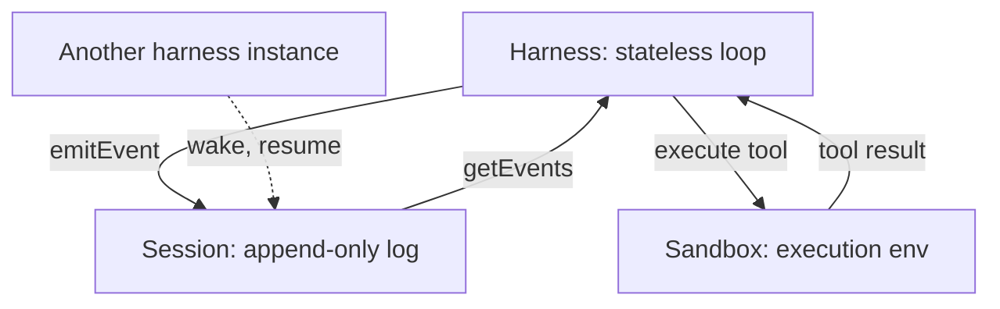

# Session Harness Sandbox Separation for Long-Running Agents

> Decouple long-running agent work into three replaceable primitives — an append-only Session log, a stateless Harness loop, and a provisioned Sandbox — so each evolves, scales, and crash-recovers independently.

## The Three Primitives

A monolithic agent process couples model inference, session state, and execution environment. When any one churns — models shift, execution targets multiply, or a crash forces recovery — the others pay the cost. The pattern splits the process along layers whose churn rates differ by orders of magnitude ([Anthropic, 2026](https://www.anthropic.com/engineering/managed-agents)):

- **Session** — an append-only event log of everything that happened. The authoritative state; not any in-memory harness object.
- **Harness** — a stateless loop that calls the model and routes tool calls. Any harness instance can resume any session.
- **Sandbox** — a provisioned execution environment where the agent runs code and edits files. Uniform tool interface regardless of target.

## Stable APIs as the Seams

The split works because the interfaces between primitives are narrow and stable. Anthropic documents the reference shape ([Anthropic, 2026](https://www.anthropic.com/engineering/managed-agents)):

| Surface | Call | Role |
|---------|------|------|
| Sandbox | `execute(name, input)` | Dispatch a tool or MCP call; returns a string result |
| Sandbox | `provision({resources})` | Spin up the execution environment on demand |
| Session | `emitEvent(id, event)` | Append a durable event to the log |
| Session | `getEvents()` | Slice the event stream positionally for context reconstruction |
| Harness | `wake(sessionId)` | Reboot a harness instance against an existing session |

LangChain's Deep Agents Deploy (April 2026) ships the same three-layer architecture on open models and sandboxes: "The high level architecture (harness, agent server, sandboxes) is the same" ([LangChain, 2026](https://blog.langchain.com/deep-agents-deploy-an-open-alternative-to-claude-managed-agents/)).

## Why Statelessness Pays

Because the Session — not the Harness — is the source of truth, two properties fall out:

**Crash recovery is free.** A failed harness is replaced by any other harness that calls `wake(sessionId)` and replays events. "Any Harness instance can pick up any Session and continue from where it left off. This is what makes horizontal scaling trivial" ([Anthropic, 2026](https://www.anthropic.com/engineering/managed-agents)).

**Inference starts before provisioning finishes.** The harness can call the model against the event log while the sandbox is still spinning up. Anthropic reports ~60% p50 and >90% p95 reduction in time-to-first-token attributed to this decoupling ([Anthropic, 2026](https://www.anthropic.com/engineering/managed-agents)).

Models change on months-to-year cadence; harness code evolves session-to-session; sandboxes provision per session. Narrow APIs let each layer churn independently — Anthropic's OS analogy: "the abstractions outlasted the hardware" ([Anthropic, 2026](https://www.anthropic.com/engineering/managed-agents)).

## Security Follows the Split

Credentials never reach the sandbox. Two patterns hold the invariant ([Anthropic, 2026](https://www.anthropic.com/engineering/managed-agents)):

- **Resource-bundled auth** — git tokens wired into local remotes during `provision`, then discarded from the sandbox environment
- **Vault-proxied auth** — OAuth tokens kept in a credential store the harness reaches via an MCP proxy; the sandbox sees only tool responses

"The tokens are never reachable from the sandbox where Claude's generated code runs" ([Anthropic, 2026](https://www.anthropic.com/engineering/managed-agents)). The separation is enforced by the shape of the APIs, not by convention.

## Many Brains, Many Hands

A stateless harness and uniform sandbox interface compose into a fan-out: multiple harnesses attach to overlapping sessions, and one harness dispatches to heterogeneous sandboxes. "The harness doesn't know whether the sandbox is a container, a phone, or a Pokémon emulator" ([Anthropic, 2026](https://www.anthropic.com/engineering/managed-agents)). This enables A/B model rollouts, migrations without rewriting session logs, and work distribution across specialized targets.

## When This Is Overbuilt

Three conditions where the cost exceeds the benefit:

- **Short, single-sandbox sessions.** Crash recovery is never exercised; provisioning is short; no model migration is planned. A coupled harness is simpler to build and debug.
- **Unbounded log growth without retention.** The Session is append-only and grows linearly with session length. Long sessions force compaction, and "the standard ways to address this all involve irreversible decisions about what to keep" ([Anthropic, 2026](https://www.anthropic.com/engineering/managed-agents)).
- **Event-schema evolution.** Replay correctness requires a stable event shape. When the schema changes across harness versions, old logs stop replaying under new code; migration is expensive and error-prone.

For complex multi-agent coordination, "a flat log is fundamentally insufficient" ([Yan, Medium, April 2026](https://medium.com/data-science-collective/anthropic-just-shipped-three-of-the-five-harness-layers-for-managed-agent-and-the-other-two-are-on-14979cb4cf00)) — additional memory layers must sit on top of the Session.

## Example

A coding agent is asked to migrate a repository from Python 3.10 to 3.12 over a multi-hour run. Midway through, the harness process crashes.

**Without virtualized primitives**: the in-memory conversation and partial tool results are lost. A new process cannot distinguish "git clone was attempted and failed" from "git clone completed successfully". The task restarts from scratch, rerunning destructive operations or producing inconsistent state.

**With Session / Harness / Sandbox split**:

- The Session log contains every event up to the crash: `provision` call, each `execute("bash", ...)` with its return, every model turn and tool result
- A replacement harness calls `wake(sessionId)` and receives the log via `getEvents()`
- The sandbox still holds the on-disk state from before the crash (same container, same filesystem); the harness reconciles by reading the last few events and resuming at the next tool call
- Git credentials that initialized the remote during `provision` are not re-exposed to the sandbox — no credential leak across the crash boundary

The user sees a brief pause, not a restart. Time-to-first-token on resume is dominated by the model call, not by reprovisioning the sandbox ([Anthropic, 2026](https://www.anthropic.com/engineering/managed-agents)).

## Key Takeaways

- Three virtualized primitives with narrow APIs: Session (`emitEvent`, `getEvents`), Harness (stateless, wake-able), Sandbox (`execute`, `provision`)
- The Session is the source of truth; statelessness of the harness makes crash recovery and horizontal scale fall out of the design
- TTFT improves because inference starts against the event log in parallel with sandbox provisioning — measured at ~60% p50, >90% p95 reduction by Anthropic
- Security is structural: credentials never reach the sandbox because the API shape prevents it
- Overbuilt for short single-sandbox sessions; watch for unbounded log growth and event-schema drift

## Related

- [Managed vs Self-Hosted Agent Harness](managed-vs-self-hosted-harness.md) — which layer to run on, versus how the layer is structured internally
- [Agent Harness: Initializer and Coding Agent](agent-harness.md) — the two-phase initializer/worker pattern that predates full virtualization
- [Harness Engineering](harness-engineering.md) — the broader discipline of environment design for reliable agent output
- [Event Sourcing for Agents](../observability/event-sourcing-for-agents.md) — the event-sourcing pattern that the Session log instantiates
- [Scaffold Architecture Taxonomy](scaffold-architecture-taxonomy.md) — where this pattern sits among agent scaffolding choices
- [Cognitive Reasoning vs Execution: A Two-Layer Agent](cognitive-reasoning-execution-separation.md) — a finer-grained split within the harness layer
