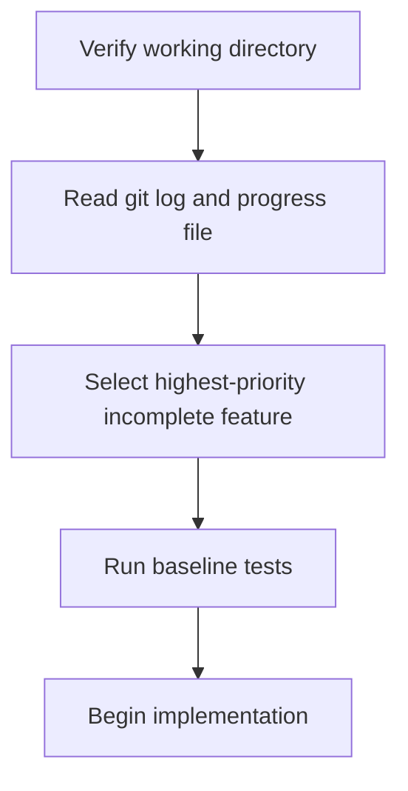

# Session Initialization Ritual: How Agents Orient Themselves

> A mandatory startup sequence that every agent session executes before touching code — verify state, orient to progress, confirm baseline health, then act.

## The Problem With Cold Starts

An agent dropped into an active project mid-session has no inherent awareness of prior work, what's broken, or where to begin. Without a structured startup sequence, the agent makes assumptions: it may duplicate completed work, start in the wrong directory, or ignore bugs left by a previous session. A session initialization ritual eliminates this ambiguity by giving every session a shared on-ramp.

## The Ritual

[Anthropic's harness engineering guidance](harness-engineering.md) describes an initializer agent pattern for long-running workflows. Applied to coding sessions, the ritual maps to five ordered steps:



### 1. Verify Working Directory

Run `pwd` and confirm it matches the expected path. Agents operating in monorepos, worktrees, or multi-repo environments are especially prone to this error. A wrong working directory causes every subsequent action to fail silently or corrupt the wrong location.

### 2. Read Git Log and Progress File

Read `git log --oneline -20` and any progress file (a markdown or JSON file updated by previous sessions) to establish what was completed and what remains. Without this step, the agent starts from scratch each session regardless of prior work.

### 3. Select the Highest-Priority Incomplete Feature

Identify one feature from the incomplete list and commit to it for the session. Multi-tasking within a session increases context fragmentation and produces incomplete, inconsistent output. Selecting one item — and finishing it — is the harness constraint that prevents the agent from spreading effort across several half-done tasks [unverified].

### 4. Run Baseline Tests

Before writing a line of code, run the test suite and confirm it passes. This catches bugs introduced by the previous session before the current session compounds them. An agent that skips this step risks building on broken foundations and misattributing failures to its own changes.

### 5. Begin Implementation

Only after steps 1–4 complete successfully does the agent write code. If any prior step reveals an unexpected state — wrong directory, stale progress file, failing tests — the agent pauses and surfaces the discrepancy rather than proceeding.

## Enforcing the Ritual

The ritual is only reliable when it is non-negotiable. [Anthropic's effective harnesses guidance](harness-engineering.md) notes that initializer agents differ from working agents in their initial user prompts — the harness enforces sequence, not the agent's discretion.

In practice:

- Encode the ritual as system prompt instructions with explicit ordering: "You must complete steps 1 through 4 before writing any code."
- Require the agent to output a confirmation for each step before proceeding [unverified].

- Use pre-commit hooks to enforce that git log was consulted (e.g., by requiring a commit message format that references the progress file).

## Progress Files

A progress file persists state across sessions in a form the agent can read. A minimal format:

```markdown
## Completed
- [x] User authentication flow
- [x] Token refresh logic

## In Progress
- [ ] Password reset endpoint — 60% complete, stub at `/api/auth/reset`

## Backlog
- [ ] OAuth provider integration
- [ ] Session expiry handling
```

The agent reads this at startup, selects the highest-priority incomplete item, and updates the file when the session ends. Version-control the file so it survives across machines and context window resets.

## Example

A system prompt encoding the five-step ritual for a Claude Code agent session:

```text
You MUST complete these steps in order before writing any code:

1. Run `pwd` and confirm the output matches `/home/dev/myproject`.
   If it does not, stop and report the mismatch.

2. Run `git log --oneline -20` and read `PROGRESS.md`.
   Summarize what was completed and what remains.

3. From the incomplete items in PROGRESS.md, select the single
   highest-priority feature. State which feature you chose and why.

4. Run `npm test` and confirm all tests pass.
   If any test fails, diagnose and fix the failure before proceeding.

5. Begin implementation on the selected feature.
   When finished, update PROGRESS.md and commit.
```

On session start the agent produces output like:

```text
Step 1: Working directory is /home/dev/myproject — confirmed.
Step 2: Last 3 commits added token refresh logic. PROGRESS.md shows
        "Password reset endpoint" at 60% — stub exists at /api/auth/reset.
Step 3: Selecting "Password reset endpoint" — highest priority incomplete item.
Step 4: Running npm test... 42 passed, 0 failed — baseline clean.
Step 5: Beginning implementation of password reset endpoint.
```

## Key Takeaways

- Run `pwd` first — wrong working directory causes silent failures.
- Read git log and a progress file before touching code — establish completed and remaining work.
- Run baseline tests before implementing — catch bugs from previous sessions early.
- Select one feature per session and finish it — no multi-tasking within a session.
- Enforce the ritual via system prompt instructions, not agent discretion.

## Unverified Claims

- Selecting one feature per session and finishing it is the harness constraint that prevents effort spreading `[unverified]`
- Requiring the agent to output a confirmation for each step before proceeding ensures ritual compliance `[unverified]`

## Related

- [Context Priming](../context-engineering/context-priming.md)
- [The Ralph Wiggum Loop](ralph-wiggum-loop.md)
- [Loop Strategy Spectrum](loop-strategy-spectrum.md)
- [Context Compression Strategies](../context-engineering/context-compression-strategies.md)
- [Worktree Isolation](../workflows/worktree-isolation.md)
- [Trajectory Logging via Progress Files and Git History](../observability/trajectory-logging-progress-files.md)
- [Episodic Memory Retrieval](episodic-memory-retrieval.md)
- [Memory Synthesis from Execution Logs](memory-synthesis-execution-logs.md)
- [Subtask-Level Memory](subtask-level-memory.md)
- [Agent Harness](agent-harness.md)
- [Goal Monitoring and Progress Tracking](goal-monitoring-progress-tracking.md)
- [Agent Memory Patterns](agent-memory-patterns.md)
- [Beads: Structured Task Graphs as External Agent Memory](beads-task-graph-agent-memory.md)
