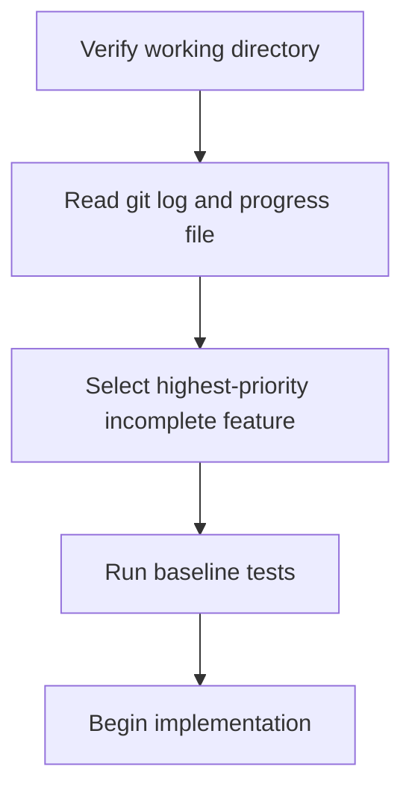

# Session Initialization Ritual: How Agents Orient Themselves

> A mandatory startup sequence that every agent session executes before touching code — verify state, orient to progress, confirm baseline health, then act.

## The Problem With Cold Starts

An agent dropped into an active project mid-session has no inherent awareness of prior work, what's broken, or where to begin. Without a structured startup sequence it makes assumptions: duplicates completed work, starts in the wrong directory, or ignores bugs left by a previous session. A session initialization ritual eliminates this ambiguity by giving every session a shared on-ramp.

## The Ritual

[Anthropic's harness engineering guidance](https://www.anthropic.com/engineering/effective-harnesses-for-long-running-agents) describes an initializer agent pattern for long-running workflows, a design also documented in the [ZenML LLMOps case study](https://www.zenml.io/llmops-database/long-running-agent-harness-for-multi-context-software-development) of the same system. Applied to coding sessions, the ritual maps to five ordered steps:


```mermaid
graph TD
    A[Verify working directory] --> B[Read git log and progress file]
    B --> C[Select highest-priority incomplete feature]
    C --> D[Run baseline tests]
    D --> E[Begin implementation]
```

### 1. Verify Working Directory

Run `pwd` and confirm it matches the expected path. Agents operating in monorepos, worktrees, or multi-repo environments are especially prone to this error. A wrong working directory causes every subsequent action to fail silently or corrupt the wrong location.

### 2. Read Git Log and Progress File

Read `git log --oneline -20` and any progress file (a markdown or JSON file updated by previous sessions) to establish what was completed and what remains. Without this step the agent starts from scratch each session regardless of prior work.

### 3. Select the Highest-Priority Incomplete Feature

Pick one feature from the incomplete list and commit to it for the session. Multi-tasking fragments context and produces incomplete output; finishing one item is the harness constraint that prevents spreading effort across half-done tasks. Anthropic's [harness engineering practice](https://www.anthropic.com/engineering/effective-harnesses-for-long-running-agents) found this "incremental approach turned out to be critical to addressing the agent's tendency to do too much at once."

### 4. Run Baseline Tests

Run the test suite and confirm it passes before writing code. This catches bugs from the previous session before the current one compounds them, and avoids misattributing those failures to the current change set.

### 5. Begin Implementation

Only after steps 1–4 complete does the agent write code. If any prior step reveals an unexpected state — wrong directory, stale progress file, failing tests — the agent pauses and surfaces the discrepancy rather than proceeding.

## Enforcing the Ritual

The ritual is only reliable when it is non-negotiable. Anthropic's [effective harnesses guidance](https://www.anthropic.com/engineering/effective-harnesses-for-long-running-agents) notes that initializer agents differ from working agents in their initial user prompts — the harness enforces sequence, not agent discretion. Parallel Web Systems' [harness overview](https://parallel.ai/articles/what-is-an-agent-harness) makes the same point: startup steps belong to the deterministic scaffold around the model, not to the model itself.

In practice:

- Encode the ritual as system prompt instructions with explicit ordering: "You must complete steps 1 through 4 before writing any code."
- Require the agent to output a brief status line for each step before proceeding — this creates an auditable trace and surfaces unexpected states early.
- Use pre-commit hooks to enforce that git log was consulted (e.g., by requiring a commit message format that references the progress file).

## Progress Files

A progress file persists state across sessions in a form the agent can read. A minimal format:

```markdown
## Completed
- [x] User authentication flow
- [x] Token refresh logic

## In Progress
- [ ] Password reset endpoint — 60% complete, stub at `/api/auth/reset`

## Backlog
- [ ] OAuth provider integration
- [ ] Session expiry handling
```

The agent reads this at startup, selects the highest-priority incomplete item, and updates the file when the session ends. Version-control the file so it survives across machines and context window resets.

## The Bootstrap Contract

The ritual describes *what* the agent does at startup. The Bootstrap Contract specifies *what must be true for that ritual to succeed*. [Walkinglabs' harness-engineering lecture on initialization](https://github.com/walkinglabs/learn-harness-engineering/blob/main/docs/en/lectures/lecture-06-why-initialization-needs-its-own-phase/index.md) defines it as four conditions a fresh session must be able to satisfy from repo contents alone — no verbal context:

- Can **start** the project
- Can **test** it
- Can **see progress** so far
- Can **pick up next steps**

The contract materialises as a markdown document that maps directly onto the ritual's read steps:

```markdown
# Bootstrap Contract

## Start Commands
- Install: `make setup`
- Run dev server: `make dev`
- Run tests: `make test`
- Full verification: `make check`

## Current State
- Dependencies installed and locked
- Test framework configured (Vitest + React Testing Library)
- Example test passing (1/1)
- Lint rules configured (ESLint + Prettier)

## Project Structure
- src/ — Source code
- src/components/ — React components
- src/api/ — API client
- tests/ — Test files
```

A new agent session reads the contract and answers "how do I run, test, and see what's done" without inference. The walkinglabs lecture frames the inverse failure as **implicit assumption landmines** — decisions made during one session (which test framework, how directories are organised, how dependencies are managed) that subsequent sessions cannot recover and may contradict.

Validate the contract before declaring initialization complete: open a fresh agent session with only repo contents and check whether it can answer those four questions. Each gap is a missing clause.

## Measuring Init Quality with TTFV

**Time-to-First-Verification (TTFV)** is the leading metric for initialization quality, defined by [the same lecture](https://github.com/walkinglabs/learn-harness-engineering/blob/main/docs/en/lectures/lecture-06-why-initialization-needs-its-own-phase/index.md) as the minutes between session start and the first green verification signal — a passing test, a successful build, a lint clean run. Rising TTFV across sessions is a regression in init quality: the agent is spending more time re-deriving context than verifying work.

**Downstream Usability** is the lagging counterpart — the proportion of subsequent sessions that execute tasks without re-deriving context. Both measure the same property; TTFV catches problems sooner.

The mechanism for why this matters is documented in [Anthropic's harness engineering guidance](https://www.anthropic.com/engineering/effective-harnesses-for-long-running-agents): initialization patterns "eliminated the need for an agent to have to guess at what had happened and spend its time trying to get the basic app working again." Every minute of guessing is a minute not spent on verification — TTFV makes that cost visible.

### Cold Start vs Warm Start

The lecture distinguishes two starting positions:

- **Cold start** — an empty directory where the agent infers structure from scratch. High TTFV, no contract to read.
- **Warm start** — a templated project with directory structure, test framework, and contract already preset. Low TTFV from session one.

A warm-start strategy preloads init infrastructure (project templates, pre-baked configs, an empty Bootstrap Contract scaffolded into the template) so the first session writes the *project-specific* portion of the contract rather than authoring it from nothing.

### When the Investment Pays Back

[The walkinglabs lecture](https://github.com/walkinglabs/learn-harness-engineering/blob/main/docs/en/lectures/lecture-06-why-initialization-needs-its-own-phase/index.md) reports that upfront init investment is recovered within the next 3–4 sessions — the time spent writing start commands, current state, and project structure is amortised across every session that no longer has to re-infer them. Below that horizon (one-shot scripts, throwaway prototypes) the contract adds cost without recovery. Above it, TTFV converges to a low steady state and the ritual becomes routine rather than overhead.

## Example

A system prompt encoding the five-step ritual for a Claude Code agent session:

```text
You MUST complete these steps in order before writing any code:

1. Run `pwd` and confirm the output matches `/home/dev/myproject`.
   If it does not, stop and report the mismatch.

2. Run `git log --oneline -20` and read `PROGRESS.md`.
   Summarize what was completed and what remains.

3. From the incomplete items in PROGRESS.md, select the single
   highest-priority feature. State which feature you chose and why.

4. Run `npm test` and confirm all tests pass.
   If any test fails, diagnose and fix the failure before proceeding.

5. Begin implementation on the selected feature.
   When finished, update PROGRESS.md and commit.
```

On session start the agent produces output like:

```text
Step 1: Working directory is /home/dev/myproject — confirmed.
Step 2: Last 3 commits added token refresh logic. PROGRESS.md shows
        "Password reset endpoint" at 60% — stub exists at /api/auth/reset.
Step 3: Selecting "Password reset endpoint" — highest priority incomplete item.
Step 4: Running npm test... 42 passed, 0 failed — baseline clean.
Step 5: Beginning implementation of password reset endpoint.
```

## When This Backfires

The ritual adds overhead at session start — when that cost outweighs the benefit, the pattern degrades:

- **Stale progress file**: If the file is not updated at session end, the next session reads stale state and picks the wrong task. The ritual amplifies a missing exit habit rather than replacing it.
- **Long baseline test suites**: When tests take minutes, agents skip the step under time pressure — scope it to a fast smoke test or targeted subset.
- **Single-session work**: For short tasks with no prior context, startup adds latency with no orientation benefit. Apply the ritual only when prior state exists to read.
- **Context overloading**: A large git log, verbose progress file, and multiple config files front-load context consumption. Keep progress files minimal.

## Key Takeaways

- Run `pwd` first — wrong working directory causes silent failures.
- Read git log and a progress file before touching code — establish completed and remaining work.
- Run baseline tests before implementing — catch bugs from previous sessions early.
- Select one feature per session and finish it — no multi-tasking within a session.
- Enforce the ritual via system prompt instructions, not agent discretion.
- Write a Bootstrap Contract — a fresh session must answer "can I start, test, see progress, pick up next steps" from repo contents alone.
- Track TTFV across sessions — rising time-to-first-verification is the earliest signal that init quality is regressing.
- Prefer warm start over cold start when the project will run beyond 3–4 sessions; contract maintenance pays back inside that window.

## Related

- [Context Priming](../context-engineering/context-priming.md)
- [Trajectory Logging via Progress Files and Git History](../observability/trajectory-logging-progress-files.md)
- [Agent Harness](agent-harness.md)
- [Harness Engineering](harness-engineering.md)
- [Goal Monitoring and Progress Tracking](goal-monitoring-progress-tracking.md)
- [Agent Memory Patterns](agent-memory-patterns.md)
- [Cross-Cycle Consensus Relay](cross-cycle-consensus-relay.md) — the relay document the ritual reads before acting on a new cycle
- [Worktree Isolation](../workflows/worktree-isolation.md)
