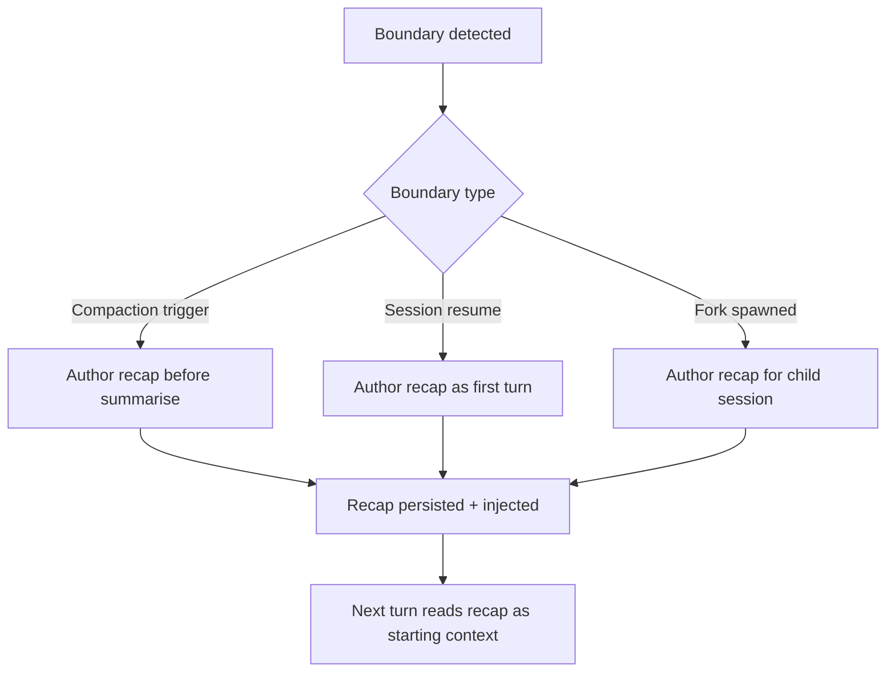

# Session Recap: Goal-Shaped Handoff at Context Boundaries

> A recap is a structured, agent-authored artifact written at a session boundary — compaction, resume, or fork — that preserves goal-state rather than text-density, so the next turn can proceed without replaying the full trajectory.

## What a Recap Is (and Isn't)

Recap is the *goal-shaped* counterpart to compaction's *text-density* compression. [Compaction](../context-engineering/context-compression-strategies.md) summarises conversation turns to free context; it optimises for preserving observations and decisions in prose. A recap is invoked at a known boundary to produce a fixed-schema artifact the next turn reads as its starting context.

| Artifact | Trigger | Shape | Consumer | Scope |
|----------|---------|-------|----------|-------|
| Compaction summary | Context threshold (e.g. 85–95%) | Prose, text-dense | Same session, post-compression | History compression |
| [Progress file](../observability/trajectory-logging-progress-files.md) (`todo.md`) | Every step (continuous) | File, incrementally updated | Agent + human, any turn | Running state |
| [Goal recitation](../context-engineering/goal-recitation.md) | Every step (continuous) | Prose at context tail | Same session | Objective reinforcement |
| **Session recap** | Discrete boundary (compaction / resume / fork) | Fixed schema, goal-shaped | Next turn (agent) or returning human | Handoff |

Compaction answers "what happened, compressed?" Recap answers "why are we here and what's next?"

## When Recap Earns Its Cost

Authoring a recap costs tokens. It pays off only under specific conditions:

- A **natural boundary** exists — compaction fired, the session was resumed after a pause, a fork was spawned for parallel work, or a scheduled checkpoint reached
- No continuous progress-file pattern already owns the same state — if the agent already maintains a `todo.md` every step ([goal recitation](../context-engineering/goal-recitation.md)), a recap duplicates it
- The **consumer is defined** — an agent resuming needs different fields than a human returning to a stale terminal. Claude Code's `/recap` is framed as "context when returning to a session" ([Claude Code v2.1.108 changelog](https://code.claude.com/docs/en/changelog), April 14, 2026), where the consumer may be either

Outside these conditions, a recap adds a second surface of truth that can drift from existing state.

## Minimal Schema

A goal-shaped recap preserves four fields — not observations, not tool outputs:

```yaml
# Written by the agent at the boundary; read on the next turn.
session_intent: >
  Refactor UserService to use dependency injection without changing
  public method signatures.
decisions_made:
  - Chose constructor injection over setter injection
  - Kept UserRepository interface; injected concrete DbUserRepository
open_questions:
  - Should session.py also migrate in this pass, or follow-up?
current_focus: Migrating UserService tests to mock the injected dependency
next_action: Run the updated test file and confirm all pass
```

The schema is small on purpose. [LangChain's analysis of DeepAgents context management](https://blog.langchain.com/context-management-for-deepagents/) notes that a named `session_intent` field survives compression better than prose because compressors preserve *structure* more reliably than *salience*. A fixed schema gives the next turn a predictable handle.

## Who Authors It, When

The agent authors its own recap. The harness fires the authoring step at a detectable boundary:



Claude Code implements the resume-return case directly: v2.1.108 added `/recap` as a manually invocable command and `CLAUDE_CODE_ENABLE_AWAY_SUMMARY` to force it when telemetry is disabled ([changelog](https://code.claude.com/docs/en/changelog)). Tool-agnostic harnesses replicate the primitive by invoking the agent at the boundary with a prompt that names the schema fields explicitly, then persisting the output to a known path (`.session/recap.md`, `session_intent.json`) for the next turn to read.

## Why It Works

Compaction optimises for retaining information density. Continuity requires retaining decision-density: *why* a choice was made, *what* is open, *what* comes next. These fields appear once in the trajectory and are cheap to discard during prose compression. The [objective-drift](../anti-patterns/objective-drift.md) anti-pattern captures the failure mode — a single-instance constraint dissolves in summarisation while the core task (repeated across many messages) survives, so the agent keeps working on a subtly wrong objective.

A structured recap authored before compression preserves decision-density verbatim; the next turn reads it as its seed context rather than reconstructing from a compressed history.

## Example

An agent midway through a multi-hour refactor hits its compaction threshold. Before summarising, the harness invokes the recap step:

**Before** — compaction alone:

```
[Long prose summary of conversation turns, tool calls, and outputs.
Mentions the refactor goal repeatedly. The constraint "no public method
signature changes" appeared once, 20 turns ago, in the original brief.]
```

**After** — recap authored first, then compaction:

```yaml
# .session/recap.md — authored by the agent pre-compaction
session_intent: Refactor UserService to use dependency injection
hard_constraints:
  - Do not change any public method signatures
  - Changes limited to src/services/user_service.py and its tests
decisions_made:
  - Constructor injection pattern; interface unchanged
open_questions: []
current_focus: Running the test suite after injection wiring
next_action: If tests pass, commit; if not, diagnose the mock setup
```

After compaction the agent's first read is the recap. The `hard_constraints` block — specifically the method-signature rule — is still present verbatim, not paraphrased into the prose summary.

## Key Takeaways

- Recap is a goal-shaped artifact authored at a boundary; compaction is text-density compression run at a threshold
- The schema (intent, decisions, open questions, focus, next action) preserves decision-density that prose summarisation discards
- Pay the token cost only at real boundaries — compaction, resume, fork — and only when no continuous progress file already owns the state
- Claude Code's `/recap` (v2.1.108, April 2026) is one concrete implementation; the tool-agnostic protocol is a fixed-schema write at a known discontinuity

## Related

- [Context Compression Strategies](../context-engineering/context-compression-strategies.md) — the text-density compression recap complements
- [Objective Drift](../anti-patterns/objective-drift.md) — the failure mode recap addresses
- [Post-Compaction Re-read Protocol](../instructions/post-compaction-reread-protocol.md) — restoring instruction fidelity after compaction, a sibling handoff
- [Goal Recitation](../context-engineering/goal-recitation.md) — the continuous alternative for single-session runs
- [Agent Memory Patterns](agent-memory-patterns.md) — cross-session persistence, the layer above per-session recap
- [Session Initialization Ritual](session-initialization-ritual.md) — the ritual a recap feeds into on resume
- [Cross-Cycle Consensus Relay](cross-cycle-consensus-relay.md) — structured handoff artifacts for long-running loops across sessions
