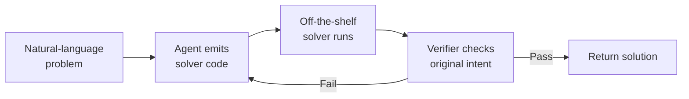

# Solver-Externalized Constraint Reasoning (MaxSAT/SMT Encoding)

> Have the agent emit a formal encoding for z3, python-sat, or OR-Tools instead of reasoning through constraints in prose — then verify the solver's output.

Solver-externalized constraint reasoning is a three-step pattern: the agent translates a multi-constraint problem into a formal encoding (MaxSAT, SMT, or CP), an exact off-the-shelf solver returns an optimum, and an independent check confirms the result satisfies the original intent. It extends the Program-of-Thought line — "let the model write code, not reason in prose" — to constraint satisfaction ([Wolfe — Program-Aided Language Models](https://cameronrwolfe.substack.com/p/program-aided-language-models)).

## When This Pattern Applies

The pattern is **conditional**, not universal. Apply it only when all three hold:

- **Crisp objective** — preferences encode as numeric weights or hard/soft clauses without inventing trade-offs the user did not state
- **Decidable, tractable fragment** — the theory is one the solver handles (linear arithmetic, bitvectors, finite-domain CSP); nonlinear integer arithmetic and similar undecidable fragments are out of scope ([John D. Cook on Z3 limits](https://www.johndcook.com/blog/2025/03/17/lessons-learned-with-the-z3-sat-smt-solver/))
- **Verifiable solution** — you can independently check the solver's answer against the original constraints, not just the encoded ones ([Orvalho et al. — arXiv:2605.29687](https://arxiv.org/abs/2605.29687))

Skip it when prose reasoning suffices, when fuzzy preferences make any numeric encoding false precision, or when constraints depend on real-world signals the encoding cannot ingest.

## The Three-Step Pattern



**1. Encode.** The agent writes Python that constructs the formal encoding — `z3.Solver()` calls for SMT, `pysat` clauses for MaxSAT, `ortools.sat.python.cp_model` for CP-SAT. Here natural-language preferences become hard constraints, weighted soft constraints, and an objective.

**2. Solve.** An exact solver computes an optimal assignment. SAT, SMT, and MaxSAT solvers carry formal correctness guarantees on the encoded problem — the *only* layer of the stack with that property.

**3. Verify.** A separate check confirms the output satisfies the original prompt constraints, not just the ones the encoding captured. The cited paper uses a dual-encoding canonicalisation that accommodates multiple optima ([Orvalho et al. — arXiv:2605.29687](https://arxiv.org/abs/2605.29687)); practical setups re-run the constraints against the candidate and print the proof.

Verification is not optional. LLM-generated combinatorial-optimisation output is not feasibility-safe by default; constraint violations are routine without an explicit check layer ([Yan et al. — arXiv:2602.01090](https://arxiv.org/abs/2602.01090)).

## Why It Works

The pattern moves the load-bearing step onto a tool with formal correctness guarantees. LLMs are reliable at language understanding and code synthesis but unreliable on multi-step constraint satisfaction, where each added constraint compounds silent-mistake risk. Handing the encoding to an exact solver converts an unreliable competency into a reliable one — the mechanism behind Program-of-Thought: separate code generation from execution so the verifier certifies what the model could not ([Orvalho et al. — arXiv:2605.29687](https://arxiv.org/abs/2605.29687); [Wolfe — Program-Aided Language Models](https://cameronrwolfe.substack.com/p/program-aided-language-models)). The cited paper reports the externalised pipeline exceeding 80% acceptance on three reasoning families where chain-of-thought and program-of-thought baselines rarely yield a feasible solution. Replication on operations-research problems shows the same shape: a three-stage decomposition (model → solver code → debug) beats LLM-only baselines by 7% accuracy ([Zhang et al. — OR-LLM-Agent, arXiv:2503.10009](https://arxiv.org/abs/2503.10009)).

## When This Backfires

- **Soft preferences without a crisp objective.** When preferences cannot become numeric weights without arbitrary choices, the encoding becomes the source of error ([Cook on Z3 limits](https://www.johndcook.com/blog/2025/03/17/lessons-learned-with-the-z3-sat-smt-solver/)).
- **Undecidable or intractable fragments.** Nonlinear integer arithmetic is undecidable; SMT solvers return `unknown` or time out, and the pattern fails silently when constraints drift there ([Cook on Z3 limits](https://www.johndcook.com/blog/2025/03/17/lessons-learned-with-the-z3-sat-smt-solver/)).
- **Natural-language mis-translation.** The model writes valid code that encodes the wrong problem; without verification, the agent reports an "optimal" answer to a different question ([Yan et al. — arXiv:2602.01090](https://arxiv.org/abs/2602.01090); [Wang et al. — arXiv:2409.09271](https://arxiv.org/pdf/2409.09271)).
- **Tiny problems and low stakes.** The solver dependency is not justified when prose suffices, and a human spots a prose mistake more easily than a MaxSAT-clause one.
- **Signals the encoding cannot ingest.** When real-world state (current load, qualitative judgement) belongs in the constraints but cannot be made formal, the solver returns a mathematically optimal but operationally wrong answer.

## Off-the-Shelf Solvers

Reach for an established solver, not a paper-specific one — the pattern externalises to a verified routine, not a particular engine.

| Solver | Theory | Use for |
|--------|--------|---------|
| [z3](https://github.com/Z3Prover/z3) | SMT (LIA, BV, arrays, strings) | Config validation, dependency resolution, type-system encodings |
| [python-sat](https://pysathq.github.io/) | SAT + MaxSAT | Preference-weighted discrete-choice problems |
| [OR-Tools CP-SAT](https://github.com/google/or-tools/blob/stable/ortools/sat/docs/scheduling.md) | CP + scheduling | Scheduling, timetabling, resource allocation |

Practitioner reports already pair this triad with LLM-generated encodings — translating scheduling requirements into CP-SAT code for personal logistics is a documented case ([Lobsters discussion](https://lobste.rs/s/wnrum7/new_life_hack_using_llms_generate); [Towards Data Science: Constraint Programming in Python](https://towardsdatascience.com/constraint-programming-67ac16fa0c81/)).

## Example

A team-scheduling problem: assign five engineers to five on-call shifts so each engineer covers at most two shifts, each shift has one engineer, no engineer covers consecutive shifts, and preferences (engineer X prefers weekends, engineer Y prefers weekdays) are honoured where possible.

Instead of asking the agent to reason through the assignment in prose, prompt it to emit CP-SAT code:

```python
from ortools.sat.python import cp_model

model = cp_model.CpModel()
engineers, shifts = range(5), range(5)
x = {(e, s): model.NewBoolVar(f"x_{e}_{s}")
     for e in engineers for s in shifts}

# Each shift covered by exactly one engineer
for s in shifts:
    model.Add(sum(x[e, s] for e in engineers) == 1)

# Each engineer covers at most two shifts
for e in engineers:
    model.Add(sum(x[e, s] for s in shifts) <= 2)

# No engineer covers consecutive shifts
for e in engineers:
    for s in range(len(shifts) - 1):
        model.Add(x[e, s] + x[e, s + 1] <= 1)

# Soft preferences as objective
preferences = {(0, 4): 1, (0, 3): 1, (1, 0): 1, (1, 1): 1}
model.Maximize(sum(w * x[e, s] for (e, s), w in preferences.items()))

solver = cp_model.CpSolver()
status = solver.Solve(model)
```

The solver returns an assignment; a verification pass checks each hard constraint against the candidate before the agent reports the result. If verification fails, the encoding step gets repaired — not the solver's output ([Yan et al. — arXiv:2602.01090](https://arxiv.org/abs/2602.01090)).

## Key Takeaways

- Apply only when constraints have a crisp objective, the theory is decidable, and you can independently verify the solver's output against the original intent.
- The encoding step is where mistakes hide — the solver is correct on the problem it was given, not on the problem the user asked.
- Pick an off-the-shelf solver (z3, python-sat, OR-Tools CP-SAT) instead of building a paper-specific system; the pattern is about externalising, not about a particular engine.
- A verification pass that checks the solver's answer against the original constraints is part of the pattern, not optional.

## Related

- [Externalization in LLM Agents: Memory, Skills, Protocols, and Harness](externalization-in-llm-agents.md) — Broader framework for moving cognitive burdens out of the model; this pattern is the constraint-reasoning instance of that shift.
- [Cognitive Reasoning vs Execution: A Two-Layer Agent Architecture](cognitive-reasoning-execution-separation.md) — The architectural split this pattern depends on — reasoning generates the encoding, execution runs the solver.
- [RubricRefine: Pre-Execution Rubric Refinement for Code-Mode Tool Use](rubric-refine-pre-execution-tool-use.md) — Pre-execution check on agent-emitted tool-use code; the verification step in this pattern plays the same role for solver code.
- [Critic Agent Pattern](critic-agent-plan-review.md) — A second model reviewing the encoding before solver invocation is the practical form of this pattern's verification step.
- [Deterministic Guardrails Around Probabilistic Agents](../verification/deterministic-guardrails.md) — The exact solver and the verification pass are deterministic guardrails wrapped around the probabilistic encoding step.
