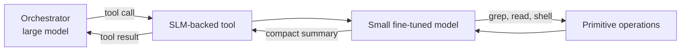

# Specialized Small Language Models as Agent Sub-Tools

> A large orchestrator agent invokes a tool that internally runs a small fine-tuned model. The SLM absorbs verbose intermediate context (file contents, terminal output, search results) and returns a compact answer — the orchestrator never sees the raw bytes.

A specialized-SLM-as-tool is *nested model invocation* hidden behind a tool-call interface. The orchestrator issues one tool call; inside the tool, a smaller model runs its own loop over the underlying primitives (grep, file read, shell) and returns a summarised result. VS Code 1.118 ships two production examples — an "agentic search tool" and an "agentic execution tool" — and reports up to 20% token savings from the combination ([VS Code 1.118 release notes](https://code.visualstudio.com/updates/v1_118)).

## What Makes This Structurally Different

The SLM is not selected as the agent for a turn, and it does not share weights with the orchestrator. It lives behind a tool boundary, invisible to the orchestrator's reasoning surface.

| Pattern | Selection unit | Where the small model lives |
|---------|---------------|----------------------------|
| [Cross-vendor competitive routing](cross-vendor-competitive-routing.md) | Whole task | Replaces the orchestrator |
| [Cost-aware tier routing](cost-aware-agent-design.md) | Per turn or per role | Replaces the orchestrator for that turn |
| [Role orchestration on a single model](role-orchestration-single-model.md) | Per role | Same weights, different conditioning |
| **SLM-as-tool** | Per tool call | Inside a tool, behind a function-call interface |

The orchestrator sees a normal tool definition. It does not know — and does not need to know — that the implementation runs a model loop internally.

## How It Works

VS Code 1.118's agentic search tool runs "a fine-tuned small language model, trained to run many searches in parallel" over grep, file search, semantic search, and file reading. The agentic execution tool handles terminal commands and "filters that output down to what a coding agent actually needs," capped at 10 calls per invocation to bound runaway loops ([VS Code 1.118 release notes](https://code.visualstudio.com/updates/v1_118)).

The savings come from one mechanism: verbose intermediate context (full file contents, raw terminal output, dozens of search hits) stays inside the SLM's window. Only the compact final answer crosses the boundary.

## When It Pays Off

The pattern fits operations that are high-volume and narrow:

- **Codebase exploration** — many parallel searches, large intermediate results, shallow reasoning
- **Terminal output filtering** — verbose stdout/stderr, only a few lines matter for the next decision
- **Document reading and summarisation inside a tool** — long inputs, short answers
- **Pre-aggregated data fetching** — multiple primitive calls combined into one tool result

Belcak et al. argue SLMs are "sufficiently powerful, inherently more suitable, and necessarily more economical for many invocations in agentic systems" ([Belcak et al., 2025](https://arxiv.org/abs/2506.02153)). This composes with API-level features rather than replacing them — VS Code 1.118 reports the Anthropic Tool Search Tool delivers "up to 20% in token savings" on its own ([VS Code 1.118 release notes](https://code.visualstudio.com/updates/v1_118); [Anthropic — Advanced Tool Use](https://www.anthropic.com/engineering/advanced-tool-use)).

## When It Backfires

- **Small tool surface** — when the orchestrator uses few tools or short-output primitives, the SLM's own framing tokens can exceed what it saves
- **Latency-sensitive interactive flows** — nested model invocations stack serially; an orchestrator → SLM → primitive chain is slower than a direct tool call
- **Error attribution opacity** — when the result is wrong, evals must distinguish SLM summarisation failure from primitive failure; without trace separation, two surfaces collapse into one
- **Determinism-required outputs** — diff application or security operations cannot tolerate an SLM summarising the result; the tool must pass raw output through, defeating the savings
- **Brittle narrow training** — SLMs fine-tuned for one surface can fail on adjacent intents; the VS Code 10-call cap on the execution tool exists to bound this failure mode ([VS Code 1.118 release notes](https://code.visualstudio.com/updates/v1_118))

## Trade-offs vs Direct Tool Calls

| Approach | Pros | Cons |
|----------|------|------|
| SLM-backed tool | Verbose intermediate state stays out of orchestrator context; can run many parallel sub-operations and summarise | Nested model loop adds latency and a second hallucination surface; harder to attribute failures |
| Direct primitive tool (grep, fd, bash) | Deterministic, debuggable, zero model-call cost; raw output is auditable | Verbose output enters orchestrator context |
| API tool search ([Anthropic Tool Search Tool](../tool-engineering/advanced-tool-use.md)) | Defers tool *definitions* until needed | Does not reduce per-call output volume; complementary, not a substitute |

The two efficiency surfaces — fewer tool definitions, smaller tool outputs — are independent and compose.

## Example

VS Code 1.118 illustrates the pattern with two shipped tools:

**Agentic search tool** — when the orchestrator needs to find where a symbol is used, it calls one tool. Inside, an SLM trained for parallel search uses grep, file search, semantic search, and file read; reads the matching files; and returns a compact list of relevant locations and snippets. The orchestrator sees one tool call with a short result instead of a sequence of grep calls and file reads filling its context ([VS Code 1.118 release notes](https://code.visualstudio.com/updates/v1_118)).

**Agentic execution tool** — when the orchestrator needs to run a build or a test, it calls one tool. The SLM runs the command (capped at 10 calls per invocation), filters verbose stdout/stderr, and returns only what changes the orchestrator's next decision (passed/failed, the failing assertion, the relevant traceback line). The cap exists specifically to prevent the SLM from looping indefinitely against a misconfigured environment ([VS Code 1.118 release notes](https://code.visualstudio.com/updates/v1_118)).

In the same release, prompt caching reuses "more than 93% of each request" once a session begins, with cache breakpoints set at stable boundaries (end of system prompt, end of tools, end of most recent tool turn, conversation turn boundaries) ([VS Code 1.118 release notes](https://code.visualstudio.com/updates/v1_118)). SLM-backed tools shrink the *new* portion of each request; caching minimises the cost of the *repeated* prefix. The two effects compose.

## Key Takeaways

- SLM-as-tool is nested model invocation behind a function-call boundary — structurally distinct from per-task vendor selection or per-turn tier routing
- The savings mechanism is keeping verbose intermediate state out of the orchestrator's context window, not making the SLM smarter at the underlying task
- Pattern fits high-volume narrow operations (search, exploration, terminal output filtering); it backfires on small tool surfaces, latency-sensitive flows, and determinism-required outputs
- Composes with API-level features like tool search and prompt caching — these address different efficiency surfaces (tool definitions, cached prefix) than the SLM-backed tool addresses (per-call output volume)

## Related

- [Cross-Vendor Competitive Routing](cross-vendor-competitive-routing.md) — selects one vendor per task; no nesting
- [Role Orchestration on a Single Model](role-orchestration-single-model.md) — same weights, different conditioning per role
- [Cost-Aware Agent Design](cost-aware-agent-design.md) — heterogeneous models per role with fallback chains
- [Code-Health-Gated Tier Routing](code-health-gated-tier-routing.md) — pre-call tier selection on file health
- [Cognitive Reasoning vs Execution](cognitive-reasoning-execution-separation.md) — two-layer split, typically across different models
- [Advanced Tool Use](../tool-engineering/advanced-tool-use.md) — Anthropic Tool Search Tool, programmatic calling, tool use examples
- [Token-Efficient Tool Design](../tool-engineering/token-efficient-tool-design.md) — design-level strategies for shrinking tool output
- [Orchestrator-Worker Pattern](../multi-agent/orchestrator-worker.md) — multi-agent decomposition; SLM-as-tool is a single-agent analogue
