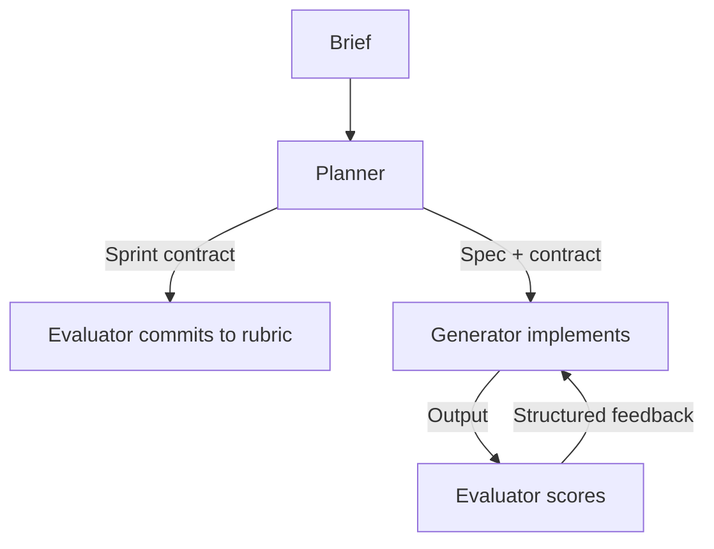

# Sprint Contracts

> A pre-coding agreement between planner, generator, and evaluator agents that converts vague goals into graded scoring dimensions before implementation begins — preventing evaluator rationalization and enabling consistent feedback loops.

## The Problem

Multi-agent loops break down when success criteria are undefined at coding time. Evaluators score output against whatever the generator produced, drifting toward approval because they have no prior commitment to contradict. Generators optimize for undefined targets and produce inconsistent results.

Without explicit criteria agreed *before* generation, evaluation becomes post-hoc rationalization — the evaluator sees plausible output and convinces itself the requirements were met.

## Structure

The pattern uses three agent roles, each with a distinct session and context boundary ([Anthropic Engineering, March 2026](https://www.anthropic.com/engineering/harness-design-long-running-apps)):

- **Planner** — expands a brief into a spec, scopes one sprint chunk, writes the contract, and hands it to the evaluator before the generator starts.
- **Generator** — implements against the contract. No access to the evaluator's session or reasoning.
- **Evaluator** — commits to the rubric *before* seeing output, then scores the generator's result against the agreed dimensions.



The contract is written before the generator starts — not derived from its output. This ordering is the mechanism: the evaluator cannot rationalize decisions it did not make.

## Graded Dimensions

Sprint contracts define success as weighted dimensions, not binary pass/fail. Anthropic's engineering post describes four frontend design dimensions:

| Dimension | What it measures |
|-----------|-----------------|
| Design Quality | Coherent visual identity across colors, typography, layout |
| Originality | Custom decisions vs. templates; penalizes "AI slop" patterns |
| Craft | Technical execution: hierarchy, spacing, contrast ratios |
| Functionality | Usability independent of aesthetics |

Weights are explicit and agreed upfront. The generator knows what matters; the evaluator cannot later shift weights to justify approval.

## Evaluator Calibration

An uncalibrated evaluator is a liability. Without tuning, LLM-based evaluators approve mediocre output — they rationalize rather than reject ([Anthropic Engineering](https://www.anthropic.com/engineering/harness-design-long-running-apps)). Research on LLM-as-judge systems identifies self-enhancement bias and position bias as common failure modes — evaluators score outputs they "authored" or encountered first more favorably regardless of quality ([Zheng et al., NeurIPS 2023](https://arxiv.org/abs/2306.05685)). Shankar et al. document a related "criteria drift" effect: evaluators and humans refine their criteria while grading outputs, so some rubric dimensions cannot be fully specified upfront ([Shankar et al., UIST 2024](https://arxiv.org/abs/2404.12272)). Sprint contracts treat the pre-committed rubric as a floor — expected to extend during calibration — not a frozen specification.

Calibration process:

1. Run the evaluator against known-good and known-bad examples.
2. Identify where its judgment diverged from the correct verdict.
3. Update the system prompt to enforce skepticism at those failure points.
4. Add few-shot examples to reduce score drift.

An evaluator that passes its calibration suite but drifts on production output needs its few-shot set expanded.

## Context Isolation

The evaluator must not have access to the generator's reasoning. When a generator explains decisions inline — "I chose this layout because..." — an evaluator that reads those explanations inherits the generator's framing and is more likely to accept the output.

Session-level isolation enforces the boundary: the evaluator receives the artifact and the contract, not the generator's session transcript. File-based communication supports this — one agent writes, the other reads, with no shared context window.

## When to Apply

Sprint contracts pay off when:

- The task spans multiple implementation cycles and consistent evaluation matters
- Success criteria are subjective enough that an unconstrained evaluator would drift (UI design, creative work, product features)
- Output quality is hard to verify programmatically — judgment is needed but must be consistent

Skip them when:

- Criteria are machine-checkable (tests pass, lint is clean) — an evaluator-optimizer with a test suite is simpler
- The task fits in a single generation pass
- Evaluation dimensions cannot be agreed before implementation

## Relationship to Adjacent Patterns

Sprint contracts extend the [evaluator-optimizer pattern](evaluator-optimizer.md) with an upfront commitment step: the contract fixes the scoring rubric before generation, where the base pattern scores whatever the generator produces.

The [critic agent pattern](critic-agent-plan-review.md) reviews the *plan* before execution. Sprint contracts gate on *scoring criteria* before generation — a later checkpoint focused on measurable outcomes rather than plan validity.

## Caveat: Model Capability Changes the Trade-Off

Sprint decomposition is scaffolding. It pays off when models struggle to sustain coherent work across long tasks; as frontier models improve, the overhead can outweigh the benefit. The same Anthropic post was later updated to describe removing the sprint construct once Claude Opus 4.6 could plan, sustain agentic work, and self-review over a full run — the evaluator shifted to a single end-of-run pass ([Anthropic Engineering](https://www.anthropic.com/engineering/harness-design-long-running-apps)). Treat the contract as conditional on model capability and revisit decomposition when a more capable model ships.

## Example

A sprint contract for a UI component generator might look like:

```yaml
# sprint-contract-v1.yaml
task: "Build a dashboard header component"
chunk: "Navigation bar with user avatar and notifications"

dimensions:
  design_quality:
    weight: 0.35
    criteria: "Consistent color palette, readable typography, logical layout hierarchy"
  originality:
    weight: 0.30
    criteria: "Custom decisions over Bootstrap defaults; no generic card/shadow patterns"
  craft:
    weight: 0.20
    criteria: "Accessible contrast ratios, consistent spacing (8px grid), responsive breakpoints"
  functionality:
    weight: 0.15
    criteria: "Avatar renders, notification badge updates, mobile menu collapses"

passing_threshold: 0.72
```

Harness flow:

```python
contract = load_contract("sprint-contract-v1.yaml")

# Evaluator commits to rubric before generation starts
evaluator_session = create_session(system_prompt=build_evaluator_prompt(contract))
evaluator_session.send("Acknowledge the scoring dimensions and weights.")

# Generator runs in an isolated session — no access to evaluator session
generator_session = create_session(system_prompt=build_generator_prompt(contract))
artifact = generator_session.send("Implement the component per the spec.")

# Evaluator scores the artifact, not the generator's reasoning
score = evaluator_session.send(f"Score this artifact:\n\n{artifact}")
```

The evaluator session holds no memory of the generator's reasoning — it receives only the contract and the artifact. If `score.total < contract.passing_threshold`, the harness feeds the structured feedback back to the generator for another cycle.

## Key Takeaways

- The contract is written before the generator starts; the evaluator commits to scoring dimensions before seeing any output — this ordering prevents rationalization
- Graded dimensions with explicit weights replace binary pass/fail, giving the generator a clear optimization target
- Evaluator calibration against known-good and known-bad examples is a prerequisite for consistent evaluation; uncalibrated evaluators drift toward approval
- Session-level context isolation between generator and evaluator enforces independence — the evaluator scores the artifact, not the generator's rationale
- Harness scaffolding encodes assumptions about model capability; revisit contracts and calibration as models improve

## Related

- [Evaluator-Optimizer Pattern](evaluator-optimizer.md)
- [Critic Agent Pattern](critic-agent-plan-review.md)
- [Specialized Agent Roles](specialized-agent-roles.md)
- [Agent Harness](agent-harness.md)
- [Harness Engineering](harness-engineering.md)
- [Convergence Detection](convergence-detection.md)
- [Loop Strategy Spectrum](loop-strategy-spectrum.md)
- [Spec-Driven Development](../workflows/spec-driven-development.md)
