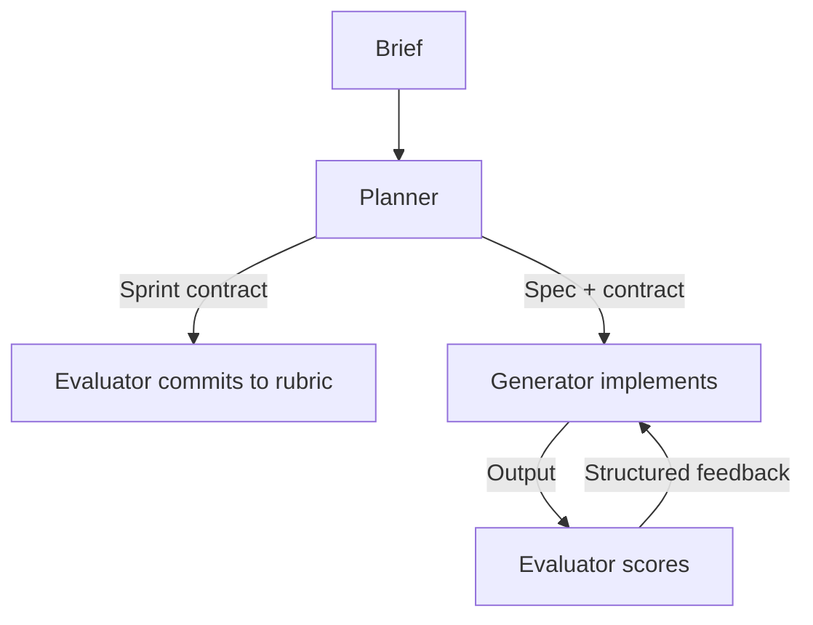

# Sprint Contracts

> A pre-coding agreement between planner, generator, and evaluator agents that converts vague goals into graded scoring dimensions before implementation begins — preventing evaluator rationalization and enabling consistent feedback loops.

## The Problem

Multi-agent loops break down when success criteria are undefined at coding time. Evaluators score output against whatever the generator produced, drifting toward approval of mediocre work because they have no prior commitment to contradict. Generators optimize for undefined targets and produce inconsistent results across runs.

The failure mode is structural: without explicit criteria agreed *before* generation, evaluation becomes post-hoc rationalization. The evaluator sees plausible output and convinces itself the requirements were met.

## Structure

The sprint contract pattern uses three agent roles, each with a distinct session and context boundary ([Anthropic Engineering, March 2026](https://www.anthropic.com/engineering/harness-design-long-running-apps)):

- **Planner** — expands a brief (1–4 sentences) into a product specification. Scopes deliverables for one sprint chunk, writes the contract, and hands it to the evaluator before the generator starts.
- **Generator** — implements against the contract. Has no access to the evaluator's session or reasoning.
- **Evaluator** — commits to the scoring rubric *before* seeing generated output, then scores the generator's result against the agreed dimensions.



The contract is written before the generator starts — not derived from its output. This ordering is the mechanism: the evaluator cannot rationalize decisions it did not make.

## Graded Dimensions

Sprint contracts define success as weighted dimensions, not binary pass/fail. The Anthropic engineering post describes four frontend design dimensions as an example:

| Dimension | What it measures |
|-----------|-----------------|
| Design Quality | Coherent visual identity across colors, typography, layout |
| Originality | Custom decisions vs. templates; penalizes "AI slop" patterns |
| Craft | Technical execution: hierarchy, spacing, contrast ratios |
| Functionality | Usability independent of aesthetics |

Weights are explicit and agreed upfront. A contract that emphasizes design quality and originality over craft and functionality produces different generator behavior than an equal-weight contract. The generator knows what matters; the evaluator cannot later shift weights to justify approval.

## Evaluator Calibration

An uncalibrated evaluator is a liability. Without tuning, LLM-based evaluators approve mediocre output — they rationalize rather than reject ([Anthropic Engineering](https://www.anthropic.com/engineering/harness-design-long-running-apps)). Research on LLM-as-judge systems identifies self-enhancement bias and position bias as common failure modes — evaluators score outputs they "authored" or encountered first more favorably regardless of quality ([Zheng et al., NeurIPS 2023](https://arxiv.org/abs/2306.05685)).

Calibration process:

1. Run the evaluator against known-good and known-bad examples.
2. Read logs to identify where the evaluator's judgment diverged from the correct verdict.
3. Update the evaluator's system prompt to enforce skepticism at those specific failure points.
4. Add few-shot examples with detailed breakdowns to align evaluator preferences and reduce score drift.

Calibration is iterative and continues as the generator produces new edge cases. An evaluator that passes its calibration suite but drifts on production output needs its few-shot set expanded.

## Context Isolation

The evaluator must not have access to the generator's reasoning. When a generator explains its decisions inline — "I chose this layout because..." — an evaluator that reads those explanations inherits the generator's framing and is more likely to accept the output.

Session-level isolation enforces the boundary: the evaluator receives the artifact and the contract, not the generator's session transcript. File-based communication between agents (structured artifacts on disk) supports this — one agent writes, the other reads, and no shared context window exists between them.

## When to Apply

Sprint contracts pay off when:

- The task spans multiple implementation cycles where consistent evaluation matters
- Success criteria are subjective enough that an unconstrained evaluator would drift (UI design, creative work, product features)
- Generator output quality is hard to verify programmatically — human-level judgment is needed but must be consistent

Skip them when:

- Criteria are machine-checkable (tests pass, lint is clean) — the evaluator-optimizer with a test suite is simpler and more reliable
- The task is short enough that a single generation pass is adequate
- Evaluation dimensions cannot be agreed before implementation — the contract requires upfront clarity

## Relationship to Adjacent Patterns

Sprint contracts extend the [evaluator-optimizer pattern](evaluator-optimizer.md) with an upfront commitment step. The evaluator-optimizer has no pre-agreement: the evaluator scores whatever the generator produces. Sprint contracts add the contract phase, which fixes the scoring rubric before generation.

The [critic agent pattern](critic-agent-plan-review.md) reviews the *plan* before execution. Sprint contracts have the evaluator agree to *scoring criteria* before generation — a later gate, focused on measurable outcomes rather than plan validity.

## Example

A sprint contract for a UI component generator might look like:

```yaml
# sprint-contract-v1.yaml
task: "Build a dashboard header component"
chunk: "Navigation bar with user avatar and notifications"

dimensions:
  design_quality:
    weight: 0.35
    criteria: "Consistent color palette, readable typography, logical layout hierarchy"
  originality:
    weight: 0.30
    criteria: "Custom decisions over Bootstrap defaults; no generic card/shadow patterns"
  craft:
    weight: 0.20
    criteria: "Accessible contrast ratios, consistent spacing (8px grid), responsive breakpoints"
  functionality:
    weight: 0.15
    criteria: "Avatar renders, notification badge updates, mobile menu collapses"

passing_threshold: 0.72
```

Harness flow:

```python
contract = load_contract("sprint-contract-v1.yaml")

# Evaluator commits to rubric before generation starts
evaluator_session = create_session(system_prompt=build_evaluator_prompt(contract))
evaluator_session.send("Acknowledge the scoring dimensions and weights.")

# Generator runs in an isolated session — no access to evaluator session
generator_session = create_session(system_prompt=build_generator_prompt(contract))
artifact = generator_session.send("Implement the component per the spec.")

# Evaluator scores the artifact, not the generator's reasoning
score = evaluator_session.send(f"Score this artifact:\n\n{artifact}")
```

The evaluator session holds no memory of the generator's reasoning — it receives only the contract and the artifact. If `score.total < contract.passing_threshold`, the harness feeds the structured feedback back to the generator for another cycle.

## Key Takeaways

- The contract is written before the generator starts; the evaluator commits to scoring dimensions before seeing any output — this ordering prevents rationalization
- Graded dimensions with explicit weights replace binary pass/fail, giving the generator a clear optimization target
- Evaluator calibration against known-good and known-bad examples is a prerequisite for consistent evaluation; uncalibrated evaluators drift toward approval
- Session-level context isolation between generator and evaluator enforces independence — the evaluator scores the artifact, not the generator's rationale
- Harness scaffolding encodes assumptions about model capability; revisit contracts and calibration as models improve

## Related

- [Evaluator-Optimizer Pattern](evaluator-optimizer.md)
- [Critic Agent Pattern](critic-agent-plan-review.md)
- [Specialized Agent Roles](specialized-agent-roles.md)
- [Agent Harness](agent-harness.md)
- [Harness Engineering](harness-engineering.md)
- [Convergence Detection](convergence-detection.md)
- [Loop Strategy Spectrum](loop-strategy-spectrum.md)
- [Spec-Driven Development](../workflows/spec-driven-development.md)
