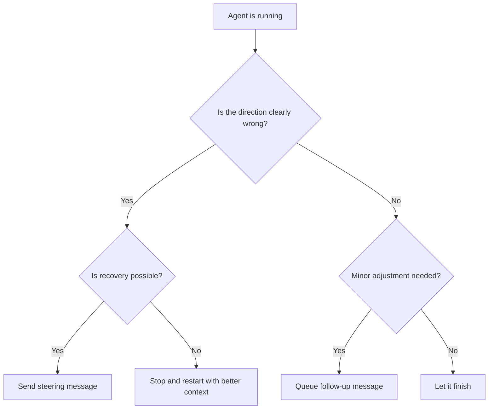

# Steering Running Agents: Mid-Run Redirection and Follow-Ups

> Steering a running agent means sending a mid-execution message that redirects its tool calls without discarding the context already built — conversation history, file reads, and prior results all remain available.

!!! note "Also known as"
    **Mid-Run Correction**, **Unsticking Stuck Agents**. Proactive human intervention — redirecting agents before they go too far off course. For *reactive* pre-built recovery mechanisms, see [Escape Hatches](../workflows/escape-hatches.md).

## Two Correction Mechanisms

**Steering message**: A mid-run user message that interrupts tool execution and redirects behavior. The agent stops its current approach and responds to the new direction.

**Follow-up message**: A correction queued during execution, delivered after the current step completes. The agent finishes what it's doing, then processes the queued message.

Both preserve accumulated context. Restarting discards it.

## When to Use Each



**Steer** when the agent is heading toward wasted context or unusable output — wrong file, wrong approach, misunderstood requirement.

**Follow up** when the current step is fine but you want to adjust the next one — "also update the tests" or "use the existing utility function."

**Restart** when the agent is too far down the wrong path. A fresh context with a better prompt is cheaper than repeated steering.

**Let it finish** when the approach is acceptable, even if not ideal.

## Observing Agent Direction

Effective steering depends on reading tool calls as they happen. Most agent interfaces show tool use in real time. Watch which files are read and which commands run to detect wrong direction early.

Indicators that a steer may be needed:

- Reading files unrelated to the task
- Creating new abstractions when existing ones should be used
- Tool calls suggest it misunderstood the scope
- Repeating the same search with minor variations (stuck)

## Anti-Patterns

**Waiting too long**: Letting the agent finish a bad approach before correcting. Context is consumed on useless work, and you still need to undo it.

**Over-steering**: Interrupting every few steps. The initial prompt was underspecified — restart with a clearer specification.

**Steering instead of restarting**: Trying to salvage a fundamentally wrong run through multiple steers. Restart is cheaper.

**Ignoring tool calls**: Steering requires detecting wrong direction early through active observation, not waiting for output.

## Practical Notes

Steer as early as possible — ideally after the first tool call that signals a problem.

Follow-up messages work best when the current step is short. For long-running steps, steering mid-step may be more efficient.

Interface behavior varies: Claude Code queues messages typed during execution and delivers them at the next turn boundary — pressing Enter alone does not interrupt the current step ([issue #36326](https://github.com/anthropics/claude-code/issues/36326)). To interrupt immediately, press Ctrl+C first, then send your message.

## Example

You ask Claude Code to refactor the authentication module. After two tool calls you see it is reading files in the payment module instead.

**What you observe in the tool-call stream:**

```
Tool: read_file("src/payments/stripe_client.py")   ← wrong module
Tool: read_file("src/payments/webhook_handler.py") ← still wrong
```

**Steering message** — interrupt immediately, before the agent has read more unrelated files:

```
Stop. You're reading the payments module. The task is to refactor
src/auth/ only — specifically auth/session.py and auth/tokens.py.
Do not touch anything in src/payments/.
```

The agent stops, acknowledges the redirect, and re-reads the correct files. The conversation history (and the two payment file reads) remain in context, but the agent's next tool calls target `src/auth/` as instructed.

**Follow-up message scenario** — the agent is correctly refactoring `auth/session.py` and is mid-way through. You want to add one more requirement without interrupting:

```
After you finish the session refactor, also update
auth/tokens.py to use the same expiry constant you define in session.py.
```

The agent queues this and processes it once the session refactor step completes. No context is lost and the agent already has the session.py changes in context when it moves to tokens.py.

Both messages preserve the file reads and reasoning the agent has already accumulated. A restart at this point would discard that context and require the agent to re-read the auth files from scratch.

## Key Takeaways

- Steering messages interrupt mid-run; follow-up messages queue for after the current step
- Both preserve accumulated context; restarting discards it
- Steer early — detecting wrong direction from tool calls beats correcting finished output
- Over-steering signals an underspecified prompt; fix the prompt, not the run

## Why It Works

LLM inference is stateless between calls, but context is not — each tool call appends its inputs and outputs to the conversation history that feeds the next call. When you steer mid-run, you prepend a new instruction to that accumulated history. The model reads the correction together with everything it has already learned: file contents, error messages, prior tool results. A restart, by contrast, discards all accumulated context and forces the model to re-read files and re-derive conclusions it had already reached, paying both token and latency costs again. Steering is efficient precisely because LLM context windows are readable in both directions: past results inform future steps regardless of when the instruction arrived.

## When This Backfires

**Irreversible side-effects already executed**: If the agent has already written to a database, sent API requests, or pushed commits, a mid-run steer redirects future steps but cannot undo completed actions. In pipelines with irreversible side-effects, checkpoint-and-restart with pre-verified state is safer than ad-hoc mid-run correction.

**Interfaces that only queue, not interrupt**: Sending a follow-up when you mean to interrupt does not stop the current step. In Claude Code, typed messages queue until the next turn boundary; only Ctrl+C produces an immediate interrupt ([issue #36326](https://github.com/anthropics/claude-code/issues/36326)). If the current step consumes significant context in the wrong direction, a queued correction arrives too late to be cost-effective.

**Heavily cached sub-agent architectures**: In orchestrator-worker setups where workers run in isolated context windows, a steering message to the orchestrator does not propagate to already-dispatched workers. The worker completes its current task with the original instruction; only the next dispatch receives the correction.

**Accumulated context is itself the problem**: If earlier tool calls introduced noise — verbose error traces, irrelevant file contents, or conflicting outputs — preserving that context may hurt the subsequent steps rather than help them. Restart with a cleaner prompt when the context itself is contaminated.

## Related

- [Rollback-First Design](rollback-first-design.md) — design agent actions to be reversible before irreversible side-effects execute
- [Escape Hatches](../workflows/escape-hatches.md) — reactive recovery mechanisms for stuck agents
- [Agent Debugging](../observability/agent-debugging.md)
- [Wink: Classifying and Auto-Correcting Coding Agent Misbehaviors](wink-agent-misbehavior-correction.md) — auto-correcting misbehaving agents mid-run
- [Agent Loop Middleware](agent-loop-middleware.md) — middleware hooks for observing and intervening in the agent loop
- [Agent Turn Model](agent-turn-model.md) — the multi-step inference-tool-call loop that a single agent turn runs through
- [Goal Monitoring and Progress Tracking](goal-monitoring-progress-tracking.md) — detecting wrong direction through progress signals
- [The Ralph Wiggum Loop](ralph-wiggum-loop.md) — restarting with fresh context when steering cannot salvage a run
- [Convergence Detection](convergence-detection.md) — deciding when to stop or redirect an iterating agent
- [Team Onboarding for Agent Workflows](../workflows/team-onboarding.md)
- [The AI Development Maturity Model: From Skeptic to Agentic](../workflows/ai-development-maturity-model.md)
