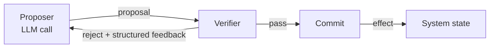

# Stochastic-Deterministic Boundary as First-Class Contract

> Treat the LLM-proposal-to-system-action boundary as a typed four-part contract — proposer, verifier, commit, reject — once a system has multiple action sites or risky commits.

The stochastic-deterministic boundary (SDB) names the transition where an LLM's probabilistic output becomes a deterministic system effect. Naming it as a first-class object places a typed verifier and structured reject signal at every such transition, instead of scattering ad-hoc `try/except` downstream where the error context is gone ([Srinivasan, 2026 — arXiv:2605.20173](https://arxiv.org/abs/2605.20173)).

## When to Apply

Apply the contract only when at least one condition holds:

- **Multiple LLM-to-action transitions.** Two or more call-sites whose verifier and commit semantics differ (planner emitting patches, router emitting tool calls, refunder emitting API requests).
- **Non-trivial commit side effects.** The commit writes to external state — database, billing API, deployment — where partial writes are expensive to reverse.
- **Replay or audit requirements.** Compliance or eval pipelines need to re-run verifier and commit against new model versions without re-rolling the proposer.

Single-call assistants and read-only flows do not need the contract. Anthropic warns frameworks "create extra layers of abstraction that can obscure the underlying prompts and responses" — start simple and add layers only when performance demands it ([Anthropic, Building Effective Agents](https://www.anthropic.com/engineering/building-effective-agents); see [Anthropic's Effective Agents Framework](anthropic-effective-agents-framework.md) for pattern selection guidance).

## The Four Parts

| Part | Role | Determinism |
|------|------|-------------|
| **Proposer** | LLM call that emits a candidate action (tool call, patch, JSON payload). | Stochastic |
| **Verifier** | Typed check that the proposal is well-formed and policy-conformant. Schema validation, tests, lint, policy rules, or a second model. | Deterministic where possible |
| **Commit** | The actual write — tool dispatch, DB write, API call, file mutation. | Deterministic |
| **Reject signal** | Structured failure message returned to the proposer with enough specificity to drive a revision. | Deterministic |

The reject signal is the part most often missing. A boolean verifier leaves the proposer guessing; one that returns the failed field, the violated rule, and an example of acceptable input converges in one round.

## Why It Works

Most production agent incidents happen at the transition point, not inside the proposer or commit. In the MAST failure taxonomy that Augment Code's production analysis draws on, inter-agent misalignment — where one component's output is incompatible with what the next consumes, such as a planner emitting YAML while the executor expects JSON — is one of the largest failure categories, roughly a third of observed multi-agent failures ([Augment Code, 2026](https://www.augmentcode.com/guides/why-multi-agent-llm-systems-fail-and-how-to-fix-them)). Naming the SDB forces a typed verifier and structured reject at every transition, where failure context is still local.

Separating the stochastic proposer from the deterministic commit also makes "replay divergence" debuggable — the failure mode where re-executing a logged session against an updated model produces different outputs. With the proposer's output logged separately, verifier and commit can be replayed deterministically against any new model version ([Srinivasan, 2026](https://arxiv.org/abs/2605.20173)).

## Where It Fits

The SDB generalises the boundary that several existing patterns implement at different points in the loop:

- [Critic Agent](critic-agent-plan-review.md) places the contract at the *plan* stage — the verifier is a second model reviewing the full plan.
- [Evaluator-Optimizer](evaluator-optimizer.md) places it around *generated output* in a refinement loop — the reject drives revisions until PASS.
- [Inference-Time Tool-Call Reviewer](inference-time-tool-call-reviewer.md) places it at *each provisional tool call* — intercepted between proposer and harness dispatch.

Naming the SDB lets you discuss whether a system has a verifier at all, where it lives, and whether the reject is structured — independently of where in the loop the boundary sits.

## When This Backfires

The contract is over-engineered in these conditions:

- **Single-call assistants.** With one LLM call and one downstream effect, the four parts collapse to "parse the JSON; if it parses, write it." Spelling out four roles adds vocabulary without reducing defects ([Anthropic, Building Effective Agents](https://www.anthropic.com/engineering/building-effective-agents)).
- **Idempotent read-only flows.** If the commit has no side effect (search, RAG read, summarisation), there is nothing to roll back — the reject is just "show retry" and the contract is over-specified.
- **Low-stakes internal tools.** When the cost of a bad commit is low, verifier overhead exceeds the avoided incident cost; premature modelling "can slow iteration" ([Speakeasy, Agentic Architectures](https://www.speakeasy.com/mcp/using-mcp/ai-agents/architecture-patterns)).
- **Tight latency budgets with no cheap verifier.** An independent verifier model serialises an extra call into the critical path. For sub-second budgets the verifier becomes the bottleneck unless it is a deterministic function check.

## Example

A patch-applying coding agent has two LLM-to-action transitions: the planner emits a patch outline, and the executor emits unified-diff text the harness applies to disk. Both transitions get the same four-part contract, with different verifiers.

| Transition | Proposer | Verifier | Commit | Reject signal |
|------------|----------|----------|--------|---------------|
| Plan → approved plan | Planner LLM | Schema check + critic model | Plan written to `plan.md` | `{ "issue": "missing rollback step", "field": "steps[3]" }` |
| Patch → applied diff | Executor LLM | `git apply --check` + lint + targeted tests | `git apply` | `{ "issue": "patch fails to apply", "hunk": 2, "reason": "context mismatch" }` |

The same contract shape appears twice; the verifier differs because the failure modes differ. The reject signal in both cases is structured enough for the proposer to act on without re-reading the whole context.

## Key Takeaways

- The SDB is a four-part contract: proposer (LLM), verifier (typed check), commit (deterministic write), reject signal (structured feedback).
- Apply when a system has ≥2 LLM-to-action transitions, non-trivial commit side effects, or replay/audit requirements.
- Skip for single-call assistants, read-only flows, and low-stakes internal tools — start simple and add the contract when it earns its weight.
- The reject signal is the load-bearing part — boolean verifiers leave the proposer guessing; structured rejects converge in fewer rounds.
- Separating the stochastic proposer from the deterministic commit is what makes the system replayable against new model versions.

## Related

- [Critic Agent Pattern](critic-agent-plan-review.md)
- [Evaluator-Optimizer Pattern](evaluator-optimizer.md)
- [Inference-Time Tool-Call Reviewer](inference-time-tool-call-reviewer.md)
- [Agent Composition Patterns](agent-composition-patterns.md)
- [Cognitive Reasoning vs Execution](cognitive-reasoning-execution-separation.md)
