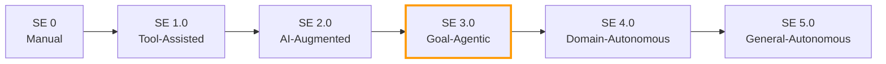

# Structured Agentic Software Engineering

> Autonomous coding agents produce PRs in minutes but nearly 30% of plausible fixes introduce regressions and over 68% of agent PRs stall in review. Structured artifacts — not faster models — close the gap between agent speed and human trust.

## The Speed-vs-Trust Gap

Agents are fast but unreliable at the boundary where code meets review.

| Metric | Value | Source |
|--------|-------|--------|
| Median agent PR turnaround | 13.2 minutes | [arXiv:2509.06216](https://arxiv.org/abs/2509.06216) |
| Plausible fixes that introduce regressions | 29.6% | [arXiv:2509.06216](https://arxiv.org/abs/2509.06216) |
| SWE-Bench solve rate drop after manual audit | 12.47% to 3.97% | [arXiv:2509.06216](https://arxiv.org/abs/2509.06216) |
| Agent PRs that face long delays or remain unreviewed | >68% | [arXiv:2509.06216](https://arxiv.org/abs/2509.06216) |

The bottleneck is verification, not generation. More agent throughput into an already-saturated review pipeline makes the problem worse. [unverified]

## SE Maturity Levels

The paper proposes a maturity model analogous to SAE driving automation:



**SE 3.0 (Goal-Agentic)** is the current frontier: the agent receives a goal, decomposes it, executes with tools, and iterates under strategic human oversight. SE 4.0 and 5.0 remain research targets. This parallels the [AI Development Maturity Model](../workflows/ai-development-maturity-model.md), which frames maturity from a team adoption perspective.

## Two Environments

SASE separates the developer workspace from the agent workspace:

**Agent Command Environment (ACE)** — the human command center for triaging MRPs and CRPs, setting goals, and reviewing evidence bundles. The developer thinks in outcomes, not implementation steps.

**Agent Execution Environment (AEE)** — the agent workbench with AST-level tools, semantic search, and MCP servers. The agent operates with full tooling access within scoped permissions, extending [agent-first software design](agent-first-software-design.md) principles.

The ACE/AEE split maps to the [cognitive-execution separation](cognitive-reasoning-execution-separation.md): ACE handles decisions; AEE handles execution.

## Structured Artifacts

The core contribution: replacing ephemeral chat with durable, structured artifacts:

### BriefingScript

A mission specification: intent, success criteria, context constraints, and a solution blueprint — what [spec-driven development](../workflows/spec-driven-development.md) calls the frozen spec, elevated to a formal artifact type. The paper reports elite developers spend approximately 1.5 hours crafting specifications per ticket. [unverified]

### MentorScript

Codified team norms in machine-readable form. MentorScript proposes a structured answer to the problem that AGENTS.md and CLAUDE.md files solve informally today — see [instruction file ecosystem](../instructions/instruction-file-ecosystem.md) and [AGENTS.md standard](../standards/agents-md.md).

### Merge-Readiness Pack (MRP)

An evidence bundle attached to a PR: test results, coverage, static analysis, rationale, and an audit trail of agent actions. MRPs formalize what [verification-centric development](../workflows/verification-centric-development.md) advocates: review the evidence, not the diff. They extend [tiered code review](../code-review/tiered-code-review.md) with progressive disclosure.

### Consultation Request Pack (CRP)

Structured agent-to-human escalation. The agent packages context, options, and a recommendation; the human responds with a Version Controlled Resolution (VCR) that becomes durable knowledge for future sessions. This operationalizes [human-in-the-loop](../workflows/human-in-the-loop.md) with a concrete artifact model.

### LoopScript

Workflow and SOP definitions. LoopScript defines repeatable processes — analogous to CI/CD pipeline definitions but for agent workflows.

## Practical Implications

**Specification is the new implementation.** The highest-leverage activity in SE 3.0 is writing precise specifications. BriefingScript quality directly reduces agent rework and review cycles. See [frozen spec file](../instructions/frozen-spec-file.md).

**Review evidence, not diffs.** MRPs shift code review from "read every line" to "verify the evidence chain," addressing the review bottleneck with structured evidence. [unverified]

**Instruction files need structure.** MentorScript suggests freeform instruction files (AGENTS.md, CLAUDE.md, .cursorrules) should evolve toward machine-readable formats with explicit norms, constraints, and quality criteria.

## Key Takeaways

- The speed-vs-trust gap — not model capability — is the defining constraint of SE 3.0
- Structured artifacts (BriefingScript, MRP, CRP, MentorScript, LoopScript) replace ephemeral chat with durable, reviewable contracts
- The ACE/AEE environment split mirrors the cognitive-execution separation at the workspace level
- Most SASE proposals have informal equivalents in practice (frozen specs, AGENTS.md, evidence-based review) — the contribution is naming and structuring them

## Example

A BriefingScript for a bug-fix task, structured as the agent's input contract:

```yaml
briefing:
  intent: "Fix race condition in session cleanup that causes orphaned locks"
  success_criteria:
    - "All sessions release locks within 30s of disconnect"
    - "No orphaned lock warnings in 24h soak test"
    - "Existing session tests pass without modification"
  context:
    repo: "acme/session-service"
    files:
      - "src/session/cleanup.rs"
      - "src/session/lock_manager.rs"
    related_issues: ["#1042", "#987"]
  constraints:
    - "Do not change the public API surface"
    - "Prefer timeout-based cleanup over heartbeat polling"
  blueprint:
    approach: "Add a cleanup sweep on a 30s interval that force-releases locks older than the session TTL"
    risk: "Sweep interval must not conflict with the existing GC timer in lock_manager.rs"
```

The corresponding MRP attached to the agent's PR would include test results, static analysis output, and the rationale linking each change back to the success criteria — giving the reviewer an evidence chain instead of a raw diff.

## Related

- [Agentic AI Architecture Evolution](agentic-ai-architecture-evolution.md) — Similar cognitive-execution separation
- [Classical SE Patterns as Agent Design Analogues](classical-se-patterns-agent-analogues.md) — GoF patterns; SASE remaps SE pillars
- [AI Development Maturity Model](../workflows/ai-development-maturity-model.md) — Team adoption maturity paralleling SE levels
- [Spec-Driven Development](../workflows/spec-driven-development.md) — BriefingScript aligns with frozen spec
- [Human-in-the-Loop](../workflows/human-in-the-loop.md) — CRPs formalize escalation
- [Verification-Centric Development](../workflows/verification-centric-development.md) — MRPs extend evidence-based verification
- [Tiered Code Review](../code-review/tiered-code-review.md) — Progressive disclosure of review evidence
- [Instruction File Ecosystem](../instructions/instruction-file-ecosystem.md) — MentorScript formalizes instruction files
- [AGENTS.md Standard](../standards/agents-md.md) — Informal approach MentorScript aims to replace
- [Agent-First Software Design](agent-first-software-design.md) — AEE extends agent-first principles
- [Cognitive Reasoning vs Execution Separation](cognitive-reasoning-execution-separation.md) — ACE/AEE maps to two-layer architecture
