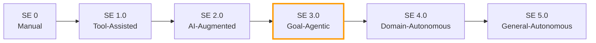

# Structured Agentic Software Engineering

> Autonomous coding agents produce PRs in minutes but nearly 30% of plausible fixes introduce regressions and over 68% of agent PRs stall in review. Structured artifacts — not faster models — close the gap between agent speed and human trust.

## The Speed-vs-Trust Gap

Empirical data from large-scale agent deployments reveals a consistent pattern: agents are fast but unreliable at the boundary where code meets review.

| Metric | Value | Source |
|--------|-------|--------|
| Median agent PR turnaround | 13.2 minutes | [arXiv:2509.06216](https://arxiv.org/abs/2509.06216) |
| Plausible fixes that introduce regressions | 29.6% | [arXiv:2509.06216](https://arxiv.org/abs/2509.06216) |
| SWE-Bench solve rate drop after manual audit | 12.47% to 3.97% | [arXiv:2509.06216](https://arxiv.org/abs/2509.06216) |
| Agent PRs that face long delays or remain unreviewed | >68% | [arXiv:2509.06216](https://arxiv.org/abs/2509.06216) |

The bottleneck is not generation — it is verification. Code review is the constraint, and throwing more agent throughput at an already-saturated review pipeline makes the problem worse. [unverified]

## SE Maturity Levels

The paper proposes a maturity model analogous to SAE driving automation levels:

**SE 3.0 (Goal-Agentic)** is the current frontier. The agent receives a goal, decomposes it into a multi-step plan, executes with tools, and iterates. Human oversight is strategic, not step-by-step. SE 4.0 and 5.0 remain research targets.

This parallels the [AI Development Maturity Model](../workflows/ai-development-maturity-model.md), which frames maturity from a team adoption perspective rather than an agent capability perspective.

## Two Environments

SASE separates the developer workspace from the agent workspace:

**Agent Command Environment (ACE)** — the human command center. Optimized for strategic orchestration: triaging Merge-Readiness Packs (MRPs) and Consultation Request Packs (CRPs), setting goals, reviewing evidence bundles. The developer thinks in outcomes, not implementation steps.

**Agent Execution Environment (AEE)** — the agent workbench. AST-level tools, semantic search, autonomous monitoring, MCP servers. The agent operates with full tooling access but within scoped permissions. This extends the [agent-first software design](agent-first-software-design.md) principle — systems designed for agent consumption, not human navigation.

The ACE/AEE split maps directly to the [cognitive-execution separation](cognitive-reasoning-execution-separation.md): ACE is where cognitive decisions happen; AEE is where execution runs.

## Structured Artifacts

The paper's core contribution is replacing ephemeral chat with durable, structured artifacts that flow between humans and agents:

### BriefingScript

A mission specification: intent, success criteria, context constraints, and a solution blueprint. This is the agent's input contract — what [spec-driven development](../workflows/spec-driven-development.md) calls the frozen spec, elevated to a formal artifact type. The paper reports that elite developers spend approximately 1.5 hours crafting detailed specifications per ticket. [unverified]

### MentorScript

Codified team norms and best practices in machine-readable form. The paper observes that "the community has no consensus on what [instruction files] should contain." MentorScript proposes a structured answer to the problem that AGENTS.md and CLAUDE.md files solve informally today — see [instruction file ecosystem](../instructions/instruction-file-ecosystem.md) and [AGENTS.md standard](../standards/agents-md.md).

### Merge-Readiness Pack (MRP)

An evidence bundle proving code quality, attached to a PR:

- Functional completeness verification
- Test results and coverage
- Static analysis findings
- Rationale and design decisions
- Audit trail of agent actions

MRPs formalize what [verification-centric development](../workflows/verification-centric-development.md) advocates: review the evidence, not just the diff. They also extend [tiered code review](../code-review/tiered-code-review.md) by providing progressive disclosure — reviewers drill into the evidence layer they care about rather than reading everything linearly.

### Consultation Request Pack (CRP)

Structured agent-to-human escalation. When the agent hits an ambiguity or a decision that exceeds its authority, it packages context, options, and a recommendation into a CRP. The human responds with a Version Controlled Resolution (VCR) — a formal decision record that becomes durable knowledge for future agent sessions.

This operationalizes [human-in-the-loop](../workflows/human-in-the-loop.md) with a concrete artifact model instead of ad-hoc interruptions.

### LoopScript

Workflow and SOP definitions. Where BriefingScript defines a single mission, LoopScript defines repeatable processes — analogous to CI/CD pipeline definitions but for agent workflows.

## Practical Implications

**Specification is the new implementation.** The highest-leverage developer activity in SE 3.0 is writing precise specifications, not writing code. Time invested in BriefingScript quality directly reduces agent rework and review cycles. See [frozen spec file](../instructions/frozen-spec-file.md) for an existing implementation of this principle.

**Review the evidence bundle, not the raw diff.** MRPs shift code review from "read every line" to "verify the evidence chain." This addresses the 68% review bottleneck — structured evidence is faster to review than unstructured code. [unverified]

**Instruction files need structure.** Current instruction files (AGENTS.md, CLAUDE.md, .cursorrules) are freeform prose. MentorScript suggests these should evolve toward structured, machine-readable formats with explicit sections for norms, constraints, and quality criteria.

**Agent-first code inverts some conventions.** When agents handle maintenance, code cloning becomes acceptable because agents can update all copies simultaneously. Strong type systems (Rust, TypeScript) become more valuable because they provide machine-verifiable constraints the agent can check without human review. [unverified]

## Key Takeaways

- The speed-vs-trust gap — not model capability — is the defining constraint of SE 3.0
- Structured artifacts (BriefingScript, MRP, CRP, MentorScript, LoopScript) replace ephemeral chat with durable, reviewable contracts
- The ACE/AEE environment split mirrors the cognitive-execution separation but at the workspace level
- Most of what SASE proposes already has informal equivalents in practice (frozen specs, AGENTS.md, evidence-based review) — the contribution is naming and structuring them

## Unverified Claims

The following claims from the source paper have not been independently verified:

- Elite developers spend ~1.5 hours on specifications per ticket
- The review bottleneck is the primary constraint on agent productivity
- MRP-based review is faster than traditional diff review
- Agent-maintained code cloning is viable at scale

## Related

- [Agentic AI Architecture Evolution](agentic-ai-architecture-evolution.md) — Reference architecture from a different paper covering similar cognitive-execution separation
- [Classical SE Patterns as Agent Design Analogues](classical-se-patterns-agent-analogues.md) — Maps GoF patterns; SASE remaps SE pillars
- [AI Development Maturity Model](../workflows/ai-development-maturity-model.md) — Team adoption maturity paralleling SE levels 0-5
- [Spec-Driven Development](../workflows/spec-driven-development.md) — BriefingScript aligns with frozen spec workflow
- [Human-in-the-Loop](../workflows/human-in-the-loop.md) — CRPs formalize the escalation model
- [Verification-Centric Development](../workflows/verification-centric-development.md) — MRPs extend evidence-based verification
- [Tiered Code Review](../code-review/tiered-code-review.md) — Progressive disclosure of review evidence
- [Instruction File Ecosystem](../instructions/instruction-file-ecosystem.md) — MentorScript formalizes instruction files
- [AGENTS.md Standard](../standards/agents-md.md) — Current informal approach MentorScript aims to replace
- [Agent-First Software Design](agent-first-software-design.md) — AEE extends agent-first design principles
- [Cognitive Reasoning vs Execution Separation](cognitive-reasoning-execution-separation.md) — ACE/AEE maps to the two-layer architecture
