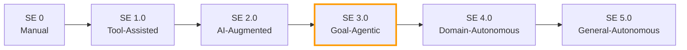

# Structured Agentic Software Engineering

> Autonomous coding agents produce PRs in minutes but nearly 30% of plausible fixes introduce regressions and over 68% of agent PRs stall in review. Structured artifacts — not faster models — close the gap between agent speed and human trust.

## The Speed-vs-Trust Gap

Agents are fast but unreliable at the boundary where code meets review.

| Metric | Value | Source |
|--------|-------|--------|
| Median agent PR turnaround | 13.2 minutes | [arXiv:2509.06216](https://arxiv.org/abs/2509.06216) |
| Plausible fixes that introduce regressions | 29.6% | [arXiv:2509.06216](https://arxiv.org/abs/2509.06216) |
| SWE-Bench solve rate drop after manual audit | 12.47% to 3.97% | [arXiv:2509.06216](https://arxiv.org/abs/2509.06216) |
| Agent PRs that face long delays or remain unreviewed | >68% | [arXiv:2509.06216](https://arxiv.org/abs/2509.06216) |

The bottleneck is verification, not generation. More agent output into an already-saturated pipeline compounds the problem ([arXiv:2509.06216](https://arxiv.org/abs/2509.06216)). An independent replication found roughly half of SWE-bench-passing PRs would be rejected by real maintainers, most often for core functionality failure ([METR, 2026](https://metr.org/notes/2026-03-10-many-swe-bench-passing-prs-would-not-be-merged-into-main/)).

## SE Maturity Levels

The paper proposes a maturity model analogous to SAE driving automation:



**SE 3.0 (Goal-Agentic)** is the current frontier: the agent receives a goal, decomposes it, executes with tools, and iterates under human oversight. SE 4.0 and 5.0 remain research targets. This parallels the [AI Development Maturity Model](../workflows/ai-development-maturity-model.md), which frames maturity from a team-adoption perspective.

## Two Environments

SASE splits developer and agent workspaces:

**Agent Command Environment (ACE)** — the human command center for triaging MRPs and CRPs, setting goals, and reviewing evidence. The developer thinks in outcomes, not implementation steps.

**Agent Execution Environment (AEE)** — the agent workbench: AST-level tools, semantic search, and MCP servers, scoped by permissions. Extends [agent-first software design](agent-first-software-design.md).

The split maps to the [cognitive-execution separation](cognitive-reasoning-execution-separation.md): ACE decides, AEE executes.

## Structured Artifacts

The core contribution: replacing ephemeral chat with durable, structured artifacts.

### BriefingScript

A mission specification — intent, success criteria, constraints, and a solution blueprint — what [spec-driven development](../workflows/spec-driven-development.md) calls the frozen spec, elevated to a formal artifact. The paper reports elite developers spend ~1.5 hours per ticket on specifications ([arXiv:2509.06216](https://arxiv.org/abs/2509.06216)).

### MentorScript

Team norms in machine-readable form — the structured counterpart to AGENTS.md and CLAUDE.md files (see [instruction file ecosystem](../instructions/instruction-file-ecosystem.md) and [AGENTS.md standard](../standards/agents-md.md)).

### Merge-Readiness Pack (MRP)

An evidence bundle on each PR: test results, coverage, static analysis, rationale, and an audit trail. MRPs formalize [verification-centric development](../workflows/verification-centric-development.md) — review the evidence, not the diff — and extend [tiered code review](../code-review/tiered-code-review.md) with progressive disclosure.

### Consultation Request Pack (CRP)

Structured agent-to-human escalation: the agent packages context, options, and a recommendation; the human replies with a Version Controlled Resolution (VCR) that persists as context for future sessions. Operationalizes [human-in-the-loop](../workflows/human-in-the-loop.md) with a concrete artifact.

### LoopScript

Repeatable workflow and SOP definitions — analogous to CI/CD pipeline specs but for agent workflows.

## Practical Implications

**Specification is the new implementation.** In SE 3.0 the highest-leverage activity is writing precise specifications. BriefingScript quality directly reduces agent rework and review cycles — see [frozen spec file](../instructions/frozen-spec-file.md).

**Review evidence, not diffs.** MRPs shift review from "read every line" to "verify the evidence chain," addressing the [review bottleneck](../anti-patterns/pr-scope-creep-review-bottleneck.md) ([arXiv:2509.06216](https://arxiv.org/abs/2509.06216)).

**Instruction files need structure.** MentorScript argues freeform instruction files (AGENTS.md, CLAUDE.md, .cursorrules) should evolve toward machine-readable formats with explicit norms and quality criteria.

## Why It Works

The gap is an information problem: reviewers cannot trust output they cannot audit, and agents cannot improve without durable feedback. Structured artifacts address both sides. BriefingScripts and LoopScripts give agents stable, machine-readable contracts, cutting the ambiguity that drives rework. MRPs give reviewers an auditable evidence chain — trust rests on test results and rationale, not line-by-line diff reading. CRPs with Version Controlled Resolutions stop the same escalation recurring by persisting decisions as referenceable context. The paper frames this as moving SE "from a craft into a true engineering discipline" through reproducibility and institutional memory ([arXiv:2509.06216](https://arxiv.org/abs/2509.06216)).

## When This Backfires

SASE adds process overhead that can exceed its benefits:

- **Small teams or early-stage projects**: authoring BriefingScripts and MRPs rarely pays off when the codebase is small and reviewers hold full context.
- **Ill-defined requirements**: structured artifacts assume goals stable enough to specify. When requirements shift mid-task, the BriefingScript becomes a constraint and agents over-optimize for the original spec.
- **Low-trust agent pipelines**: MRPs are evidence bundles, not correctness proofs. With a 29.6% regression rate on "plausible" fixes, a polished evidence package can manufacture false confidence.
- **Tooling immaturity**: ACE/AEE separation needs agents that consume structured artifacts reliably. Model adherence to structured formats varies, so benefits depend on the runtime.

## Key Takeaways

- The speed-vs-trust gap — not model capability — is the defining constraint of SE 3.0
- Structured artifacts (BriefingScript, MRP, CRP, MentorScript, LoopScript) replace ephemeral chat with durable, reviewable contracts
- The ACE/AEE environment split mirrors the cognitive-execution separation at the workspace level
- Most SASE proposals have informal equivalents in practice (frozen specs, AGENTS.md, evidence-based review) — the contribution is naming and structuring them

## Example

A BriefingScript for a bug-fix task, structured as the agent's input contract:

```yaml
briefing:
  intent: "Fix race condition in session cleanup that causes orphaned locks"
  success_criteria:
    - "All sessions release locks within 30s of disconnect"
    - "No orphaned lock warnings in 24h soak test"
    - "Existing session tests pass without modification"
  context:
    repo: "acme/session-service"
    files:
      - "src/session/cleanup.rs"
      - "src/session/lock_manager.rs"
    related_issues: ["#1042", "#987"]
  constraints:
    - "Do not change the public API surface"
    - "Prefer timeout-based cleanup over heartbeat polling"
  blueprint:
    approach: "Add a cleanup sweep on a 30s interval that force-releases locks older than the session TTL"
    risk: "Sweep interval must not conflict with the existing GC timer in lock_manager.rs"
```

The corresponding MRP attached to the agent's PR would include test results, static analysis output, and the rationale linking each change back to the success criteria — giving the reviewer an evidence chain instead of a raw diff.

## Related

- [Cognitive Reasoning vs Execution Separation](cognitive-reasoning-execution-separation.md) — ACE/AEE maps to the two-layer architecture
- [Spec-Driven Development](../workflows/spec-driven-development.md) — BriefingScript aligns with the frozen spec
- [Verification-Centric Development](../workflows/verification-centric-development.md) — MRPs extend evidence-based verification
- [Tiered Code Review](../code-review/tiered-code-review.md) — progressive disclosure of review evidence
- [Human-in-the-Loop](../workflows/human-in-the-loop.md) — CRPs formalize structured escalation
- [Instruction File Ecosystem](../instructions/instruction-file-ecosystem.md) — MentorScript formalizes instruction files
- [AI Development Maturity Model](../workflows/ai-development-maturity-model.md) — team-adoption maturity paralleling SE levels
- [Agentless vs Autonomous](agentless-vs-autonomous.md) — counterpoint: when simpler workflows outperform structured agentic approaches
