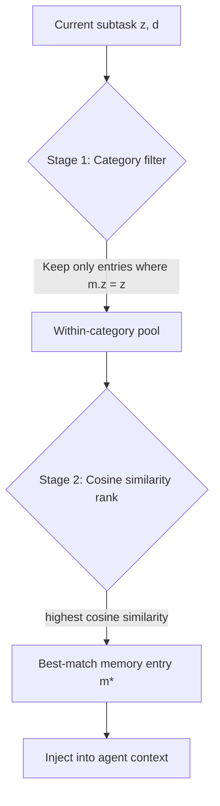

# Subtask-Level Memory for Software Engineering Agents

> Store and retrieve memory at the granularity of individual reasoning stages — not whole task sessions — to prevent misguided retrieval when tasks share surface similarity but require distinct reasoning at specific steps.

## The Granularity Mismatch Problem

Instance-level memory stores a whole episode as one unit. Retrieval returns the full episode when a new task resembles it — useful when reasoning matches throughout, harmful when only one stage overlaps.

A bug needing a `Reproduce` step may share surface description with a prior episode that needed only an `Edit`; the retrieved memory injects guidance from the wrong phase. ([arXiv:2602.21611](https://arxiv.org/abs/2602.21611)) The fix is to match the memory unit to the reasoning unit.

## Subtask-Aligned Memory Architecture

A structurally aligned system stores memory per functional category. The paper ([arXiv:2602.21611](https://arxiv.org/abs/2602.21611)) defines four categories for software engineering agents:

| Category | What It Covers |
|----------|---------------|
| **Analyze** | Understanding the problem, locating relevant code |
| **Reproduce** | Constructing reproduction steps and test cases |
| **Edit** | Implementing the fix or change |
| **Verify** | Confirming correctness, running tests |

Each memory entry is a structured triple `(z, d, e)`:

- **z** — the functional category (hard constraint on retrieval scope)
- **d** — a structured description with objective and mechanism-level keywords (the retrieval anchor)
- **e** — an abstracted experience with instance-specific noise removed (file paths, variable names stripped)

Abstraction is critical: raw trajectory storage yields +1.2 pp; LLM-abstracted entries deliver +3.9 pp because abstraction distills transferable insights and drops ungeneralizable artifacts. ([arXiv:2602.21611](https://arxiv.org/abs/2602.21611))

## Two-Stage Retrieval

Retrieval runs in two stages to prevent cross-phase contamination:



Stage 1 hard-filters by category `z`, removing cross-phase entries before ranking. Stage 2 ranks within-category entries by cosine similarity between the current description embedding and stored anchor embeddings; only the best match is injected. ([arXiv:2602.21611](https://arxiv.org/abs/2602.21611))

## Implementation Notes

**Transition prediction via system prompt.** The agent predicts its current category and synthesizes a structured description during reasoning — driven by the system prompt, no separate orchestrator required. ([arXiv:2602.21611](https://arxiv.org/abs/2602.21611))

**Memory sparsity in early sessions.** The first ~200 instances produce a slight dip (−1 pp) from retrieval overhead on sparse pools; gains accelerate with density, reaching +9–10 pp after 300+ instances. ([arXiv:2602.21611](https://arxiv.org/abs/2602.21611))

**Model-agnostic.** Results hold across model families; Gemini 2.5 Pro sees +6.8 pp. ([arXiv:2602.21611](https://arxiv.org/abs/2602.21611))

## Results

Subtask-level memory improves mean Pass@1 by +4.7 pp on SWE-bench Verified over unaligned baselines. ([arXiv:2602.21611](https://arxiv.org/abs/2602.21611)) The broader principle — retrieval granularity should match reasoning granularity — is independently supported by dual-layer episodic-semantic memory work, where granular logs plus abstract concept synthesis outperform flat retrieval on multi-hop tasks. ([arXiv:2601.02744](https://arxiv.org/abs/2601.02744))

## Relation to Scope-Based Memory

This technique is orthogonal to the scope-based patterns (episodic, working, project, user) in [Agent Memory Patterns](agent-memory-patterns.md). Scope controls *where* and *how long* memories persist; subtask-level controls *at what granularity* they are stored and retrieved. The two combine: subtask-aligned entries stored in a project-scoped, episodic system.

## Caveat: Dense-Retrieval Noise

The Stage-2 cosine step is a dense-retrieval operation. Follow-up work argues dense retrieval "fails to distinguish instances that are semantically similar but contextually distinct," yielding noisy matches even within a correctly filtered category; schema-constrained generation is proposed as an alternative. ([arXiv:2604.20117](https://arxiv.org/abs/2604.20117)) The category hard-filter mitigates cross-phase confusion but does not solve within-category ambiguity.

## Example

The following shows the structure of a memory entry triple for the **Reproduce** category, and how two-stage retrieval uses it to inject only the relevant experience when a new task reaches its reproduction stage.

```python
# Storing a memory entry after a successful Reproduce subtask
memory_store.add({
    "z": "Reproduce",   # functional category — hard constraint on retrieval
    "d": {              # structured description — the retrieval anchor
        "objective": "construct failing test case for off-by-one in pagination",
        "keywords": ["off-by-one", "pagination", "boundary condition", "unit test"]
    },
    "e": (              # abstracted experience — instance-specific details stripped
        "When reproducing boundary errors in list pagination, write a test that requests "
        "exactly page_size items, then page_size+1. The second call reveals the off-by-one "
        "because the slice index uses < instead of <=. Avoid mocking the data layer; "
        "use real objects to ensure the boundary arithmetic is exercised."
    )
})
```

At retrieval time, the agent predicts it is entering the Reproduce stage and synthesizes a description for the current task:

```python
# Two-stage retrieval
current_z = "Reproduce"   # predicted by agent from system prompt instruction
current_d_embedding = embed("construct test case for cursor-based pagination bug")

# Stage 1: hard filter by category — eliminates Analyze/Edit/Verify entries
candidates = [m for m in memory_store if m["z"] == current_z]

# Stage 2: rank by cosine similarity within category, inject best match
best_match = max(candidates, key=lambda m: cosine(embed(m["d"]), current_d_embedding))
inject_into_context(best_match["e"])
```

The injected experience is the abstracted lesson from the prior pagination episode — not the raw trajectory with file paths and variable names from that specific codebase. The agent applies the transferable reasoning pattern to the new task.

## Key Takeaways

- Task description similarity doesn't imply reasoning stage similarity — instance-level memory causes granularity mismatch.
- LLM-abstracted experience entries outperform raw trajectory storage; abstraction is not optional.
- Gains are largest for long, multi-step tasks and grow with memory density.

## When This Backfires

Subtask-level memory adds overhead that outweighs benefits in several conditions:

- **Cold-start penalty**: The first ~200 instances yield a slight dip as retrieval fires on sparse per-category pools. Skip memory entirely for tasks that won't accumulate 200+ episodes.
- **Category misprediction**: Misprediction routes retrieval to the wrong pool, injecting misleading experience. Ambiguous or interleaved phases (analyze and edit) raise this risk.
- **Abstraction cost**: Each subtask requires an LLM call to abstract the experience, adding latency and token cost. Raw trajectory storage avoids this but delivers only +1.2 pp vs +3.9 pp.
- **Non-repetitive task streams**: The pattern assumes recurring task structures. One-off or heterogeneous streams never reach the density where cross-episode transfer materializes.

## Related

- [Agent Memory Patterns: Learning Across Conversations](agent-memory-patterns.md)
- [Episodic Memory Retrieval](episodic-memory-retrieval.md) -- retrieval mechanics for episodic memory using trigger, context, and outcome indexing
- [Seeding Agent Context: Breadcrumbs in Code](../context-engineering/seeding-agent-context.md)
- [Retrieval-Augmented Agent Workflows](../context-engineering/retrieval-augmented-agent-workflows.md)
- [Beads: Structured Task Graphs as External Agent Memory](beads-task-graph-agent-memory.md)
- [Memory Synthesis: Extracting Lessons from Execution Logs](memory-synthesis-execution-logs.md)
- [AST-Guided Agent Memory](ast-guided-agent-memory.md) -- uses AST representations instead of natural language as memory substrate for code generation agents
- [Orchestrator-Worker Pattern](../multi-agent/orchestrator-worker.md)
