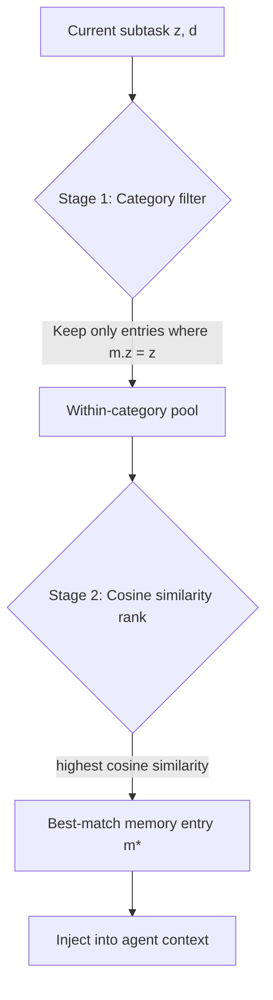

# Subtask-Level Memory for Software Engineering Agents

> Store and retrieve memory at the granularity of individual reasoning stages — not whole task sessions — to prevent misguided retrieval when tasks share surface similarity but require distinct reasoning at specific steps.

## The Granularity Mismatch Problem

Instance-level memory stores an entire problem-solving episode as a single unit. When a new task description resembles a stored episode, the retrieval system returns the full episode as context. This works when the new task requires the same reasoning throughout — but fails when only one stage of the task overlaps.

A bug requiring a `Reproduce` step might have the same surface description as a prior episode that required only an `Edit`. The retrieved memory misguides the specific reasoning stage that actually needs it, injecting guidance from the wrong phase. ([arXiv:2602.21611](https://arxiv.org/abs/2602.21611))

The fix is to match the memory unit to the reasoning unit.

## Subtask-Aligned Memory Architecture

A structurally aligned memory system decomposes agent tasks into functional categories and stores memory per category. The paper ([arXiv:2602.21611](https://arxiv.org/abs/2602.21611)) defines four categories for software engineering agents:

| Category | What It Covers |
|----------|---------------|
| **Analyze** | Understanding the problem, locating relevant code |
| **Reproduce** | Constructing reproduction steps and test cases |
| **Edit** | Implementing the fix or change |
| **Verify** | Confirming correctness, running tests |

Each memory entry is a structured triple `(z, d, e)`:

- **z** — the functional category (hard constraint on retrieval scope)
- **d** — a structured description with objective and mechanism-level keywords (the retrieval anchor)
- **e** — an abstracted experience with instance-specific noise removed (file paths, variable names stripped)

The abstraction step is critical: raw trajectory storage yields only +1.2 pp improvement; LLM-abstracted experience entries deliver +3.9 pp, because abstraction distills transferable insights while removing artifacts that don't generalize. ([arXiv:2602.21611](https://arxiv.org/abs/2602.21611)) [unverified]

## Two-Stage Retrieval

Retrieval operates in two stages to prevent cross-phase contamination:



Stage 1 hard-filters by category `z`, eliminating cross-phase contamination before ranking begins. Stage 2 ranks within-category entries by cosine similarity between the current description embedding and stored anchor embeddings. Only the best match is injected — not a ranked list. ([arXiv:2602.21611](https://arxiv.org/abs/2602.21611))

## Implementation Notes

**Transition prediction via system prompt.** The agent autonomously predicts its current functional category and synthesizes a structured description as part of its reasoning process. This is integrated into the system prompt — no separate orchestrator is required. ([arXiv:2602.21611](https://arxiv.org/abs/2602.21611))

**Memory sparsity in early sessions.** Gains are near zero with few stored memories per category [unverified — the "fewer than five entries" threshold is not confirmed as an exact figure in the cited paper]. Gains accelerate with density, reaching +9–10 pp in later phases. ([arXiv:2602.21611](https://arxiv.org/abs/2602.21611))

**Model-agnostic.** Results are consistent across multiple model families; Gemini 2.5 Pro sees +6.8 pp. ([arXiv:2602.21611](https://arxiv.org/abs/2602.21611))

## Results

Subtask-level memory improves mean Pass@1 by +4.7 pp on SWE-bench Verified compared to baseline agents without subtask alignment. ([arXiv:2602.21611](https://arxiv.org/abs/2602.21611))

## Relation to Scope-Based Memory

This technique addresses a different dimension from the scope-based memory patterns (episodic, working, project, user) covered in [Agent Memory Patterns](agent-memory-patterns.md). Scope-based memory controls *where* and *for how long* memories persist. Subtask-level memory controls *at what granularity* memories are stored and retrieved. Both dimensions can be applied together: subtask-aligned entries stored in a project-scoped, episodic memory system.

## Example

The following shows the structure of a memory entry triple  for the **Reproduce** category, and how two-stage retrieval uses it to inject only the relevant experience when a new task reaches its reproduction stage.

```python
# Storing a memory entry after a successful Reproduce subtask
memory_store.add({
    "z": "Reproduce",   # functional category — hard constraint on retrieval
    "d": {              # structured description — the retrieval anchor
        "objective": "construct failing test case for off-by-one in pagination",
        "keywords": ["off-by-one", "pagination", "boundary condition", "unit test"]
    },
    "e": (              # abstracted experience — instance-specific details stripped
        "When reproducing boundary errors in list pagination, write a test that requests "
        "exactly page_size items, then page_size+1. The second call reveals the off-by-one "
        "because the slice index uses < instead of <=. Avoid mocking the data layer; "
        "use real objects to ensure the boundary arithmetic is exercised."
    )
})
```

At retrieval time, the agent predicts it is entering the Reproduce stage and synthesizes a description for the current task:

```python
# Two-stage retrieval
current_z = "Reproduce"   # predicted by agent from system prompt instruction
current_d_embedding = embed("construct test case for cursor-based pagination bug")

# Stage 1: hard filter by category — eliminates Analyze/Edit/Verify entries
candidates = [m for m in memory_store if m["z"] == current_z]

# Stage 2: rank by cosine similarity within category, inject best match
best_match = max(candidates, key=lambda m: cosine(embed(m["d"]), current_d_embedding))
inject_into_context(best_match["e"])
```

The injected experience is the abstracted lesson from the prior pagination episode — not the raw trajectory with file paths and variable names from that specific codebase. The agent applies the transferable reasoning pattern to the new task.

## Key Takeaways

- Task description similarity doesn't imply reasoning stage similarity — instance-level memory causes granularity mismatch.
- LLM-abstracted experience entries outperform raw trajectory storage; abstraction is not optional.
- Gains are largest for long, multi-step tasks and grow with memory density.

## Unverified Claims

- Raw trajectory storage yields only +1.2 pp improvement; LLM-abstracted experience entries deliver +3.9 pp [unverified]
- Performance dips when fewer than five entries exist per category [unverified — the "fewer than five entries" threshold is the author's characterization and is not confirmed as an exact figure in the cited paper]

## Related

- [Agent Memory Patterns: Learning Across Conversations](agent-memory-patterns.md)
- [Episodic Memory Retrieval](episodic-memory-retrieval.md) -- retrieval mechanics for episodic memory using trigger, context, and outcome indexing
- [Seeding Agent Context: Breadcrumbs in Code](../context-engineering/seeding-agent-context.md)
- [Retrieval-Augmented Agent Workflows](../context-engineering/retrieval-augmented-agent-workflows.md)
- [Beads: Structured Task Graphs as External Agent Memory](beads-task-graph-agent-memory.md)
- [Memory Synthesis: Extracting Lessons from Execution Logs](memory-synthesis-execution-logs.md)
