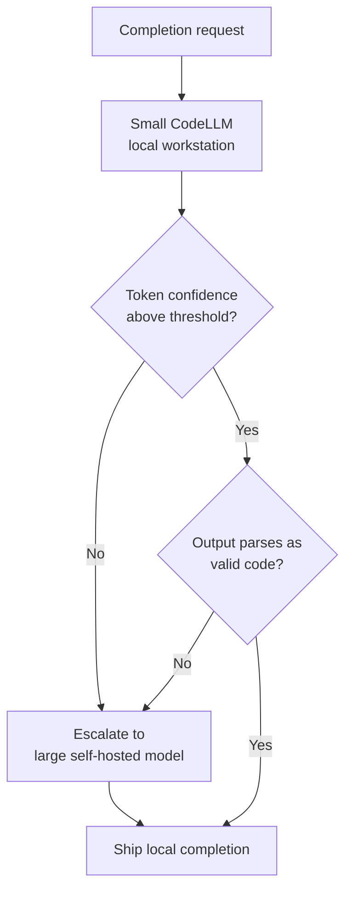

# Syntax-Aware Completion Routing

> Route per-request between a local small CodeLLM and a self-hosted large model using two stacked signals — token confidence on the small model's output, then a parse-time check that the completion is valid code — and only escalate when both signals say the local result is unsafe.

## The Routing Signal

Two-tier code-completion stacks — small model on a developer workstation, large model in self-hosted infrastructure — need a per-request decision: keep the local completion or escalate. The naive signal is the small model's token-level confidence.

Confidence alone is noisy. A small model can be highly confident on a syntactically broken completion (truncated identifier, unmatched brace) and under-confident on a clean one. SynConfRoute, proposed by [Thangarajah, Chen, and Hassan (2026)](https://arxiv.org/abs/2605.04894), combines confidence with a second signal — does the small model's own output parse as valid code — and reports +6.4 pass@1 over confidence-only routing on routine completions, up to +31 on harder multi-language tasks.

The mechanism rests on a measured failure profile: 46% of the 3B model's incorrect completions are not valid code ([Thangarajah et al., 2026](https://arxiv.org/abs/2605.04894)). A syntax check captures roughly half the failure mass at parse-time cost, before the large model is invoked.

## How It Composes



Both gates must pass for the local completion to ship. Confidence is free during decoding; the parse check is cheap relative to a large-model call.

## What "Training-Free" Buys

The pipeline uses off-the-shelf models with no router fine-tuning. Thresholds for the two gates are hand-tuned, not learned ([Thangarajah et al., 2026](https://arxiv.org/abs/2605.04894)). The router drops onto an existing local-plus-self-hosted stack without training, but thresholds couple to the specific small model and language coverage — swapping models or adding a language requires re-tuning.

The paper reports routine pass@1 of 78.9% — 7.4 points higher than always invoking the 480B model — and 58% lower accelerator usage ([Thangarajah et al., 2026](https://arxiv.org/abs/2605.04894)).

## How It Compares to Existing Routing Signals

| Signal | Unit of decision | Where it's measured | Coverage of failure modes |
|--------|------------------|---------------------|---------------------------|
| [Code-health-gated tier routing](code-health-gated-tier-routing.md) | Per file, pre-generation | File complexity score before any inference | File difficulty, not output quality |
| Token confidence only | Per request | Inside the small model's decoding | Misses confident-but-broken outputs |
| **Confidence + syntax (SynConfRoute)** | Per request | Decoding stats + parse check on output | Catches the ~46% of small-model errors that fail to parse |
| [Cross-vendor competitive routing](cross-vendor-competitive-routing.md) | Per task | Run both, judge results | High cost — pays both sides |

Code-health routing decides before the small model runs; syntax-aware routing decides after, using the generated tokens as evidence. The two are stackable.

## When It Backfires

The pattern is reported on Python, Java, and C++ fill-in-the-middle benchmarks ([Thangarajah et al., 2026](https://arxiv.org/abs/2605.04894)). Several conditions outside that envelope erode the gain:

- **Polyglot repos with partial parser coverage** — a syntax check missing some language either always fails (every unsupported-language completion escalates) or always passes (the precision claim breaks). Tree-sitter grammar coverage sets the ceiling.
- **Embedded DSLs and string-interpolated code** — SQL in Python, JSX in JavaScript, regex literals, templated YAML. Partial completions may not be parse-clean by construction; the gate over-escalates legitimate output.
- **Sub-100ms completion budgets** — IDE inline completion competes on tens-of-milliseconds latency. A parse pass is cheap but non-zero; an escalation round-trip is not.
- **Single-developer or offline setups** — without a reachable large model, escalation silently fails and quality drops to small-model-alone.

The headline numbers come from a single 2026 preprint with abstract-level methodological detail. The paper does not specify which 3B and 480B models were used, the exact thresholds, or whether the syntax validator is a parser, AST checker, or compiler invocation. Treat the +6.4 / +31 / 58% figures as *the paper reports* until the full PDF and any released code can be checked.

## When the Pattern Fits

Three conditions favour syntax-aware routing:

1. **Two-tier topology already in place** — workstation small model plus self-hosted large model where escalation cost is real.
2. **Fill-in-the-middle or single-language completion** — self-contained span in a language with mature parser support.
3. **A measurable share of small-model errors is syntactic** — verify on your own traffic. If most errors are semantically wrong but syntactically clean, the syntax gate adds latency without filtering.

Outside those conditions, simpler alternatives — a single right-sized 7B-13B local model, or confidence-only routing — do most of the same work without the parser-coverage tax.

## Example

A reference pipeline for a Python-Java-C++ workstation IDE:

```text
1. Decode with local 3B CodeLLM, capture average token log-probability p
2. If p < confidence_threshold:
     escalate to 480B self-hosted
3. Else parse the generated span with tree-sitter for the file's language
4. If parse fails:
     escalate to 480B self-hosted
5. Else ship the local completion
```

The two thresholds (confidence cutoff, parse-strictness) are tuned per-language on a held-out FIM evaluation set. The reported 78.9% pass@1 / 58% accelerator-usage cell reflects this configuration on Python, Java, and C++ FIM benchmarks ([Thangarajah et al., 2026](https://arxiv.org/abs/2605.04894)).

## Key Takeaways

- The signal is not just confidence — it is confidence *and* a parse-time check on the small model's output, both required.
- The mechanism works because a measured ~46% of small-model errors are not valid code; a syntax gate filters that mass before incurring large-model cost.
- The pattern is training-free, but thresholds are coupled to the specific small model and the specific language coverage of the parser.
- Reported numbers (+6.4 / +31 pass@1, 58% accelerator-usage reduction) are from a 2026 preprint on FIM Python/Java/C++; verify on your own traffic before deploying.

## Related

- [Code-Health-Gated LLM Tier Routing](code-health-gated-tier-routing.md) — A pre-generation routing signal based on file complexity; stackable with syntax-aware routing.
- [Specialized Small Language Models as Agent Sub-Tools](specialized-slm-as-agent-tool.md) — Different topology — a small model behind a tool boundary rather than a routed peer.
- [Cross-Vendor Competitive Routing](cross-vendor-competitive-routing.md) — Run both sides and judge; higher cost but no per-request signal needed.
- [Cost-Aware Agent Design: Route by Complexity, Not Habit](cost-aware-agent-design.md) — Task-complexity-driven tier selection; the upstream framing for any per-request router.
- [The Advisor Strategy: Frontier Model as Strategic Advisor](advisor-strategy.md) — Different escalation shape — a frontier model invoked for guidance, not for the completion itself.
