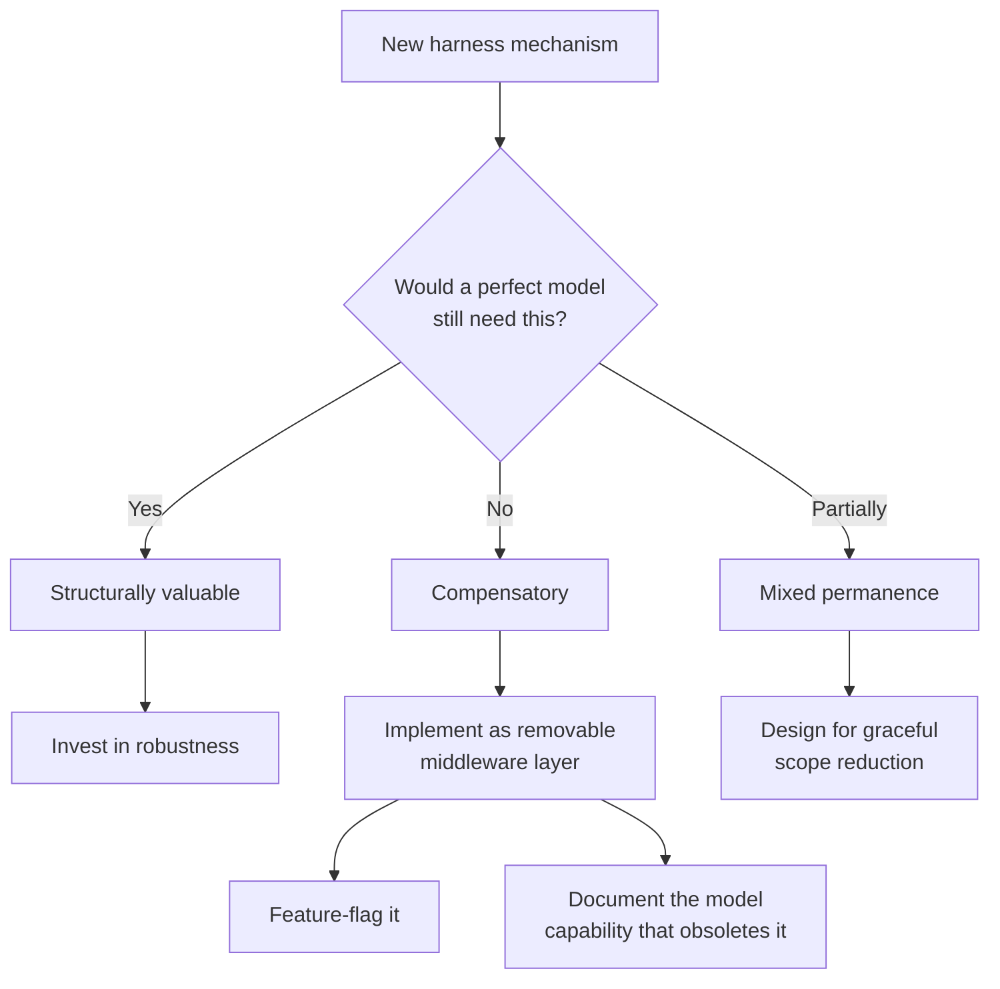

# Temporary Compensatory Mechanisms

> Design scaffolding that compensates for current model limitations as removable layers, not load-bearing architecture. Track which mechanisms are compensatory and which are permanently valuable.

## The Problem

Agent harnesses accumulate mechanisms that compensate for model limitations — unreliable self-verification, instruction fade-out, infinite loops. When this scaffolding becomes load-bearing, removing it requires a rewrite. Design it for removal from the start.

## Classifying Harness Mechanisms

Every harness mechanism falls into one of three categories:

| Category | Design Implication | Examples |
|---|---|---|
| **Compensatory** | Removable middleware; feature-flag; track which model capability obsoletes it | Loop detection, forced verification, instruction reminders, iteration caps |
| **Structurally valuable** | Invest in robustness; valuable regardless of model capability | Sandboxing, permission gates, [context compaction](../context-engineering/context-compression-strategies.md), tool discovery, feedback loops |
| **Mixed permanence** | Design for graceful degradation; shrinks in scope but does not disappear | Context summarization, structured feature tracking, progress files |

The classification question: *If the model were perfect at this capability, would I still want this mechanism?* Yes = structural; No = compensatory; Partially = mixed.

## Compensatory Mechanisms in Practice

### Loop Detection Middleware

[LangChain's LoopDetectionMiddleware](https://blog.langchain.com/improving-deep-agents-with-harness-engineering/) intercepts agent actions and detects repetitive patterns because models lack consistent self-monitoring for circular behavior.

**Design for removal**: implement as middleware disabled via configuration, not logic woven into the core agent loop.

### Forced Verification Passes

[Pre-completion checklists](../verification/pre-completion-checklists.md) force agents through verification before declaring completion. Models currently optimize for plausible output over verified correctness [unverified].

**Design for removal**: separate the gate from the criteria. The criteria (tests pass, linter clean) are permanently valuable. The gate forcing the agent to check them is compensatory.

### Instruction Fade-Out Reminders

The [OPENDEV agent](https://arxiv.org/abs/2603.05344) re-injects initial instructions during long sessions via event-driven system reminders, counteracting instruction fade-out as context fills.

**Design for removal**: implement as configurable middleware with a kill switch. If a future model maintains instruction adherence across its full context window, the reminders become noise.

### Doom-Loop Iteration Caps

Hard iteration limits that terminate execution after N failed attempts — the [OPENDEV agent](https://arxiv.org/abs/2603.05344) includes this in its execution cycle.

**Design for removal**: implement as a [circuit breaker](../observability/circuit-breakers.md) with configurable thresholds, removable independently of core execution logic.

## Structurally Valuable Mechanisms

These remain necessary regardless of model capability:

- **Sandboxing and permission gates** — a more capable model is a *stronger* argument for sandboxing.
- **Environmental feedback loops** — agents must observe effects of their actions (test output, build results, runtime errors).
- **Tool discovery and lazy loading** — [deferred tool loading](../tool-engineering/filesystem-tool-discovery.md) manages finite tool schema budgets; selective loading stays efficient even with larger windows.
- **Task decomposition** — bounded units are sound engineering regardless of model capability.

## Decision Framework



For each compensatory mechanism, record:

1. **What limitation it compensates for** — e.g., "models do not self-verify before declaring completion"
2. **What improvement would obsolete it** — e.g., "reliable self-verification with 95%+ accuracy"
3. **How to remove it** — e.g., "disable PRE_COMPLETION_CHECKLIST_ENABLED flag; remove middleware registration"

## Example: Annotating a Harness Config

```yaml
harness:
  middleware:
    - name: loop_detection
      type: compensatory
      compensates_for: "Models repeat failing actions without recognizing the pattern"
      obsoleted_by: "Reliable action-outcome metacognition"
      enabled: true

    - name: instruction_reminder
      type: compensatory
      compensates_for: "Instruction adherence degrades beyond ~60% context utilization"
      obsoleted_by: "Stable instruction following across full context window"
      enabled: true

    - name: sandbox_isolation
      type: structural
      rationale: "Defense-in-depth; value increases with agent capability"
      enabled: true

    - name: context_compaction
      type: mixed
      compensates_for: "Finite context windows require summarization"
      structural_aspect: "Even with larger windows, selective loading is more efficient"
      enabled: true
```

## Key Takeaways

- Classify every mechanism as compensatory, structural, or mixed permanence before building it.
- Compensatory mechanisms should be removable middleware — feature-flag them and document what obsoletes them.
- Sandboxing, permission gates, and environmental feedback are permanently valuable.
- [Context management](../context-engineering/context-engineering.md) has mixed permanence: compaction shrinks as windows grow but does not disappear.

## Related

- [Pre-Completion Checklists](../verification/pre-completion-checklists.md)
- [Circuit Breakers for Agent Loops](../observability/circuit-breakers.md)
- [Agent Harness](agent-harness.md)
- [The Ralph Wiggum Loop](ralph-wiggum-loop.md)
- [Loop Detection](../observability/loop-detection.md)
- [Event-Driven System Reminders](../instructions/event-driven-system-reminders.md)
- [Agent Loop Middleware](agent-loop-middleware.md)
- [Harness Engineering](harness-engineering.md)
- [Loop Strategy Spectrum](loop-strategy-spectrum.md)
- [Advanced Tool Use](../tool-engineering/advanced-tool-use.md)
- [Agentic Flywheel](agentic-flywheel.md)
- [GoF Patterns as Agent Design Analogues](classical-se-patterns-agent-analogues.md)
- [Agent Turn Model](agent-turn-model.md)
- [Agent Backpressure](agent-backpressure.md)
- [Wink: Agent Misbehavior Correction](wink-agent-misbehavior-correction.md)
- [Open Agent School Pattern Mapping](open-agent-school-pattern-mapping.md)
- [Reasoning Budget Allocation](reasoning-budget-allocation.md)
- [Memory Synthesis from Execution Logs](memory-synthesis-execution-logs.md)
- [Evaluator-Optimizer Pattern](evaluator-optimizer.md)
- [Trajectory Logging via Progress Files and Git History](../observability/trajectory-logging-progress-files.md)
- [Runtime Scaffold Evolution](runtime-scaffold-evolution.md)
