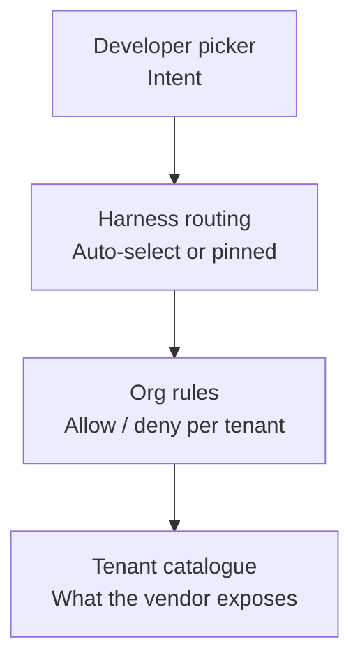

# Tenant Model Policy

> Tenant model policy is the admin-tier rule plane that decides which AI models an organization can invoke — above picker and routing.

## The Four Layers

Tenant model policy is a governance layer that sits between the model invocation request and the model itself. Map any harness against four stacked decision points before treating per-tenant rules as the right surface:



The picker reflects what a user *wants*. The harness decides what to *call*. The org rules decide what is *permitted*. The tenant catalogue defines what *exists* at all for the contract. When routing logic and policy logic share a code path, the strict-priority guarantee disappears — and the strict-priority guarantee is the whole mechanism (see [Microsoft: Authorization and Governance for AI Agents](https://techcommunity.microsoft.com/blog/microsoft-security-blog/authorization-and-governance-for-ai-agents-runtime-authorization-beyond-identity/4509161)).

## The Three Implementations

| Surface | How rules attach | Default stance | Override depth |
|---|---|---|---|
| GitHub Copilot model rules | Enterprise owner targets organizations; each model is `Enabled` (auto-on for all orgs) or `Optional` (orgs opt in) ([GitHub Changelog 2026-05-26](https://github.blog/changelog/2026-05-26-target-copilot-models-to-organizations-with-model-rules/)) | Default-allow on new model launches under `Enabled` | Enterprise overrides organization ([GitHub Docs: Copilot policies](https://docs.github.com/en/copilot/concepts/policies)) |
| Claude Code `availableModels` | Managed/policy settings file; arrays merge across user/project/managed surfaces ([Claude Code: Model configuration](https://code.claude.com/docs/en/model-config)) | Default-allow; "Default" picker option always available regardless of `availableModels` | Managed settings take highest priority |
| Cursor Enterprise admin controls | Enterprise admins "whitelist or blocklist repos, models, and MCP servers" ([Cursor Enterprise](https://cursor.com/enterprise)); Business tier exposes no equivalent surface, per [Cursor Forum](https://forum.cursor.com/t/cursor-business-plan-restrict-models-for-all-users/44556) | Default-allow except where admin restricts | No documented per-team override; teams reach for gateway workarounds |

The three diverge on a critical detail: Claude Code documents that "even with `availableModels: []`, users can still use Claude Code with the Default model for their tier" — an `availableModels` allow-list is not a deny-list. To actually pin model identity, admins must combine `availableModels`, `model`, and `ANTHROPIC_DEFAULT_*_MODEL` together ([Claude Code: Model configuration](https://code.claude.com/docs/en/model-config)).

## Why It Works

The policy decision and the model invocation are decoupled at distinct layers, so the rule engine can reject or substitute based on tenant identity *before* the call reaches a model. Microsoft's runtime governance framing names the mechanism: "evaluate policies in deterministic order with tenant isolation and residency checks as hard deny first, preventing approval workflows from bypassing foundational security boundaries" ([Microsoft: Authorization and Governance for AI Agents](https://techcommunity.microsoft.com/blog/microsoft-security-blog/authorization-and-governance-for-ai-agents-runtime-authorization-beyond-identity/4509161)). The pattern holds because lower-priority surfaces — picker, env var, CLI flag — never see the request once the strict-priority managed setting denies it.

The mechanism collapses the moment policy becomes advisory. A picker that hides a denied model but leaves it reachable via `--model` flag is back to four uncorrelated decision points, not a policy plane.

## When This Backfires

- **Default-allow under regulated workloads.** Copilot's `Enabled` stance auto-approves every newly-launched model for every organization until an admin disables it ([GitHub Changelog 2026-05-26](https://github.blog/changelog/2026-05-26-target-copilot-models-to-organizations-with-model-rules/)). For tenants under data-residency rules (EU public sector, healthcare) this inverts the safer default — explicit allow-list rules are required.
- **Silent fallback hides denials.** When the picker substitutes a default model without surfacing the denial reason, denial telemetry drops to zero and the developer reads the rejection as "the tool just feels worse." Silent fallback is independently an [anti-pattern that distorts metrics and trust](https://medium.com/@hadiyolworld007/stop-shipping-silent-fallbacks-8-ways-models-hide-errors-6df9330a3114).
- **Picker drift after deprecations.** An `availableModels` list that was correct on day one becomes a deny-list of retired model IDs over months. Without a tied lifecycle to model-deprecation calendars, the policy ages into silent denial of every selection. Pair with [Model Deprecation Lifecycle](../workflows/model-deprecation-lifecycle.md).
- **Missing override depth.** A security-research team needs a long-context Opus run that the cost-ceiling rule denies. Without a per-project or team-lead exception path, the request goes off-platform and the audit boundary collapses — the exact failure mode reported on the [Cursor forum](https://forum.cursor.com/t/cursor-business-plan-restrict-models-for-all-users/44556).
- **Carve-outs that defeat the rule.** Claude Code's documented Default-option exception means a casually-applied `availableModels` setting does not actually deny anything for that tier ([Claude Code: Model configuration](https://code.claude.com/docs/en/model-config)). Admins reading the docs without the recipe — `availableModels` plus `model` plus `ANTHROPIC_DEFAULT_*_MODEL` — ship policy theatre.

## Example

A Copilot Enterprise owner targeting a data-residency-constrained subsidiary with model rules sets each model's stance explicitly rather than relying on the `Enabled` default:

**Before** — single enterprise-wide setting, one model launch auto-onboards every org:

```text
Enterprise: claude-opus-4-7 → Enabled
EU-Public-Sector-Org: claude-opus-4-7 → (inherited) Enabled
```

**After** — targeted rules, the regulated org opts in explicitly:

```text
Enterprise: claude-opus-4-7 → Optional
US-Engineering-Org: claude-opus-4-7 → enabled
EU-Public-Sector-Org: claude-opus-4-7 → (no rule) disabled
```

The Claude Code equivalent in managed settings, pinning a Sonnet 4.5 build to a regulated tenant:

```json
{
  "model": "claude-sonnet-4-5",
  "availableModels": ["claude-sonnet-4-5", "haiku"],
  "env": {
    "ANTHROPIC_DEFAULT_SONNET_MODEL": "claude-sonnet-4-5"
  }
}
```

Without the `env` block, a user selecting `Default` in the picker would land on the latest Sonnet release, bypassing the version pin ([Claude Code: Model configuration](https://code.claude.com/docs/en/model-config)).

## Key Takeaways

- Tenant model policy is the layer *above* harness routing and *below* the vendor catalogue — failure modes come from collapsing it into either neighbour.
- Default-allow stances (Copilot `Enabled`) are wrong for regulated workloads; treat every new model launch as untrusted until an org rule says otherwise.
- Allow-lists in isolation are not deny-lists. Claude Code's `availableModels` requires `model` and `ANTHROPIC_DEFAULT_*_MODEL` companions to pin model identity.
- Explicit denial signals matter more than the deny itself: silent fallback erases the audit trail and pushes developers off-platform.
- Tie rule lifecycle to the model-deprecation calendar — without it, policy ages into accidental total denial.

## Related

- [Agent Governance Policies](../workflows/agent-governance-policies.md) — the broader three-tier policy hierarchy (enterprise → organization → user) Copilot enforces.
- [Auto Model Selection](auto-model-selection.md) — harness-side routing within the catalogue an org rule has filtered.
- [Gateway Model Routing](gateway-model-routing.md) — the infrastructure-layer alternative when the harness exposes no native admin surface.
- [Cost-Aware Agent Design](cost-aware-agent-design.md) — within-budget tier routing that runs once policy has constrained the catalogue.
- [Model Deprecation Lifecycle](../workflows/model-deprecation-lifecycle.md) — the operational wrapper that prevents rule drift after model retirements.
