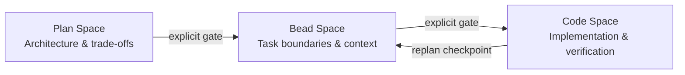

# Three Reasoning Spaces: Plan, Bead, and Code

> Treat plan space, bead space, and code space as explicit gates — transitioning between them deliberately prevents architecture drift during implementation.

## Overview

Agent development spans three reasoning spaces with different artifacts and decision types. Mixing them — debating architecture while writing code, or redesigning task boundaries during implementation — degrades quality in all three. The [Agent Flywheel methodology](https://agent-flywheel.com/complete-guide) formalises this separation; the same principle appears independently in Osmani's 80% problem, LangChain's reasoning sandwich, and nibzard's agentic handbook.

## The Three Spaces

| Space | Focus | Primary Artifact | Failure when mixed |
|-------|-------|------------------|--------------------|
| **Plan space** | Architecture, technology choices, system trade-offs | Large markdown plan | Agent improvises architecture from a narrow local window |
| **Bead space** | Task boundaries, dependencies, context requirements, acceptance criteria | Self-contained work units (`.beads/` JSONL) | Execution order and context requirements are re-derived per session |
| **Code space** | Implementation, testing, verification against bead definitions | Code changes, test results | Settled decisions get re-debated; scope creeps mid-task |

Plan space works while the whole system fits in context. Bead space converts that plan into self-contained work units. Code space executes within those constraints.

## The Law of Rework Escalation

Mistakes injected at each layer compound downstream:

```
Plan layer   →  1x cost  (pure reasoning, zero code churn)
Bead layer   →  5x cost  (orchestration rewrites, coordination overhead)
Code layer   → 25x cost  (implementation fixes + cleanup)
```

The deeper a mistake lands, the more downstream structure has hardened around it — front-loading decisions into plan space is the highest-leverage investment.

## Transitions as Explicit Gates

Transitions between spaces should be decisions, not drift:

- **Plan → Bead**: convert the plan into self-contained work units before any code is written.
- **Bead → Code**: each work unit has acceptance criteria and dependencies; agents implement within those bounds.
- **Replan checkpoints**: if code-space work invalidates a bead assumption, stop and surface it. Replanning is a feature, not a failure.



## Corroborating Evidence

- **Addy Osmani** observes that effective AI-assisted development requires 70% effort on problem definition before 30% on execution — skipping plan space embeds architectural choices invisibly in generated code.
- **LangChain's reasoning sandwich** allocates maximum compute to planning and verification, standard compute to implementation — enforcing phase separation at the harness level.
- **nibzard's agentic handbook** describes a plan-then-execute gate: the agent proposes goals, steps, tools, constraints, and done checks before execution begins.

## Key Takeaways

- Plan, bead, and code spaces have different artifacts and decision types — treat them as distinct phases with explicit gates, not a continuous flow.
- Mistakes cost 1x/5x/25x as they move deeper — front-load decisions into plan space. `[unverified]`
- Transitions between spaces should be deliberate decisions, not gradual drift.
- When code-space work invalidates a bead assumption, replan explicitly rather than adapting silently.

## Example

A feature request arrives: "add CSV export to the report dashboard." The three spaces produce distinct artifacts before any code is written.

**Plan space** — the whole system fits in context; global decisions are made:

```markdown
# CSV Export Plan

## Architecture decision
Add export via a new `ExportService` that reads from the existing `ReportRepository`.
No changes to the dashboard rendering pipeline; export is a side path.

## Technology choice
Use Python's built-in `csv` module — no new dependency. Stream rows to avoid
loading the full report into memory.

## Trade-offs accepted
- No async export queue (small reports only; revisit if >10k rows becomes common)
- No custom column mapping UI (fixed schema for v1)
```

**Bead space** — the plan converts into self-contained work units, each carrying its own context:

```json
{"id": "bead-001", "title": "Add ExportService", "depends_on": [],
 "context": "ReportRepository.get_rows(report_id) returns List[Row]. Row has fields: id, date, value, label.",
 "acceptance": ["ExportService.to_csv(report_id) returns bytes", "streams rows, does not buffer full report"],
 "tools_needed": ["read", "write", "test"]}

{"id": "bead-002", "title": "Wire export endpoint", "depends_on": ["bead-001"],
 "context": "ExportService exists at app/services/export.py. Route: GET /reports/{id}/export.csv",
 "acceptance": ["returns 200 with Content-Type: text/csv", "filename header set to report_{id}.csv"],
 "tools_needed": ["read", "write", "test"]}
```

**Code space** — each bead executes within its stated bounds; the `ExportService` bead is implemented without reopening the architecture question of whether to use an async queue.

When `bead-002` reveals that the route handler needs a streaming response type that wasn't anticipated, the agent stops and surfaces it — triggering a replan checkpoint rather than silently adding a new dependency.

## Unverified Claims

- The 1x/5x/25x cost multipliers are illustrative, not empirically derived measurements `[unverified]`
- "Bead space" terminology is specific to the Agent Flywheel methodology `[unverified — no independent corroboration found]`

## Sources

- [Agent Flywheel: Complete Guide](https://agent-flywheel.com/complete-guide) — Jeffrey Emanuel: three-space framework, Law of Rework Escalation
- [The 80% Problem in Agentic Coding](https://addyo.substack.com/p/the-80-problem-in-agentic-coding) — Addy Osmani: 70/30 definition/execution split
- [Improving Deep Agents with Harness Engineering](https://blog.langchain.com/improving-deep-agents-with-harness-engineering/) — LangChain: reasoning sandwich, phase-separated compute allocation
- [Agentic Handbook](https://www.nibzard.com/agentic-handbook) — nibzard: plan-then-execute gate, replan checkpoints

## Related

- [Beads: Structured Task Graphs as External Agent Memory](beads-task-graph-agent-memory.md)
- [Cognitive Reasoning vs Execution: A Two-Layer Agent](cognitive-reasoning-execution-separation.md)
- [Plan-First Loop](../workflows/plan-first-loop.md)
- [Reasoning Budget Allocation](reasoning-budget-allocation.md)
- [Harness Engineering](harness-engineering.md)
