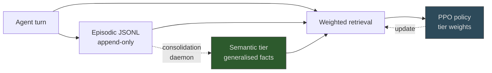

# Tiered Memory Architecture

> A two-tier memory store with a consolidation pipeline that promotes episodic facts into a semantic tier on observed re-use. Reported to improve long-window retrieval over flat-file baselines, but the gain is conditional on long sessions and recurring task structure.

## The Architecture

A flat-file memory store grows monotonically: every episode lands in the same JSONL or vector index, and signal dilutes as the corpus expands. Tiered architectures separate raw episodes from generalised facts and run a promotion pipeline between them.

[MEMTIER (Sidik & Rokach, 2026)](https://arxiv.org/abs/2605.03675) defines five components:

- **Episodic JSONL store** — observations, tool calls, and outcomes appended as structured records
- **Five-signal weighted retrieval** — relevance, recency, outcome, frequency, and structural compatibility scored per query
- **Attention-attributed cognitive weight loop** — entry weights updated from how the model actually attended to retrieved entries
- **Asynchronous consolidation daemon** — promotes episodic entries into a semantic tier when re-use crosses a threshold
- **PPO-based retrieval policy** — adapts the per-tier weights from feedback rather than hand-tuned constants

The semantic tier is not pre-populated. It accumulates only entries the daemon observes retrieved across multiple unrelated triggers — the test for whether a fact has generalised beyond its original episode.

## What Promotion Buys You

Flat-store retrieval re-ranks every entry on every call, so a high-value generalised fact competes against thousands of low-value raw observations. Promoting it into a smaller, separately-scored tier evaluates that fact against fewer competitors and lets the tiers carry different weights ([MEMTIER §3](https://arxiv.org/abs/2605.03675)). Broader memory surveys treat consolidation between memory forms as a generalisation step, not a storage optimisation ([Memory in the Age of AI Agents, arxiv:2512.13564](https://arxiv.org/abs/2512.13564)).

Reported numbers are conditional. MEMTIER claims 38.2% accuracy on LongMemEval-S with Qwen2.5-7B — +33 percentage points over a full-context baseline at 5% on a 6GB consumer GPU ([Sidik & Rokach, 2026](https://arxiv.org/abs/2605.03675)). The baseline is weak; a tuned RAG-over-JSONL system operates well above 5%, so the margin over a non-tiered RAG store is smaller than the headline suggests. The paper is preprint-only and unreplicated. Treat the architecture as defensible, not the absolute numbers as load-bearing.

## When Tiering Pays Off

The overhead — a consolidation daemon, attention-attribution loop, and PPO policy network — is amortised across long windows and recurring tasks. It is not free.

Tiering pays off when:

- **Operation windows exceed a day or two.** The 14-percentage-point degradation over 72 hours that motivates the design ([MEMTIER abstract](https://arxiv.org/abs/2605.03675)) is the regime where consolidation fires often enough to matter.
- **Task structure is recurring.** The PPO policy learns from outcome feedback; without recurring task signatures it never converges and tier-aware retrieval underperforms a static recency-weighted baseline.
- **Retrieval is dilution-bound, not relevance-bound.** Below a few thousand entries the embedding model dominates; tier separation contributes little.
- **Cross-tenant isolation is required.** A separate semantic tier with controlled promotion is the natural place for provenance and pruning policies once stored episodes become an attack surface ([Memory Poisoning and Secure Multi-Agent Systems, arxiv:2603.20357](https://arxiv.org/abs/2603.20357)).

## When a Flat Store Is the Right Answer

Tiering adds two new failure surfaces — incorrect promotion (an episodic fact generalised into a wrong semantic rule) and policy drift (the PPO retrieval policy learning to over- or under-fetch from the wrong tier). Both compound with agent lifetime, the regime where memory is supposed to help ([arxiv:2512.13564](https://arxiv.org/abs/2512.13564)).

Skip tiering when:

- **Sessions are short** (sub-day) — promotion never fires often enough to amortise the daemon.
- **Latency dominates accuracy** — per-turn cost from consolidation, attention attribution, and a PPO policy inflates inner-loop time.
- **Single-developer, single-tenant** — tier isolation costs are not justified.
- **A simpler design already meets the bar.** A flat JSONL store with an embedding index, a recency multiplier, and periodic LLM-summarised compaction captures most of the value. Site patterns — [episodic memory retrieval](episodic-memory-retrieval.md), [memory synthesis from execution logs](memory-synthesis-execution-logs.md), [abstention-aware retrieval](abstention-aware-memory-retrieval.md) — cover the same ground at lower operational complexity.

## Risks Specific to Tier Promotion

- **Wrong-direction generalisation** — frequency does not distinguish "valid across contexts" from "the same incident kept recurring in one context." Stack- or environment-specific entries get promoted then misapplied.
- **Stale semantic facts persist longer** — promoted entries weighted higher decay slower. Facts invalidated by a refactor outlive their originating episodes — the staleness mode in [agent memory patterns](agent-memory-patterns.md), amplified by tier weighting.
- **Policy drift on heterogeneous workloads** — a PPO policy trained on one distribution silently retrieves from the wrong tier when the workload shifts.

Mitigate by gating promotion on a confidence signal, reviewer pass, or semantic-tier expiry — not on frequency alone.

## Key Takeaways

- A two-tier store with consolidation is one design point on the agent-memory spectrum, not a default — it pays off for long operation windows and recurring task structure
- Promotion should be conditional on observed cross-context re-use, not raw frequency, to avoid generalising single-context facts
- Reported accuracy gains are against a weak full-context baseline; the margin over a well-tuned flat RAG store is smaller and unreplicated
- Tiering adds incorrect-promotion and policy-drift failure modes that scale with agent lifetime — audit the promotion step explicitly

## Related

- [Episodic Memory Retrieval](episodic-memory-retrieval.md) — episode-keyed recall without explicit tier promotion
- [Agent Memory Patterns: Learning Across Conversations](agent-memory-patterns.md) — scope-based memory architecture for cross-session learning
- [Abstention-Aware Memory Retrieval](abstention-aware-memory-retrieval.md) — controller deciding *whether* to inject retrieved memory
- [Memory Synthesis from Execution Logs](memory-synthesis-execution-logs.md) — extracting causal lessons from execution traces into persistent knowledge
- [Subtask-Level Memory for Software Engineering Agents](subtask-level-memory.md) — granularity choice in memory retrieval
- [Memory Reinforcement Learning](memory-reinforcement-learning.md) — utility-score updates for stored memories from outcome feedback
- [Generative Agents Memory Stream](generative-agents-memory-stream.md) — three-layer architecture for long-running agents with high observation density
