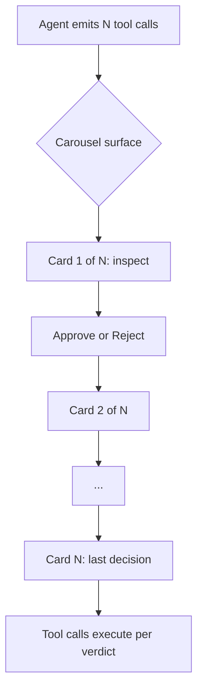

# Tool Confirmation Carousel

> A carousel control reviews multiple pending tool calls in one navigable surface instead of scattered modals — useful only for the residual approvals that allowlists and sandboxes cannot absorb.

## The Residual-Prompt Problem

Allowlists and sandboxes remove most permission prompts. Anthropic reports an [84% reduction](https://www.anthropic.com/engineering/claude-code-sandboxing) in Claude Code through pre-authorising read-only and locally scoped operations (see [Safe Command Allowlisting](../human/safe-command-allowlisting.md)). The residue — destructive writes, unknown commands, network calls — must stay per-call because each decision depends on context the allowlist cannot encode.

When a 50-step task produces ten of those residual prompts, the harness UI determines whether the operator reviews each one or dispatches the queue reflexively. Scattered modals interleaved with agent output train the reflex: scroll, click, scroll, click. The same Anthropic post names the failure mode directly: "Constantly clicking 'approve' slows down development cycles and can lead to 'approval fatigue', where users might not pay close attention to what they're approving, and in turn making development less safe" ([Claude Code sandboxing](https://www.anthropic.com/engineering/claude-code-sandboxing)).

The carousel reframes where those residual prompts live — not whether they exist.

## What the Carousel Does

VS Code 1.116 (April 2026) ships an experimental Tool Confirmation Carousel. From the [release notes](https://code.visualstudio.com/updates/v1_116): "To make approving or rejecting multiple tool calls more efficient, chat now shows a carousel control for tool confirmations." The control provides "a compact and navigable way to review and approve multiple tool calls in sequence without scrolling through the conversation."

The setting is `chat.tools.confirmationCarousel.enabled`, on by default in Insiders and rolling out gradually to Stable ([release notes](https://code.visualstudio.com/updates/v1_116)).



Three properties distinguish the pattern from a stack of modals:

- **Consistent geography.** Each pending call renders in the same visual frame, so scanning the queue costs less than jumping between differently positioned dialogs.
- **Visible queue depth.** A "3 of 12" counter exposes the batch size the agent is asking about, information a single modal hides.
- **Preserved per-call verdict.** The carousel batches review, not execution — each tool call still requires its own approve or reject. Per the release notes, the UI does not change execution order or introduce a blanket-approve path.

## When It Helps

The carousel is a UX addition to the residual approval surface. It earns its place when:

- Allowlists and sandboxes have already absorbed the routine prompts (see [Safe Command Allowlisting](../human/safe-command-allowlisting.md) and [Blast Radius Containment](../security/blast-radius-containment.md))
- The remaining prompts still cluster — the agent emits several non-routine calls per turn rather than one at a time
- The operator is at the terminal, not relaying approvals off-device

For off-terminal or headless flows, the carousel is the wrong surface. [Deferred Permission Pattern](deferred-permission-pattern.md) pauses a headless session and hands the pending call to the caller; [Channels Permission Relay](../tools/claude/channels-permission-relay.md) forwards individual prompts to chat apps. Neither benefits from a carousel — they replace the terminal review surface entirely.

## When It Backfires

Smoother approval is orthogonal to better approval; in some conditions it makes review quality worse:

- **Low-variance queues.** Twenty near-identical file reads train the operator to tap approve without reading. A coarser allowlist entry would remove the prompts entirely — the right fix.
- **Risk heterogeneity.** A destructive `rm -rf` inside a queue of benign reads gets the same card geometry. Uniform framing hides uneven blast radius.
- **Rubber-stamp culture.** Teams already inclined to rubber-stamp AI output (see [Law of Triviality in AI PRs](../anti-patterns/law-of-triviality-ai-prs.md) and [Context Ceiling](../human/context-ceiling.md)) dispatch a carousel faster than they dispatched modals.
- **Parallel agent fleets.** A single operator supervising multiple sessions stacks carousel surfaces per session — off-terminal relay fits that shape better.

VS Code ships the feature behind an experimental flag because the net effect on review quality is not measured. Treat it as a candidate UI for residual prompts, not a safety improvement.

## Stack It, Don't Substitute It

The carousel belongs at the end of a layered permission stack, not the top:

| Layer | Effect on prompts |
|---|---|
| Sandbox ([blast radius](../security/blast-radius-containment.md)) | Limits what any prompt can reach |
| Allowlist ([safe-command allowlisting](../human/safe-command-allowlisting.md)) | Removes routine prompts entirely |
| Auto-mode ([auto-mode](../tools/claude/auto-mode.md)) | Removes classifier-confident prompts |
| Deferred or relay ([deferred permission](deferred-permission-pattern.md), [channels relay](../tools/claude/channels-permission-relay.md)) | Moves remaining prompts off-terminal |
| **Carousel** | Organises whatever survives the earlier layers |

Skip the earlier layers and the carousel is a smoother path to rubber-stamping. Exhaust them first and only genuinely ambiguous calls remain — the surface where a review UI can plausibly help.

## Example

```json
// settings.json
{
  "chat.tools.confirmationCarousel.enabled": true
}
```

A chat turn that emits multiple pending tool calls renders a carousel card. The operator steps through "1 of N" with navigation controls and approves or rejects each; disabling the setting reverts to the prior inline layout ([VS Code 1.116 release notes](https://code.visualstudio.com/updates/v1_116)). Pair with allowlisting so the carousel only surfaces calls that need a human judgement.

## Key Takeaways

- The carousel is a UI surface for residual per-call approvals that allowlists and sandboxes could not absorb
- Consistent geography and visible queue depth are the mechanisms; they reduce friction, not inherent decision quality
- Per-call verdicts are preserved — the carousel batches review, not execution ([VS Code 1.116](https://code.visualstudio.com/updates/v1_116))
- Low-variance queues and mixed-risk batches make rubber-stamping easier, not harder
- Stack the carousel at the end of a permission pipeline — allowlist, sandbox, and relay layers belong first
- The feature is experimental in VS Code; no primary source claims it improves review quality over modals

## Related

- [Safe Command Allowlisting](../human/safe-command-allowlisting.md)
- [Deferred Permission Pattern](deferred-permission-pattern.md)
- [Channels Permission Relay](../tools/claude/channels-permission-relay.md)
- [Human-in-the-Loop Confirmation Gates](../security/human-in-the-loop-confirmation-gates.md)
- [Blast Radius Containment](../security/blast-radius-containment.md)
- [Context Ceiling](../human/context-ceiling.md)
- [Law of Triviality in AI PRs](../anti-patterns/law-of-triviality-ai-prs.md)
- [VS Code Agents App: Agent-Native Parallel Task Execution](vscode-agents-parallel-tasks.md)
