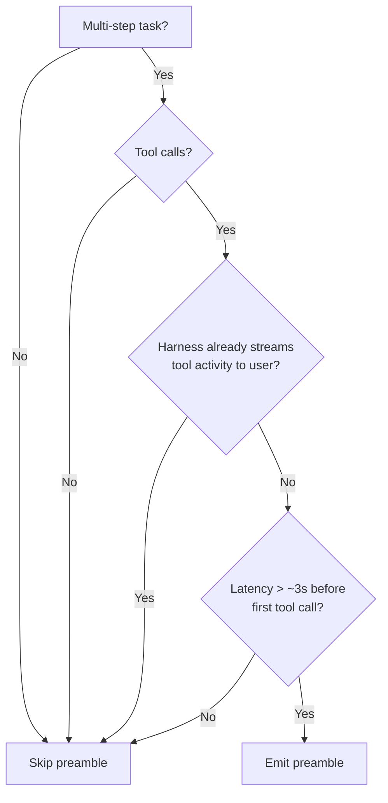

# Tool Preamble

> A one-or-two-sentence visible update emitted before tool calls in a multi-step task. It exists to break the silent gap between user request and first observable action so the run does not read as a stall.

## What the Pattern Is

A tool preamble is a short user-facing message the model writes before it begins calling tools, acknowledging the request and naming the first step. OpenAI defines it in the GPT-5.5 prompting guide under the section "Improve time to first visible token with a preamble" and gives the canonical instruction: "Before any tool calls for a multi-step task, send a short user-visible update that acknowledges the request and states the first step. Keep it to one or two sentences." ([OpenAI: Prompt guidance for GPT-5.5](https://developers.openai.com/api/docs/guides/prompt-guidance?model=gpt-5.5))

The mechanism is perceptual, not behavioural. Reasoning models can spend several seconds planning before any tool call, and during that gap the user sees nothing. A preface message replaces the silence with evidence of work, so longer runs feel less like the model has crashed ([Simon Willison, 2026-04-25](https://simonwillison.net/2026/Apr/25/gpt-5-5-prompting-guide/)).

## When to Use It



The conditions stack — a preamble pays off only when all four are true. OpenAI's own guidance restricts the pattern to "longer or tool-heavy tasks" ([OpenAI: Prompt guidance for GPT-5.5](https://developers.openai.com/api/docs/guides/prompt-guidance?model=gpt-5.5)).

## Cadence: Per Phase, Not Per Call

The most common failure is interpreting the rule as "narrate every tool call". OpenAI's GPT-5.2 prompting guide defines the cadence rule explicitly:

> Send brief updates (1-2 sentences) only when:
> - You start a new major phase of work, or
> - You discover something that changes the plan.
>
> Avoid narrating routine tool calls ("reading file...", "running tests..."). Each update must include at least one concrete outcome ("Found X", "Confirmed Y", "Updated Z").

[OpenAI: GPT-5.2 prompting guide](https://developers.openai.com/cookbook/examples/gpt-5/gpt-5-2_prompting_guide)

Per-call narration collapses into the [three-act response anti-pattern](controlling-agent-output.md) — explain, do, explain again — at the cost of every tool call.

## Newer Models Calibrate by Default

Claude Opus 4.7 already provides "more regular, higher-quality updates to the user throughout long agentic traces" without prompt scaffolding, and Anthropic explicitly tells teams to remove forced-status instructions like "After every 3 tool calls, summarize progress" because they fight the model's calibrated pacing ([Anthropic: Prompting best practices](https://platform.claude.com/docs/en/build-with-claude/prompt-engineering/claude-prompting-best-practices)). Before adding a preamble instruction, check whether the model already does this — layered scaffolding produces redundant output and burns tokens.

## Where to Enforce It

Two points of enforcement, with different trade-offs:

| Enforcement point | Mechanism | Trade-off |
|---|---|---|
| System prompt | Instruction in the persistent system message | Cheap to add; cost is one-or-two sentences per turn; subject to the model ignoring it under load |
| Harness wrapper | The harness injects a fixed preface around the first tool dispatch in a run | Deterministic; preface text is generic ("Working on your request...") rather than task-aware |

The system-prompt approach matches what OpenAI ships in Codex and is what the GPT-5.5 guide recommends. The harness approach is appropriate when determinism matters more than relevance — for example, audit-logged enterprise agents where every run must show a visible update regardless of model behaviour.

## When This Backfires

- **Harness already streams tool calls.** When the user can see live tool indicators (Claude Code's tool panel, Cursor's agent panel), the preamble is duplicate signal that adds tokens and noise.
- **Single-step or sub-second tasks.** A preface before a fast tool call triples the visible turn for no perceived-latency gain.
- **Per-call instead of per-phase.** "Reading file X. Running test Y. Reading file Z." matches the GPT-5.2 anti-pattern and is what readers report as chatty agent output.
- **Headless or batch agents.** No human is watching the stream, so the preface is dead tokens.
- **Default-progress models.** Layering a forced preface on Claude Opus 4.7 fights its calibrated update behaviour ([Anthropic: Prompting best practices](https://platform.claude.com/docs/en/build-with-claude/prompt-engineering/claude-prompting-best-practices)).

## Example

A canonical preamble instruction for a coding agent that does multi-step refactors. The instruction lives in the system prompt and applies across all runs:

```text
Before any tool calls for a multi-step task, send a short user-visible
update (one or two sentences) that acknowledges the request and states
the first step. Send another brief update only when you start a new
major phase of work or discover something that changes the plan.
Do not narrate routine tool calls. Each update must report at least
one concrete outcome ("Found X", "Confirmed Y", "Updated Z").
```

The first sentence is OpenAI's recommended preamble instruction. The remainder applies the GPT-5.2 cadence rule so the agent does not slide from per-task preface into per-call narration. A run executing a five-file refactor would emit a preface at the start, an update when it discovers the affected modules span an unexpected directory, and a final summary — three visible messages, not one per tool call.

## Key Takeaways

- A tool preamble is a one-or-two-sentence visible message before tool calls in a multi-step task; it improves perceived responsiveness, not actual completion time
- OpenAI documents the pattern in the GPT-5.5 prompting guide and ships it in Codex; Anthropic's Claude Opus 4.7 calibrates similar updates by default
- Apply per phase or plan change, not per tool call — the GPT-5.2 cadence rule is what separates the pattern from the chatty-output anti-pattern
- Skip the pattern when the harness already streams tool activity, when tasks are single-step, or when the model already provides calibrated updates
- Each update must carry a concrete outcome; "reading file..." style narration is the documented failure mode

## Related

- [Controlling Agent Output: Concise Answers, Not Essays](controlling-agent-output.md)
- [Goal Monitoring and Progress Tracking](goal-monitoring-progress-tracking.md)
- [Agent Loop Middleware](agent-loop-middleware.md)
- [Observability Legible to Agents](../observability/observability-legible-to-agents.md)
- [Trajectory Logging and Progress Files](../observability/trajectory-logging-progress-files.md)
- [Steering Running Agents](steering-running-agents.md)
