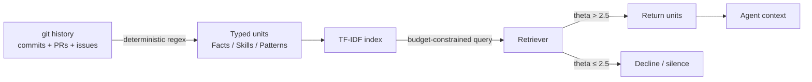

# Typed Memory from VCS History

> A typed memory layer of Facts, Skills, and Patterns distilled from git history — worth building only under tight budgets and good commit hygiene.

Typed memory from VCS history extracts structured prior knowledge from commits, PRs, and issues with deterministic extractors, then exposes it to a coding agent through a budget-constrained retriever.

## When This Pattern Applies

The reference implementation, CommitDistill, reports a 0.750 hit-rate over BM25 (0.333) and `git log` grep (0.083) at a **256-character query budget** but **no statistically detectable lift on headline LLM-as-judge metrics** in head-to-head evaluation ([Chukkapalli et al. 2026](https://arxiv.org/abs/2605.18284)). Apply only when all four conditions hold:

- **High-quality commit hygiene** — conventional commits, structured PR descriptions, linked issues. 90% of 5,000 randomly sampled GitHub commits are assessed low quality ([Tian et al. 2022](https://arxiv.org/pdf/2202.02974)). Low-quality input yields a low-signal index.
- **Tight retrieval budget** — the typing advantage shrinks as the per-query budget grows; unconstrained retrieval converges with BM25 ([Chukkapalli et al. 2026](https://arxiv.org/abs/2605.18284)).
- **Slow-evolving codebase** — extracted Facts and Patterns reflect commit-time state. Repos refactoring quarterly encode conventions the codebase no longer follows.
- **Repository scale** — small repos let the agent read raw `git log` directly; indexing only amortises once linear scans exceed the budget.

If any condition fails, prefer commit-time capture going forward (see *Trade-offs*) or read `git log` ad-hoc.

## How It Works

The CommitDistill design has three components ([Chukkapalli et al. 2026](https://arxiv.org/abs/2605.18284)):

- **Deterministic extractor** — regex over commit messages, PR descriptions, and issue threads. No embeddings, no external service. Reported throughput: 10,000 commits in under 4 seconds on a laptop.
- **Typed knowledge units** — three categories that act as a coarse-grained retrieval filter:
    - **Facts** — discrete information units (a configuration value, an API constraint)
    - **Skills** — procedural knowledge (how a migration runs, the steps to regenerate a fixture)
    - **Patterns** — recurring conventions (how this repo names files, how errors are handled)
- **Budget-constrained TF-IDF retriever with calibrated silence threshold (theta = 2.5)** — declines out-of-distribution queries rather than returning irrelevant top-k matches. The silence threshold makes the typed structure load-bearing under tight budgets.

An independent finding supports the broader approach: [Wang et al. 2025](https://arxiv.org/abs/2510.01003) shows augmenting a code-localisation agent with historical commits, linked issues, and module-functionality summaries improves repository-level bug-fix localisation. The gain comes from the combined signal — commits alone are insufficient.

## Why It Works

The typed structure acts as a category filter under tight budgets because TF-IDF's lexical noise dominates when the query carries few tokens. Splitting the corpus into three disjoint pools lets the retriever route before scoring, so a 256-character query lands in a narrower space than full lexical search over raw commits ([Chukkapalli et al. 2026](https://arxiv.org/abs/2605.18284)). The silence threshold (theta = 2.5) is the second load-bearing element — it returns nothing when no unit clears the bar, preventing the agent from acting on weakly relevant noise. Without abstention, top-k over noisy commits surfaces false positives that degrade output ([abstention-aware retrieval](abstention-aware-memory-retrieval.md) shows the effect generalises).

## When This Backfires

- **Confident retrieval of stale Facts** — on fast-evolving codebases, extracted Patterns conflict with current conventions; the index becomes a confident source of wrong answers. Outdated information in RAG knowledge bases reduces response accuracy and can mislead models even when current information is available ([Ouyang et al. 2025](https://arxiv.org/abs/2503.04800)).
- **Decision Shadow already lost** — each commit captures the diff but not the reasoning or rejected alternatives, and no extractor recovers what was never recorded. The fix is to instrument capture going forward, as the Lore protocol does with git trailers ([Stetsenko 2026](https://arxiv.org/abs/2603.15566)).
- **Treated as a default upgrade** — CommitDistill reports indistinguishable performance from BM25 in head-to-head LLM-as-judge evaluation ([Chukkapalli et al. 2026](https://arxiv.org/abs/2605.18284)). It is a budget-conditional optimisation, not a default.

## Trade-offs

| Approach | Pros | Cons |
|----------|------|------|
| Typed memory from VCS history (CommitDistill-style) | Cheap to build (10K commits < 4s, no embeddings); typing dominates under tight budgets; calibrated silence prevents noisy retrieval | No headline lift over BM25 in LLM-as-judge eval; degrades on low-quality history; stale on fast-moving repos |
| Raw `git log` read into context | Zero infrastructure; always current | Linear cost in history size; agent burns budget on irrelevant commits |
| Instrument commit-time capture (e.g. [Lore](https://arxiv.org/abs/2603.15566)) | Preserves Decision Shadow at the source; trailers carry constraints and alternatives | Requires team discipline going forward; historical commits stay unstructured |
| Combined signal (commits + linked issues + module summaries) | Reported improvement on repository-level localisation ([Wang et al. 2025](https://arxiv.org/abs/2510.01003)) | More moving parts; harder to attribute gains to one component |

## Key Takeaways

- Treat this as a budget-conditional optimisation, not a default — CommitDistill reports no headline lift over BM25 in LLM-as-judge evaluation ([Chukkapalli et al. 2026](https://arxiv.org/abs/2605.18284)).
- The reported advantage holds at a 256-character budget; larger budgets converge with the lexical baseline.
- Regex extraction, Facts/Skills/Patterns typing, and the silence threshold (theta = 2.5) work as a unit — remove abstention and the layer becomes a confident noise source.
- Commit-history quality is the binding constraint. With 90% of random GitHub commits low quality ([Tian et al. 2022](https://arxiv.org/pdf/2202.02974)), the index reflects the source.
- For repos lacking commit hygiene, instrument capture going forward (e.g. [Lore](https://arxiv.org/abs/2603.15566)) rather than mining historical noise.

## Related

- [Tiered Memory Architecture](tiered-memory-architecture.md) — Episodic-to-semantic promotion as a different shape of structured memory; both are conditional on long operation windows
- [Memory Synthesis from Execution Logs](memory-synthesis-execution-logs.md) — Extract causal lessons from agent execution traces; complementary memory source that does not depend on commit hygiene
- [Abstention-Aware Memory Retrieval](abstention-aware-memory-retrieval.md) — The calibrated-silence mechanism CommitDistill uses; abstention is what makes typed memory load-bearing under tight budgets
- [Episodic Memory Retrieval](episodic-memory-retrieval.md) — Episode-level retrieval as an alternative memory shape — closer to raw observation streams, less structured than typed units
- [Agent Memory Patterns: Learning Across Conversations](agent-memory-patterns.md) — Scope-and-temporal memory taxonomy that typed memory from VCS history slots into as a cross-session source
