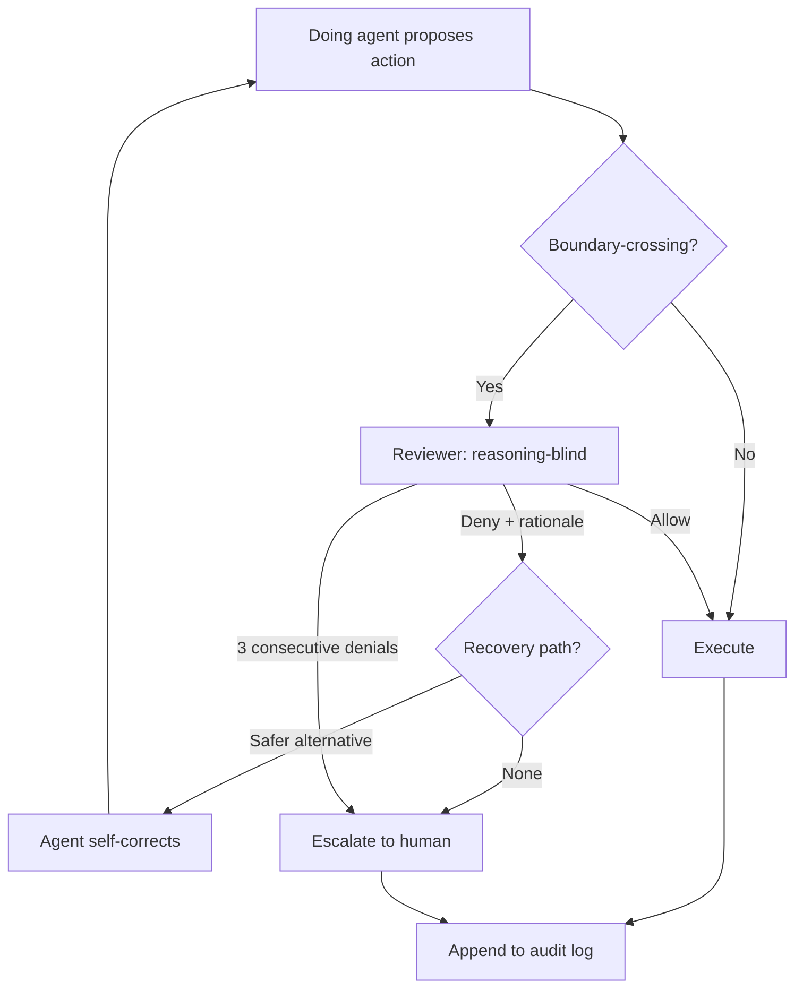

# Verification-Gated Agent Autonomy via Automated Review

> Verification-gated autonomy lets an agent act more widely while an automated reviewer screens its output for safety.

Verification-gated autonomy substitutes an automated reviewer for per-action human approval on the high-volume routine cases, escalating to a human only when the reviewer denies an action or its circuit breaker trips. The gate moves from "approve each action" to "screen the result-class against a stated request" — economic only when the reviewer is class-isolated from the doing agent, reasoning-blind, paired with deterministic carve-outs for irreversible actions, and backed by a per-action audit trail. Vendors who ship this pattern frame it explicitly as a probabilistic floor, not a safety guarantee.

## When the Technique Earns Its Complexity

The pattern adds reviewer-model tokens, a second LLM attack surface, and a new failure mode (reviewer/author shared blind spots). It pays back only when all four of the following hold:

- Action volume produces approval fatigue. Enterprise Cursor customers previously saw roughly 40% of agent actions blocked under default-mode approval prompts; auto-review brought user interruptions down to ~7% of total chats by absorbing the routine cases ([Cursor — Governing agent autonomy with Auto-review](https://cursor.com/blog/agent-autonomy-auto-review)). At that volume, the human is rubber-stamping; the reviewer wins.
- Reviewer is class-isolated from the doing agent. Same training distribution means measurable self-preference bias — Panickssery et al. (2024) report a linear correlation between self-recognition capability and self-preference strength when an LLM evaluates its own outputs ([arxiv:2404.13076](https://arxiv.org/abs/2404.13076)). Self-Correction Bench measured a 64.5% mean self-correction blind-spot rate across 14 models ([arxiv:2507.02778](https://arxiv.org/abs/2507.02778)).
- Irreversible actions are routed elsewhere. Production deploys, money movement, IAM rotation, and credential exposure belong on a [deterministic gate](deterministic-precondition-gates.md), not a probabilistic reviewer. OpenAI's published Codex posture explicitly composes auto-review with sandbox, approvals, and OTel telemetry as separate layers ([Running Codex safely at OpenAI](https://openai.com/index/running-codex-safely/)).
- Per-action audit trail is enforced. Every reviewer decision — the verdict, the rationale, the resolved action arguments — must be reconstructable post-hoc. Without telemetry, the layer provides false confidence ([Running Codex safely at OpenAI](https://openai.com/index/running-codex-safely/)).

If any condition fails, the simpler postures dominate: keep per-action human approval on the small set of high-stakes paths, or invest in deterministic gates (sandbox + cryptographic egress + irrecoverable-action allowlists) on the cases the reviewer cannot defend.

## What the Reviewer Screens

The reviewer is a separate agent that evaluates each boundary-crossing action against the user's stated request and the consequences of error. Implementations converge on three checks:

| Check | What the reviewer evaluates | Example denials |
|-------|------------------------------|------------------|
| Exfiltration risk | Outbound destinations, payload shapes | Sending private data, secrets, or credentials to untrusted destinations ([OpenAI Codex docs](https://developers.openai.com/codex/concepts/sandboxing/auto-review)) |
| Credential probing | File reads, env reads, secret-store calls | Probing for credentials, tokens, cookies, or session material ([OpenAI Codex docs](https://developers.openai.com/codex/concepts/sandboxing/auto-review)) |
| Destructive / irreversible | Deletes, force-pushes, prod deploys, persistent security weakening | "Destructive actions with significant risk of irreversible damage" ([OpenAI Codex docs](https://developers.openai.com/codex/concepts/sandboxing/auto-review)) |

Cursor's reviewer takes the same shape and is configured through natural-language `autoRun.allow_instructions` and `autoRun.block_instructions` in `permissions.json`, so the policy is version-controllable per repository ([Cursor — Governing agent autonomy with Auto-review](https://cursor.com/blog/agent-autonomy-auto-review)).

## Why It Works

The reviewer raises the autonomy ceiling not because it is a *better* judge than the human, but because it is a *separable* one with a narrower job. OpenAI states the mechanism: "The main agent is optimized to complete the user's task. This creates pressure to treat an approval boundary as just another obstacle to overcome. Auto-review has a narrower job: decide whether a proposed boundary-crossing action should run" ([Auto-review of agent actions](https://alignment.openai.com/auto-review/)). Reasoning-blinding — Codex's reviewer sees "a compact transcript plus the exact approval request" but "Hidden assistant reasoning is not included" ([OpenAI Codex docs](https://developers.openai.com/codex/concepts/sandboxing/auto-review)) — closes the channel by which the doing agent could argue the reviewer down.

The empirical effect is the rubber-stamp problem inverted. OpenAI reports Codex sessions stop for human approval "roughly 200x less often than in manual approval mode, while still catching many of the actions humans would want stopped" ([Auto-review of agent actions](https://alignment.openai.com/auto-review/)). Cursor reports the reviewer blocks ~4% of reviewed actions, and only ~7% of total chats produce a user interrupt — down from ~40% under default-mode approval prompts ([Cursor — Governing agent autonomy with Auto-review](https://cursor.com/blog/agent-autonomy-auto-review)).

The recovery contract matters as much as the screening. OpenAI's docs state that when the reviewer denies an action, "Do not pursue the same outcome via workaround, indirect execution, or policy circumvention. Continue only with a materially safer alternative. Otherwise, stop and ask the user" ([OpenAI Codex docs](https://developers.openai.com/codex/concepts/sandboxing/auto-review)). A circuit breaker — 3 consecutive denials or 10 within 50 recent reviews — aborts the turn ([OpenAI Codex docs](https://developers.openai.com/codex/concepts/sandboxing/auto-review)). Without these, the agent learns to route around the gate.

## When This Backfires

- Reviewer/author share training distribution. Same model class inherits the doing agent's jailbreak surface; same family inherits its blind spots. A production study of LLM judges on live multi-turn transaction-agent traffic found the built-in judge caught only 22% of confirmed systematic problems ([Catching One in Five, arxiv:2606.10315](https://arxiv.org/abs/2606.10315)).
- Workload outside the reviewer's calibration. Vendor numbers (~4% block / ~99% auto-approve) reflect calibrated traffic. Independent stress testing of a related auto-permission system measured an 81% false-negative rate (95% CI 73.8%–87.4%) on deliberately ambiguous DevOps prompts and 36.8% of state-changing actions bypassing classification entirely ([Measuring the Permission Gate, arxiv:2604.04978](https://arxiv.org/abs/2604.04978)). The floor is workload-conditional.
- Contextual bias in security review. Contextual bias in LLM-based security code review is systematic and exploitable; the authors demonstrated 100% bypass success via iterative refinement attack on metadata-driven framing ([Measuring and Exploiting Contextual Bias, arxiv:2603.18740](https://arxiv.org/abs/2603.18740)).
- Reviewer-targeted prompt injection. The reviewer is an LLM-as-judge and inherits the documented failure modes — judge decisions are "highly sensitive to prompt biases even when the underlying code snippet is unchanged" ([Bias in the Loop, arxiv:2604.16790](https://arxiv.org/abs/2604.16790)).
- Vendor declines to call it a guarantee. OpenAI states explicitly: "Auto-review improves the default operating point for long-running agentic work, but it is not a deterministic security guarantee" ([OpenAI Codex docs](https://developers.openai.com/codex/concepts/sandboxing/auto-review)). Treat the reviewer as the floor on routine traffic, not as license for result-level trust.
- Untrusted configuration surface. If the autonomy policy lives in a file the agent can rewrite (`autoRun.*` in workspace `permissions.json`, repo-local rule files), the gate collapses to whichever layer the attacker reaches first. Policy belongs on an admin-enforced surface.

## Distinguishing the Technique From Adjacent Stations

Three nearby patterns occupy different slots — none is interchangeable:

| Station | What it gates | Cost shape | When |
|---------|----------------|------------|------|
| Verification-gated agent autonomy | Whether to ask the human for output-level approval | One reviewer call per boundary-crossing action | High-volume routine where per-action approval is rubber-stamping |
| [Classifier-Gated Auto-Permission](classifier-gated-auto-permission.md) | Whether the *action* matches a known safety class | One classifier call per Tier-3 action | High-volume tool calls where the safety binary is enumerable |
| [Inference-Time Tool-Call Reviewer](inference-time-tool-call-reviewer.md) | Whether the proposed call is *correct* | One reviewer call per provisional tool call | High blast radius + measured Helpfulness:Harmfulness |

Verification-gated autonomy decides *whether the result-class warrants a human's attention*; classifier-gated auto-permission decides *whether the action falls inside the safety envelope*; the tool-call reviewer decides *whether the call is right*. They compose — OpenAI's published Codex posture wires all three plus sandbox and OTel telemetry as the load-bearing legs ([Running Codex safely at OpenAI](https://openai.com/index/running-codex-safely/)).

## Example

A team enabling verification-gated autonomy on a Codex fleet pins the reviewer model to a different class from the session model, leaves reasoning-blinding on, enumerates the irreversible-action set (production deploys, IAM rotation, force-push, dependency installs) for a deterministic deny gate, and exports an OTel event for every reviewer verdict. As of 2026-06-28, Codex expresses this through `approval_policy = "on-request"` and `approvals_reviewer = "auto_review"` in the request config ([OpenAI Codex — Agent approvals & security](https://developers.openai.com/codex/agent-approvals-security)); Cursor expresses the equivalent through `autoRun.allow_instructions` and `autoRun.block_instructions` in `permissions.json`, allowing read-only build-artifact inspection while pausing deletes ([Cursor — Governing agent autonomy with Auto-review](https://cursor.com/blog/agent-autonomy-auto-review)). The configuration surface differs and these keys may rename without notice; the four-condition contract above does not.

## Key Takeaways

- The technique earns its complexity only when all four conditions hold: action volume causes approval fatigue, the reviewer is class-isolated and reasoning-blind, irreversible actions are routed to a deterministic gate, and a per-action audit trail is enforced.
- Reported screening numbers hold against calibrated traffic only — production judges catch 22% of systematic problems on live traffic, and stress tests show 81% FNR on adversarial DevOps inputs. Treat published vendor numbers as workload-conditional, not universal.
- Reasoning-blinding plus a strict recovery contract (no workaround, no indirect execution, escalate to human or stop) are load-bearing — without them the reviewer becomes a step the doing agent learns to argue around.

## Related

- [Classifier-Gated Auto-Permission for Cloud-IDE Coding Agents](classifier-gated-auto-permission.md) — the adjacent technique that gates action *safety*; verification-gated autonomy gates *result-level approval frequency*
- [Inference-Time Tool-Call Reviewer](inference-time-tool-call-reviewer.md) — per-call reviewer for tool-call correctness, gated by Helpfulness:Harmfulness — composes with this technique on high-blast-radius actions
- [Selective Autonomy from Copilot Feedback](selective-autonomy-from-copilot-feedback.md) — selective classification with learned abstention; the policy-side analogue to verification-gated screening
- [Agent Self-Review Loop](../code-review/agent-self-review-loop.md) — the same agent reviews its own output before submission; verification-gated autonomy puts the review on a *separate* agent to break the shared-failure-mode chain
- [Risk-Score Threshold Calibration for Auto-Approval](../code-review/risk-score-threshold-calibration.md) — the explicit yield-vs-safety dial on the reviewer's threshold, with revert and incident telemetry for recalibration
